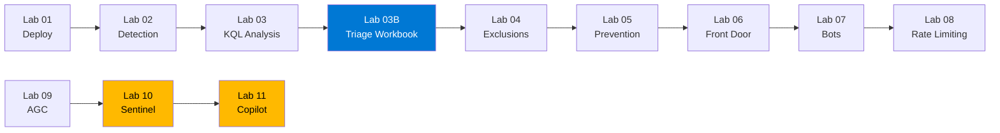

# :test_tube: Hands-on Labs

## Overview

This workshop includes **12 hands-on labs** that progressively build your Azure WAF skills.
All labs include automated infrastructure deployment, step-by-step instructions, and attack simulation scripts.

---

## :rocket: Before You Begin

<div class="script-info" markdown>

**:bulb: Pre-populate WAF Logs**: Before starting Lab 03, run the traffic simulator for at least 15 minutes to ensure WAF logs are available for analysis.

```powershell
.\scripts\simulate-waf-traffic.ps1 -TargetUrl "http://<your-appgw-fqdn>" -DurationMinutes 15
```

</div>

[:octicons-rocket-24: Deploy Infrastructure](setup.md){ .md-button .md-button--primary }

---

## Lab Progression



---

## Core Labs

<div class="lab-card" markdown>
<div markdown>
**Lab 01** — Deploy Application Gateway WAF v2 with DRS 2.1

Explore the deployed infrastructure, WAF policy, and verify connectivity.
</div>
<div markdown>
<span class="badge badge-core">Core</span>
[:octicons-arrow-right-24:](lab01.md)
</div>
</div>

<div class="lab-card" markdown>
<div markdown>
**Lab 02** — Configure WAF Detection Mode & Generate Traffic

Enable detection mode, generate attack traffic, verify logging without blocking.
</div>
<div markdown>
<span class="badge badge-core">Core</span>
[:octicons-arrow-right-24:](lab02.md)
</div>
</div>

<div class="lab-card" markdown>
<div markdown>
**Lab 03** — Analyze WAF Logs with KQL

Navigate Log Analytics, run KQL queries, identify triggered rules and false positives.
</div>
<div markdown>
<span class="badge badge-core">Core</span>
[:octicons-arrow-right-24:](lab03.md)
</div>
</div>

<div class="lab-card new" markdown>
<div markdown>
**Lab 03B** — WAF Fine Tuning with Triage Workbooks :sparkles:

Deploy the official WAF Triage Workbooks for Application Gateway and Front Door.
</div>
<div markdown>
<span class="badge badge-new">New</span>
[:octicons-arrow-right-24:](lab03b.md)
</div>
</div>

<div class="lab-card" markdown>
<div markdown>
**Lab 04** — Create Exclusions and Custom Rules

Tune WAF with per-rule exclusions, geo-filtering, and IP blocking rules.
</div>
<div markdown>
<span class="badge badge-core">Core</span>
[:octicons-arrow-right-24:](lab04.md)
</div>
</div>

<div class="lab-card" markdown>
<div markdown>
**Lab 05** — Switch to Prevention Mode & Validate

Enable prevention, re-run attacks, verify blocking and exclusion behavior.
</div>
<div markdown>
<span class="badge badge-core">Core</span>
[:octicons-arrow-right-24:](lab05.md)
</div>
</div>

<div class="lab-card" markdown>
<div markdown>
**Lab 06** — Deploy Front Door Premium with WAF

Explore edge WAF, configure origin lockdown, compare with Application Gateway.
</div>
<div markdown>
<span class="badge badge-core">Core</span>
[:octicons-arrow-right-24:](lab06.md)
</div>
</div>

<div class="lab-card" markdown>
<div markdown>
**Lab 07** — Bot Protection & JavaScript Challenge

Enable Bot Manager, configure JavaScript Challenge, test bot detection.
</div>
<div markdown>
<span class="badge badge-core">Core</span>
[:octicons-arrow-right-24:](lab07.md)
</div>
</div>

<div class="lab-card" markdown>
<div markdown>
**Lab 08** — Rate Limiting with XFF Grouping

Create rate limiting rules, test burst traffic, analyze rate limit events.
</div>
<div markdown>
<span class="badge badge-core">Core</span>
[:octicons-arrow-right-24:](lab08.md)
</div>
</div>

<div class="lab-card" markdown>
<div markdown>
**Lab 09** — Application Gateway for Containers (AGC)

Deploy AGC with WAF policy as Kubernetes CRD, test protection.
</div>
<div markdown>
<span class="badge badge-core">Core</span>
[:octicons-arrow-right-24:](lab09.md)
</div>
</div>

---

## Optional Labs

!!! warning "Additional Licensing Required"
    These labs require Microsoft Sentinel and/or Copilot for Security licenses.

<div class="lab-card optional" markdown>
<div markdown>
**Lab 10** — Microsoft Sentinel WAF Data Connector

Connect WAF data to Sentinel, create analytics rules and workbooks.
</div>
<div markdown>
<span class="badge badge-optional">Optional</span>
[:octicons-arrow-right-24:](lab10.md)
</div>
</div>

<div class="lab-card optional" markdown>
<div markdown>
**Lab 11** — Copilot for Security WAF Investigation

Use natural language to investigate WAF events and get tuning recommendations.
</div>
<div markdown>
<span class="badge badge-optional">Optional</span>
[:octicons-arrow-right-24:](lab11.md)
</div>
</div>

---

## :broom: Cleanup

When finished with all labs, remove all resources:

```powershell
.\scripts\cleanup.ps1 -ResourceGroupName "rg-waf-workshop"
```

!!! danger "Cost Warning"
    Lab resources cost approximately **$15-25 USD/day**. Always clean up when finished.
