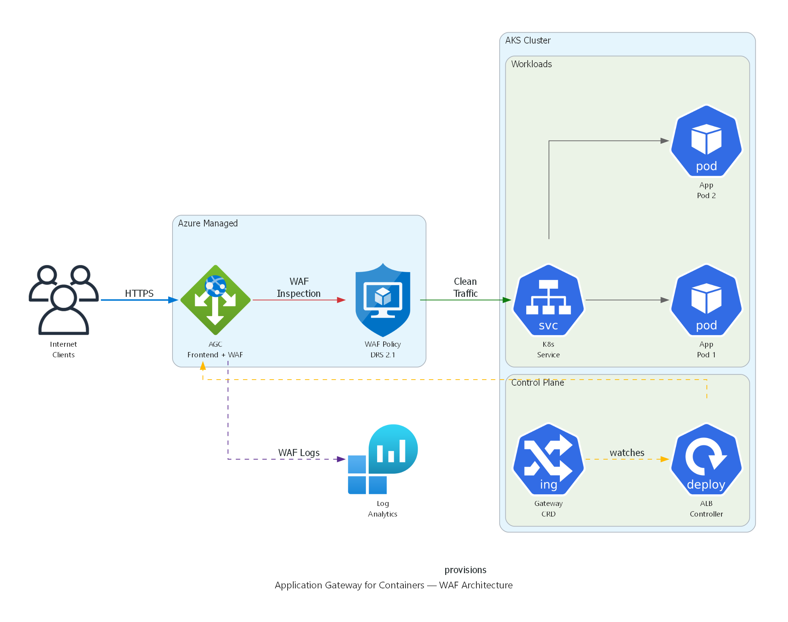

# Lab 09 - Application Gateway for Containers (AGC) with WAF

| Field | Detail |
|---|---|
| **Duration** | 45–60 minutes |
| **Level** | Intermediate – Advanced |
| **Prerequisites** | Lab 01 environment deployed; basic Kubernetes knowledge; `kubectl` configured (optional) |

## Objectives

By the end of this lab you will be able to:

- Explain what Application Gateway for Containers (AGC) is and how it differs from the traditional Application Gateway.
- Navigate AGC resources in the Azure portal.
- Understand how the ALB Controller in AKS manages AGC.
- Define WAF policies as Kubernetes Custom Resource Definitions (CRDs).
- Deploy a sample application on AKS and protect it with a WAF policy through AGC.
- Compare AGC with the traditional Application Gateway and Azure Front Door.

---

## Section 1 – Introduction to Application Gateway for Containers

**Application Gateway for Containers (AGC)** is Microsoft's next-generation application load-balancing solution designed specifically for Kubernetes workloads running on Azure Kubernetes Service (AKS). It supersedes the Application Gateway Ingress Controller (AGIC) add-on model by providing:

| Capability | Traditional AGIC | AGC |
|---|---|---|
| API model | Kubernetes Ingress | Kubernetes Gateway API |
| Provisioning | Pre-created App Gateway | Fully managed by ALB Controller |
| Configuration latency | Minutes | Seconds |
| WAF integration | WAF v2 SKU on App Gateway | WAF policy via CRD reference |
| Traffic splitting | Limited | Native weighted back-end support |
| TLS policy control | App Gateway TLS settings | Gateway API `TLSRoute` / policy |
| Scalability | Tied to App Gateway SKU | Elastic, Azure-managed data plane |

### How AGC Works

1. The **ALB Controller** is deployed as a pod inside AKS.
2. It watches for **Gateway API** resources (`Gateway`, `HTTPRoute`, `GRPCRoute`).
3. When a `Gateway` resource is created, the ALB Controller provisions or updates the AGC **frontend** in Azure.
4. When an `HTTPRoute` is created, the ALB Controller programs routing rules and back-end targets on the AGC data plane.
5. WAF policies can be referenced in the `Gateway` resource so that all traffic passing through that frontend is inspected.

---

## Section 2 – Explore AGC Resources in the Portal

1. Sign in to the [Azure portal](https://portal.azure.com).

2. In the portal search bar, type **Application Gateways for Containers** and select the service.

3. Click the AGC resource in your resource group (e.g., `waf-workshop-agc`).

4. Examine the following blades:

   | Blade | What to Look For |
   |---|---|
   | **Overview** | Provisioning state, location, associated AKS cluster |
   | **Frontends** | Public or private frontends, FQDN assigned |
   | **Associations** | AKS subnet associations that allow the ALB Controller to program the data plane |
   | **WAF Policy** | Linked WAF policy (if any) |

5. Click **Frontends** → select the frontend → note the **FQDN** (e.g., `fe-xxxxxxxx.<region>.fga.alb.azure.com`). You will use this later to test traffic.

6. Navigate back to the resource group and confirm the following companion resources exist:

   - **Managed identity** used by the ALB Controller.
   - **WAF policy** linked to the AGC frontend (if pre-deployed).

---

## Section 3 – AGC Architecture Overview



*Application Gateway for Containers with WAF: Internet traffic flows through the AGC Frontend where the WAF Policy (DRS 2.1) inspects requests. Clean traffic is routed to Kubernetes Services and Pods. The ALB Controller in the AKS control plane watches Gateway API CRDs and provisions the AGC automatically. WAF logs flow to Log Analytics.*

### Key Components

| Component | Description |
|---|---|
| **ALB Controller** | A Kubernetes controller deployed via Helm; watches Gateway API resources and translates them into AGC configuration. |
| **Gateway** | A Kubernetes resource that represents the AGC frontend (listener). |
| **HTTPRoute** | Defines how HTTP traffic is routed to Kubernetes services. |
| **Frontend** | The Azure-managed public or private endpoint that receives traffic. |
| **Association** | Links the AGC data plane to a delegated subnet inside the AKS VNet. |

---

## Section 4 – WAF Policy as a Kubernetes CRD

With AGC, WAF policies are referenced directly in the **Gateway API** resources using annotations or policy references. This enables a **GitOps-friendly** workflow — security policies live alongside application manifests.

### 4.1 – Example Gateway Resource with WAF Policy

```yaml
# gateway.yaml
apiVersion: gateway.networking.k8s.io/v1
kind: Gateway
metadata:
  name: waf-demo-gateway
  namespace: waf-demo
  annotations:
    alb.networking.azure.io/alb-id: /subscriptions/<SUBSCRIPTION_ID>/resourceGroups/<RESOURCE_GROUP>/providers/Microsoft.ServiceNetworking/trafficControllers/<AGC_NAME>
spec:
  gatewayClassName: azure-alb-external
  listeners:
    - name: http-listener
      protocol: HTTP
      port: 80
      allowedRoutes:
        namespaces:
          from: Same
  # WAF policy reference via infrastructure annotation
  infrastructure:
    annotations:
      alb.networking.azure.io/alb-frontend-waf-policy: /subscriptions/<SUBSCRIPTION_ID>/resourceGroups/<RESOURCE_GROUP>/providers/Microsoft.Network/ApplicationGatewayWebApplicationFirewallPolicies/<WAF_POLICY_NAME>
```

> **Key point:** The `alb.networking.azure.io/alb-frontend-waf-policy` annotation links the Azure WAF policy to the AGC frontend created by this Gateway.

### 4.2 – Example HTTPRoute Resource

```yaml
# httproute.yaml
apiVersion: gateway.networking.k8s.io/v1
kind: HTTPRoute
metadata:
  name: waf-demo-route
  namespace: waf-demo
spec:
  parentRefs:
    - name: waf-demo-gateway
      namespace: waf-demo
  rules:
    - matches:
        - path:
            type: PathPrefix
            value: /
      backendRefs:
        - name: waf-demo-service
          port: 80
```

### 4.3 – Example WAF Policy (ARM / Bicep Reference)

The WAF policy itself is still an Azure resource. Below is a minimal Bicep snippet that creates a WAF policy suitable for AGC:

```bicep
resource wafPolicy 'Microsoft.Network/ApplicationGatewayWebApplicationFirewallPolicies@2023-11-01' = {
  name: 'agc-waf-policy'
  location: resourceGroup().location
  properties: {
    policySettings: {
      requestBodyCheck: true
      maxRequestBodySizeInKb: 128
      fileUploadLimitInMb: 100
      state: 'Enabled'
      mode: 'Prevention'
    }
    managedRules: {
      managedRuleSets: [
        {
          ruleSetType: 'Microsoft_DefaultRuleSet'
          ruleSetVersion: '2.1'
        }
        {
          ruleSetType: 'Microsoft_BotManagerRuleSet'
          ruleSetVersion: '1.1'
        }
      ]
    }
  }
}
```

---

## Section 5 – Deploy a Sample App to AKS with WAF Protection

> ⚠️ **OPTIONAL – Requires AKS Cluster**
>
> The following steps require a running AKS cluster with the ALB Controller installed. If you do not have an AKS cluster, review the YAML manifests below as reference material and proceed to Section 7.

### 5.1 – Connect to the AKS Cluster

```bash
# Set variables
RESOURCE_GROUP="waf-workshop-rg"
AKS_CLUSTER="waf-workshop-aks"

# Get AKS credentials
az aks get-credentials \
  --resource-group $RESOURCE_GROUP \
  --name $AKS_CLUSTER \
  --overwrite-existing

# Verify connectivity
kubectl get nodes
```

### 5.2 – Create the Namespace

```bash
kubectl create namespace waf-demo
```

### 5.3 – Deploy the Sample Application

Create a file named `waf-demo-app.yaml`:

```yaml
# waf-demo-app.yaml
apiVersion: apps/v1
kind: Deployment
metadata:
  name: waf-demo-app
  namespace: waf-demo
  labels:
    app: waf-demo
spec:
  replicas: 2
  selector:
    matchLabels:
      app: waf-demo
  template:
    metadata:
      labels:
        app: waf-demo
    spec:
      containers:
        - name: nginx
          image: mcr.microsoft.com/oss/nginx/nginx:1.25.4
          ports:
            - containerPort: 80
          resources:
            requests:
              cpu: 100m
              memory: 128Mi
            limits:
              cpu: 250m
              memory: 256Mi
---
apiVersion: v1
kind: Service
metadata:
  name: waf-demo-service
  namespace: waf-demo
spec:
  type: ClusterIP
  selector:
    app: waf-demo
  ports:
    - protocol: TCP
      port: 80
      targetPort: 80
```

Apply the manifest:

```bash
kubectl apply -f waf-demo-app.yaml
```

### 5.4 – Create the Gateway Resource

Create a file named `gateway.yaml` using the template from Section 4.1. Replace the placeholders:

```bash
# Replace placeholders
SUBSCRIPTION_ID=$(az account show --query id -o tsv)
AGC_NAME="waf-workshop-agc"
WAF_POLICY_NAME="agc-waf-policy"

cat <<EOF > gateway.yaml
apiVersion: gateway.networking.k8s.io/v1
kind: Gateway
metadata:
  name: waf-demo-gateway
  namespace: waf-demo
  annotations:
    alb.networking.azure.io/alb-id: /subscriptions/${SUBSCRIPTION_ID}/resourceGroups/${RESOURCE_GROUP}/providers/Microsoft.ServiceNetworking/trafficControllers/${AGC_NAME}
spec:
  gatewayClassName: azure-alb-external
  listeners:
    - name: http-listener
      protocol: HTTP
      port: 80
      allowedRoutes:
        namespaces:
          from: Same
  infrastructure:
    annotations:
      alb.networking.azure.io/alb-frontend-waf-policy: /subscriptions/${SUBSCRIPTION_ID}/resourceGroups/${RESOURCE_GROUP}/providers/Microsoft.Network/ApplicationGatewayWebApplicationFirewallPolicies/${WAF_POLICY_NAME}
EOF

kubectl apply -f gateway.yaml
```

### 5.5 – Create the HTTPRoute

```bash
kubectl apply -f httproute.yaml   # Use the file from Section 4.2
```

### 5.6 – Verify the Deployment

```bash
# Check pods are running
kubectl get pods -n waf-demo

# Check gateway status
kubectl get gateway -n waf-demo

# Get the AGC frontend FQDN
AGC_FQDN=$(kubectl get gateway waf-demo-gateway -n waf-demo \
  -o jsonpath='{.status.addresses[0].value}')
echo "AGC Frontend: $AGC_FQDN"

# Test connectivity (may take 2-3 minutes for DNS propagation)
curl -s -o /dev/null -w "%{http_code}" http://$AGC_FQDN/
```

Expected output: `200`

---

## Section 6 – Test WAF Protection on AGC

> ⚠️ **OPTIONAL – Requires AKS Cluster with AGC deployed (Section 5)**

### 6.1 – Send Legitimate Traffic

```bash
# Normal request – should return 200
curl -s -o /dev/null -w "%{http_code}\n" http://$AGC_FQDN/
```

**Expected:** `200 OK`

### 6.2 – Send SQL Injection Attack

```bash
# SQL injection in query string – should be blocked
curl -s -o /dev/null -w "%{http_code}\n" \
  "http://$AGC_FQDN/?id=1' OR '1'='1"
```

**Expected:** `403 Forbidden`

### 6.3 – Send XSS Attack

```bash
# Cross-site scripting in query string – should be blocked
curl -s -o /dev/null -w "%{http_code}\n" \
  "http://$AGC_FQDN/?q=<script>alert('xss')</script>"
```

**Expected:** `403 Forbidden`

### 6.4 – Send Path Traversal Attack

```bash
# Path traversal – should be blocked
curl -s -o /dev/null -w "%{http_code}\n" \
  "http://$AGC_FQDN/../../etc/passwd"
```

**Expected:** `403 Forbidden`

### 6.5 – Send Command Injection Attack

```bash
# Command injection in header – should be blocked
curl -s -o /dev/null -w "%{http_code}\n" \
  -H "User-Agent: () { :; }; /bin/bash -c 'cat /etc/passwd'" \
  "http://$AGC_FQDN/"
```

**Expected:** `403 Forbidden`

### 6.6 – Verify in WAF Logs

WAF logs for AGC flow to the same Log Analytics workspace. Query them with:

```kql
AzureDiagnostics
| where ResourceProvider == "MICROSOFT.SERVICENETWORKING"
| where Category == "TrafficControllerAccessLog"
| where properties_s contains "Blocked"
| project TimeGenerated, properties_s
| order by TimeGenerated desc
| take 20
```

> **Note:** Log ingestion may take 5–10 minutes after the requests are sent.

---

## Section 7 – AGC vs Traditional Application Gateway

| Feature | Traditional Application Gateway v2 | Application Gateway for Containers (AGC) |
|---|---|---|
| **Target workloads** | VMs, VMSS, App Services, AKS | Kubernetes workloads on AKS |
| **API model** | ARM / Bicep / Terraform | Kubernetes Gateway API + ARM |
| **K8s integration** | AGIC add-on (Ingress API) | ALB Controller (Gateway API) |
| **Configuration latency** | 3–5 minutes | Seconds |
| **WAF support** | WAF v2 SKU (GA) | WAF policy via annotation (Preview) |
| **Managed rule sets** | DRS 2.1, Bot Manager 1.1 | DRS 2.1, Bot Manager 1.1 |
| **Custom rules** | Yes | Yes |
| **TLS termination** | Yes | Yes |
| **Mutual TLS (mTLS)** | Yes | Yes |
| **Traffic splitting** | Limited | Native weighted back-end |
| **Auto-scaling** | Capacity units | Fully elastic (Azure-managed) |
| **Health probes** | Custom probes | Kubernetes readiness probes |
| **Private frontend** | Yes | Yes |
| **Pricing model** | Fixed + capacity units | Per SCU (Service Compute Unit) |
| **Maturity** | GA | GA (WAF in Preview) |

---

## Section 8 – AGC WAF Limitations

As of the current preview, AGC WAF has the following limitations:

| Limitation | Details |
|---|---|
| **WAF mode** | Prevention and Detection modes are supported. |
| **Rule sets** | Microsoft_DefaultRuleSet 2.1 and Microsoft_BotManagerRuleSet 1.1 are supported. |
| **Custom rules** | Supported but with a subset of match conditions compared to Application Gateway WAF. |
| **Per-site policies** | Not yet supported — one WAF policy per AGC frontend. |
| **Exclusions** | Supported at the policy level. |
| **Request body inspection** | Supported up to 128 KB. |
| **Rate limiting** | Not yet available through AGC WAF. |
| **Geo-filtering** | Supported via custom rules. |
| **Log format** | Logs use the `TrafficControllerAccessLog` category — different from App Gateway `ApplicationGatewayFirewallLog`. |
| **Portal WAF dashboard** | Limited integration — use Log Analytics for full visibility. |

> **Tip:** Always check the [official AGC WAF documentation](https://learn.microsoft.com/azure/application-gateway/for-containers/overview) for the latest supported features.

---

## Section 9 – Key Takeaways

### When to Use Each Service

| Scenario | Recommended Service |
|---|---|
| Kubernetes-native workloads on AKS needing low-latency config | **AGC** |
| Traditional VM/VMSS workloads needing WAF | **Application Gateway v2** |
| Multi-region, global load balancing with WAF | **Azure Front Door** |
| AKS workloads needing full WAF GA features today | **Application Gateway v2 + AGIC** (until AGC WAF reaches GA) |
| API Management with WAF protection | **Application Gateway v2** or **Front Door** |

### Summary

- **AGC** is the future of application load balancing for Kubernetes on Azure — it provides **seconds-level configuration**, **Gateway API support**, and a **fully managed data plane**.
- WAF integration with AGC allows security policies to be managed as **infrastructure-as-code** alongside Kubernetes manifests.
- While AGC WAF is in **preview**, the traditional Application Gateway WAF v2 remains the GA choice for production workloads requiring full WAF feature parity.
- The **Gateway API** model used by AGC is the Kubernetes community standard, replacing the legacy Ingress API.

---

## Clean Up (Optional)

If you deployed the sample app, remove the resources:

```bash
kubectl delete namespace waf-demo
```

---

## Additional Resources

- [Application Gateway for Containers documentation](https://learn.microsoft.com/azure/application-gateway/for-containers/overview)
- [Gateway API specification](https://gateway-api.sigs.k8s.io/)
- [ALB Controller for AKS](https://learn.microsoft.com/azure/application-gateway/for-containers/quickstart-deploy-application-gateway-for-containers-alb-controller)
- [WAF on AGC](https://learn.microsoft.com/azure/application-gateway/for-containers/how-to-waf-policy-for-containers)

---

**End of Lab 09**
