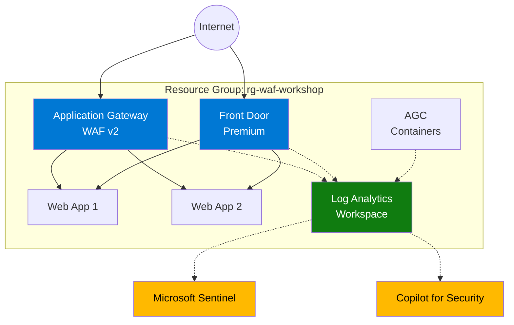

# :rocket: Infrastructure Setup

## One-Click Deployment

Deploy all lab infrastructure with a single click:

<a class="deploy-button" href="https://portal.azure.com/#create/Microsoft.Template/uri/https%3A%2F%2Fraw.githubusercontent.com%2F<your-org>%2Fazure-waf-workshop%2Fmain%2Finfra%2Fmain.json" target="_blank">
:octicons-cloud-24: Deploy to Azure
</a>

!!! info "Deploy to Azure Button"
    After pushing this repository to GitHub, update the URL above with your actual GitHub organization/username. The button opens the Azure Portal with the Bicep template pre-loaded.

---

## Alternative: Deploy via CLI

### Prerequisites

| Requirement | Version | Install Link |
|---|---|---|
| Azure CLI | 2.60+ | [Install](https://learn.microsoft.com/cli/azure/install-azure-cli) |
| PowerShell | 7.0+ | [Install](https://learn.microsoft.com/powershell/scripting/install/installing-powershell) |
| Bicep CLI | Included with Azure CLI | — |
| Azure Subscription | Contributor access | — |

### Step 1: Login to Azure

```powershell
az login
az account set --subscription "<your-subscription-name>"
```

### Step 2: Deploy Infrastructure

:octicons-download-24: **Script**: [deploy.ps1](https://github.com/lcarli/AzureWAF-Learning/blob/main/infra/deploy.ps1)

```powershell
cd infra/

.\deploy.ps1 -ResourceGroupName "rg-waf-workshop" -Location "eastus2"
```

!!! tip "Deployment Time"
    The deployment takes approximately **15-25 minutes**. All outputs are saved to `.lab-outputs.json`.

### Step 3: Verify Deployment

```powershell
# List all deployed resources
az resource list -g rg-waf-workshop -o table
```

You should see:

| Resource Type | Name |
|---|---|
| Virtual Network | waf-workshop-vnet |
| Public IP Address | waf-workshop-appgw-pip |
| Application Gateway | waf-workshop-appgw |
| WAF Policy | waf-workshop-appgw-waf-policy |
| App Service Plan | waf-workshop-asp |
| Web App (x2) | waf-workshop-web1-xxx, waf-workshop-web2-xxx |
| Front Door Profile | waf-workshop-fd-xxx |
| Front Door WAF Policy | waf-workshop-fd-waf-policy |
| Traffic Controller (AGC) | waf-workshop-agc |
| Log Analytics Workspace | waf-workshop-law |

### Step 4: Test Connectivity

```powershell
# Get Application Gateway URL
$appgwFqdn = az network public-ip show -g rg-waf-workshop `
    -n waf-workshop-appgw-pip --query dnsSettings.fqdn -o tsv

# Test
curl "http://$appgwFqdn"
```

You should see a response from one of the backend web apps.

---

## :zap: Pre-populate WAF Logs

!!! important "Run Before Lab 03"
    The analysis labs require WAF log data. Run the traffic simulator **before** starting Lab 03.

### Generate Traffic Against Application Gateway

:octicons-download-24: **Script**: [simulate-waf-traffic.ps1](https://github.com/lcarli/AzureWAF-Learning/blob/main/scripts/simulate-waf-traffic.ps1)

```powershell
cd scripts/

.\simulate-waf-traffic.ps1 `
    -TargetUrl "http://<your-appgw-fqdn>" `
    -DurationMinutes 15 `
    -RequestsPerSecond 3 `
    -AttackRatio 30
```

### Generate Traffic Against Front Door

Open a **second terminal** and run simultaneously:

```powershell
.\simulate-waf-traffic.ps1 `
    -TargetUrl "https://<your-fd-endpoint>.azurefd.net" `
    -DurationMinutes 15 `
    -RequestsPerSecond 3 `
    -AttackRatio 30
```

!!! info "Log Ingestion Delay"
    WAF logs take **5-10 minutes** to appear in Log Analytics after traffic is generated.

### Verify Logs Are Available

Navigate to **Log Analytics workspace** → **Logs** and run:

```kql
AzureDiagnostics
| where Category == "ApplicationGatewayFirewallLog"
| where TimeGenerated > ago(30m)
| count
```

You should see **500+** events before starting the analysis labs.

---

## Architecture Diagram



---

## :moneybag: Cost Estimate

| Resource | Approximate Cost/Day |
|---|---|
| Application Gateway WAF v2 (1 instance) | ~$8-12 |
| Front Door Premium | ~$3-5 |
| App Service Plan (B1) | ~$1 |
| Log Analytics (PerGB) | ~$0.50 |
| Public IPs | ~$0.50 |
| **Total** | **~$15-25/day** |

!!! danger "Remember to Clean Up!"
    ```powershell
    .\scripts\cleanup.ps1 -ResourceGroupName "rg-waf-workshop"
    ```

---

[Continue to Lab 01 :octicons-arrow-right-24:](lab01.md){ .md-button .md-button--primary }
