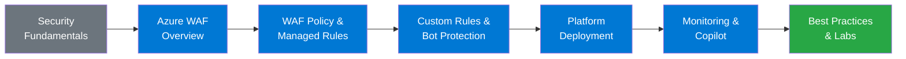

# :wave: Module 00 — Introduction

!!! abstract "Welcome to the Azure Web Application Firewall Workshop"
    This module introduces the workshop objectives, target audience, prerequisites, and the complete agenda. By the end of this page you will know exactly what to expect, what you need to get started, and how the fifteen modules fit together to build your Azure WAF expertise.

---

## :dart: Workshop Objectives

Welcome to the **Azure Web Application Firewall (WAF) Workshop — 2026 Edition**. This hands-on, self-paced program is designed to take you from foundational web-security concepts all the way through advanced WAF configuration, tuning, and monitoring in Azure.

Whether you are a security engineer hardening a production workload, a cloud architect designing a landing zone, or a SOC analyst investigating application-layer alerts, this workshop provides the knowledge and practical skills you need to protect modern web applications with Azure WAF.

### What You Will Learn

After completing every module you will be able to:

- Explain the Azure WAF architecture and how it integrates with Application Gateway, Front Door, and Application Gateway for Containers.
- Create and manage WAF policies using the Azure Portal, Azure CLI, and Bicep/ARM templates.
- Configure and tune managed rule sets (DRS 2.1+) using anomaly scoring and exclusions.
- Build custom rules for rate limiting, geo-filtering, and application-specific logic.
- Enable bot protection with Microsoft Threat Intelligence and JavaScript Challenge.
- Monitor WAF activity with Azure Monitor, KQL queries, WAF Insights workbooks, and Microsoft Sentinel.
- Leverage Copilot for Security to accelerate threat investigation and incident response.
- Design reference architectures that integrate WAF with DDoS Protection, Azure Firewall, and Private Link.

### Learning Path Overview



---

## :busts_in_silhouette: Target Audience

This workshop is intended for technical professionals who design, deploy, or operate web application security in Microsoft Azure.

| Role | Why This Workshop Helps |
|---|---|
| **Security Engineers** | Deep-dive into WAF rule tuning, threat detection, and incident response workflows. |
| **Cloud Architects** | Understand where WAF fits in a landing-zone design and how to integrate it with DDoS Protection and Azure Firewall. |
| **Network Administrators** | Learn Layer 7 inspection concepts and how WAF policies interact with Application Gateway and Front Door routing. |
| **DevOps / Platform Engineers** | Automate WAF deployments with IaC and integrate WAF logs into CI/CD observability pipelines. |
| **SOC Analysts** | Use KQL, Sentinel analytics rules, and Copilot for Security to triage WAF alerts at scale. |

!!! info "Experience Level"
    No prior Azure WAF experience is required. The modules are progressive — early modules build foundational knowledge, while later modules cover advanced topics. If you already have WAF experience, feel free to skip ahead to the modules most relevant to your role.

---

## :clipboard: Prerequisites

Before you begin, make sure you have the following resources and knowledge:

| Prerequisite | Details |
|---|---|
| **Azure Subscription** | An active subscription with at least *Contributor* rights on a resource group. A [free trial](https://azure.microsoft.com/free/) works for most labs. |
| **Basic Networking** | Familiarity with TCP/IP, DNS, HTTP/HTTPS, and TLS concepts. |
| **HTTP Knowledge** | Understanding of request methods (GET, POST, PUT, DELETE), status codes (200, 403, 502), headers, and cookies. |
| **Azure Portal** | Ability to navigate the Azure Portal, create resources, and use Cloud Shell. |
| **Azure CLI or PowerShell** | Either the `az` CLI (≥ 2.61) or the `Az` PowerShell module (≥ 12.0) installed locally or available via Cloud Shell. |
| **Browser** | A modern Chromium-based browser (Edge or Chrome recommended) for Portal access and WAF Insights dashboards. |
| **Code Editor** | VS Code with the Azure and Bicep extensions installed (recommended but not required). |

!!! tip "Cloud Shell — Zero Install Option"
    If you do not want to install tooling locally, every lab can be completed inside **Azure Cloud Shell** (`shell.azure.com`), which comes pre-loaded with the Azure CLI, PowerShell, Terraform, kubectl, and common utilities. Cloud Shell also provides a built-in file editor.

### Verifying Your Environment

=== "Azure CLI"

    ```bash
    # Verify Azure CLI version (≥ 2.61 required)
    az --version | head -1

    # Log in and set your subscription
    az login
    az account set --subscription "My Subscription Name"

    # Verify the WAF extension is available
    az network application-gateway waf-policy --help
    ```

=== "PowerShell"

    ```powershell
    # Verify Az module version (≥ 12.0 required)
    Get-Module -Name Az -ListAvailable | Select-Object Version

    # Log in and set your subscription
    Connect-AzAccount
    Set-AzContext -SubscriptionName "My Subscription Name"

    # Verify WAF cmdlets are available
    Get-Command *FirewallPolicy* -Module Az.Network
    ```

---

## :calendar: Workshop Agenda

The workshop is organized into fifteen progressive modules. Each module contains explanatory content followed by one or more hands-on labs. The table below provides a bird's-eye view of the entire curriculum.

| Module | Title | Focus Area | Est. Duration |
|:---:|---|---|:---:|
| **00** | Introduction *(this page)* | Workshop logistics and agenda | 15 min |
| **01** | [Web App Security Fundamentals & Zero Trust](01-security-fundamentals.md) | Shared responsibility, Zero Trust, OWASP Top 10, defense in depth | 60 min |
| **02** | [Introduction to Azure WAF](02-waf-overview.md) | Architecture, deployment platforms, key features, product suite | 60 min |
| **03** | [WAF Policy — Configuration & Next-Gen Engine](03-waf-policies.md) | Policy structure, modes (Detection/Prevention), Next-Gen Engine, IaC | 90 min |
| **04** | [Managed Rules — OWASP, DRS 2.1+ & Anomaly Scoring](04-managed-rules.md) | Rule sets, anomaly scoring thresholds, rule groups, per-rule actions | 90 min |
| **05** | [Exclusions & False Positive Tuning](05-exclusions.md) | Exclusion scopes, match variables, tuning workflow, log analysis | 90 min |
| **06** | [Custom Rules, Rate Limiting & Geo-Filtering](06-custom-rules.md) | Priority ordering, match conditions, rate-limit keys, geo-match | 90 min |
| **07** | [Bot Protection & JavaScript Challenge](07-bot-protection.md) | Bot manager categories, JS Challenge, CAPTCHA alternatives | 60 min |
| **08** | [Azure WAF on Application Gateway](08-application-gateway.md) | App GW v2 integration, per-site / per-listener policies, SSL profiles | 90 min |
| **09** | [Azure WAF on Front Door Premium](09-front-door.md) | Global WAF, Front Door routing, Private Link origins, caching | 90 min |
| **10** | [Azure WAF on App GW for Containers](10-agc.md) | Kubernetes-native WAF, Gateway API, Ingress controller, AKS | 90 min |
| **11** | [DDoS Protection & Layered Defense](11-ddos.md) | DDoS Network Protection, layered architecture with WAF | 60 min |
| **12** | [Monitoring — WAF Insights, Logs & Metrics](12-monitoring.md) | Diagnostic settings, KQL queries, workbooks, action-group alerts | 90 min |
| **13** | [Copilot for Security & Sentinel Integration](13-copilot-sentinel.md) | Sentinel analytics rules, Copilot prompts, SOAR playbooks | 60 min |
| **14** | [Reference Architectures & Landing Zone](14-best-practices.md) | Best practices, ALZ integration, governance with Azure Policy | 60 min |
| **15** | [Labs & Wrap-up](15-labs-wrapup.md) | Capstone lab, knowledge check, next steps | 90 min |

!!! note "Total Estimated Duration"
    The complete workshop takes approximately **16–18 hours** including lab time. This is typically delivered across **2–3 days** in an instructor-led format, or completed at your own pace over 1–2 weeks in self-study mode.

---

## :gear: Workshop Logistics

!!! info "Format Options"
    This workshop can be consumed in two ways:

    - **Instructor-led** — A facilitator guides you through the content, demonstrates features in the Azure Portal, and provides real-time Q&A support. Breaks are scheduled every 90 minutes.
    - **Self-paced** — Work through each module at your own speed. Use the navigation links at the bottom of every page to move between modules.

### Lab Environment

- Labs deploy resources into **your own Azure subscription**. Estimated cost for a full run-through is under **USD $20** if resources are deleted promptly after each lab.
- Each lab includes **cleanup instructions** to help you remove resources and avoid ongoing charges.
- Labs can also be run in a shared **Azure Lab Services** environment if provided by your organization.

### Conventions Used in This Workshop

| Convention | Meaning |
|---|---|
| `code blocks` | Commands to run in a terminal, Cloud Shell, or code editor. |
| `=== "Tab"` blocks | Alternative instructions for Azure CLI vs. PowerShell. Choose the tool you prefer. |
| `!!! tip` | Helpful advice or best-practice recommendations. |
| `!!! warning` | Important caveats or potential pitfalls to avoid. |
| `!!! info` | Additional context or background information. |
| `:octicons-beaker-24:` LAB links | Hands-on lab exercises in the `labs/` folder. |

### Source Code & Templates

All lab templates, Bicep files, and helper scripts are available in the repository's `labs/` folder. Clone the repository before starting the labs:

```bash
git clone https://github.com/your-org/AzureWAF-Learning.git
cd AzureWAF-Learning/labs
```

!!! warning "Disclaimer"
    This material is provided *as is* for educational purposes. Examples, scenarios, and sample data are fictitious. Azure service features and pricing may change at any time. This workshop does not replace [official Microsoft documentation](https://learn.microsoft.com/azure/web-application-firewall/).

---

## :white_check_mark: Key Takeaways

!!! success "What You Learned"
    - The workshop covers **fifteen modules** spanning security fundamentals through advanced WAF monitoring and AI-driven analysis.
    - You need an **Azure subscription**, basic networking knowledge, and a modern browser to participate.
    - Modules are progressive but can be completed independently; hands-on **labs** accompany every topic.
    - Total estimated duration is **16–18 hours**, suitable for 2–3 days instructor-led or 1–2 weeks self-paced.

---

## :books: References

- [Azure WAF Documentation — Microsoft Learn](https://learn.microsoft.com/azure/web-application-firewall/)
- [Azure Cloud Shell — Microsoft Learn](https://learn.microsoft.com/azure/cloud-shell/overview)
- [Azure Free Account](https://azure.microsoft.com/free/)
- [Visual Studio Code — Azure Extensions](https://marketplace.visualstudio.com/items?itemName=ms-vscode.vscode-node-azure-pack)

---

<div style="display: flex; justify-content: space-between;">
<div></div>
<div><a href="01-security-fundamentals.md">Module 01 — Security Fundamentals :octicons-arrow-right-24:</a></div>
</div>