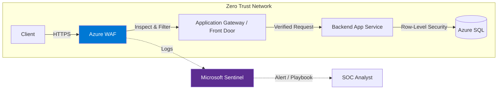
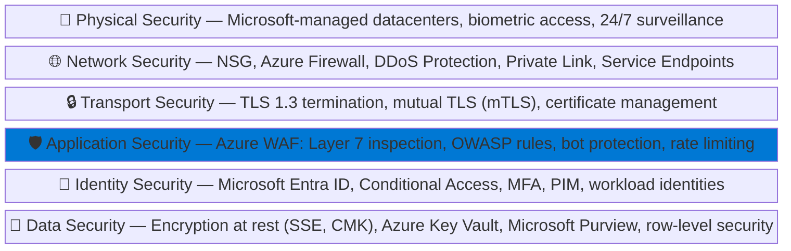
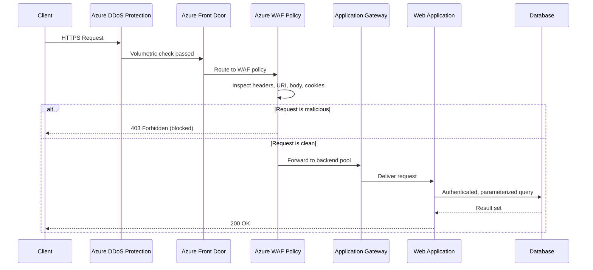

# :lock: Module 01 — Web Application Security Fundamentals & Zero Trust

!!! abstract "Zero Trust, cloud security, and the modern threat landscape"
    Before configuring a single WAF rule you need to understand **why** web application firewalls exist and how they fit into a broader security strategy. This module explores the shared responsibility model, Zero Trust principles, the OWASP Top 10, regulatory drivers, and the defense-in-depth approach that makes Azure WAF so effective. Treat this module as the conceptual foundation for everything that follows.

---

## :cloud: Cloud Security & the Shared Responsibility Model

When an organization moves workloads to the cloud, security responsibilities are **shared** between the cloud provider and the customer. The exact split depends on the service model — Infrastructure as a Service (IaaS), Platform as a Service (PaaS), or Software as a Service (SaaS). Misunderstanding these boundaries is one of the most common causes of cloud security incidents.

Microsoft secures the **physical infrastructure**, the host operating system, and the hypervisor layer across all service models. Customers are always responsible for their **data**, **identities**, and **endpoint devices**. Everything in between shifts depending on the service model you choose.

### Responsibility Matrix

The following table summarizes who is responsible for each layer across service models:

| Responsibility | On-Premises | IaaS | PaaS | SaaS |
|---|:---:|:---:|:---:|:---:|
| Physical security | Customer | **Microsoft** | **Microsoft** | **Microsoft** |
| Network controls | Customer | **Microsoft** | **Microsoft** | **Microsoft** |
| Host OS & patching | Customer | Customer | **Microsoft** | **Microsoft** |
| Runtime & middleware | Customer | Customer | **Microsoft** | **Microsoft** |
| Application code | Customer | Customer | Customer | **Microsoft** |
| Identity & access | Customer | Customer | Customer | Shared |
| Data classification & protection | Customer | Customer | Customer | Customer |
| Endpoint / client devices | Customer | Customer | Customer | Customer |

!!! warning "Compliant ≠ Secure"
    Passing a compliance audit does **not** guarantee security. Compliance establishes a *minimum baseline*; true security requires continuous risk assessment, proactive threat hunting, and layered defenses that go well beyond checkbox requirements. Organizations that confuse compliance with security often discover the gap only after a breach.

### What Does This Mean in Practice?

Consider a web application running on Azure App Service (PaaS). Microsoft manages the underlying VM, the operating system patches, and the runtime. But the **application code**, the **authentication logic**, and the **data in the database** are entirely your responsibility. If an attacker exploits a SQL injection vulnerability in your code, Microsoft's platform security cannot help — the attack is inside your responsibility boundary.

This is exactly where **Azure WAF** enters the picture.

### Where Does Azure WAF Fit?

Azure WAF is a **customer-managed** control that operates at **Layer 7** (the application layer). Whether you run your workloads on IaaS virtual machines, PaaS App Services, or containerized microservices, protecting the HTTP/HTTPS entry point is always the customer's responsibility. Azure WAF lets you fulfill that responsibility with a managed, cloud-native service instead of deploying and maintaining your own WAF appliances.

=== "IaaS Scenario"

    You run a custom web server on Azure VMs behind a Load Balancer. You are responsible for the OS, the web server configuration, the application code, **and** the WAF. Deploy Application Gateway v2 with a WAF policy in front of the VMs.

=== "PaaS Scenario"

    You run your app on Azure App Service. Microsoft manages the OS and runtime, but you are responsible for the application code and the WAF. Deploy Front Door Premium with a WAF policy to protect the App Service endpoint.

=== "Container Scenario"

    You run microservices in AKS. Microsoft manages the node OS and the Kubernetes control plane, but you are responsible for the container images, the application code, and the WAF. Deploy Application Gateway for Containers (AGC) with a WAF policy integrated via the Gateway API.

!!! tip "Cross-reference"
    Module 02 dives into the specific Azure platforms where WAF can be deployed (Application Gateway, Front Door, Application Gateway for Containers). See [Module 02 — Introduction to Azure WAF](02-waf-overview.md).

---

## :shield: Zero Trust Architecture

### The End of the Perimeter

Traditional network security relied on a clear perimeter: a firewall at the edge, a trusted internal network, and an untrusted internet. In a cloud-first, mobile-first world that model breaks down. Users connect from anywhere on any device, applications span multiple clouds and SaaS services, and APIs expose data far beyond the corporate network.

The traditional model assumed that anything inside the firewall was safe. Attackers exploited this assumption repeatedly — once inside the perimeter (through phishing, stolen VPN credentials, or a compromised endpoint), they moved laterally with little resistance.

Zero Trust replaces the concept of a trusted network with the principle of **"never trust, always verify."** Every request — regardless of origin — is authenticated, authorized, and continuously validated before access is granted.

### The Three Pillars

Microsoft's Zero Trust framework rests on three core principles. Understanding these principles is essential because Azure WAF directly implements aspects of each one.

#### 1. Verify Explicitly

Always authenticate and authorize based on **all available data points**: user identity, device health, location, service or workload, data classification, and anomaly signals. Multi-factor authentication, conditional access policies, and risk-based sign-in are concrete implementations of this principle.

**Real-world example:** A developer requests access to a production App Service. Azure AD Conditional Access verifies that the request comes from a compliant device, a known IP range, and a low-risk session before issuing a token — even though the developer is "inside" the corporate VPN. If any signal is abnormal, access is denied or stepped-up authentication is required.

**How Azure WAF contributes:** WAF inspects every HTTP/HTTPS request against managed and custom rules before forwarding it to the backend. This is explicit verification at the application layer — no request is trusted simply because it arrived at the correct URL.

#### 2. Use Least Privilege Access

Limit every identity — human or workload — to the **minimum permissions** required to perform its task, and only for the time needed. Just-In-Time (JIT) access, Just-Enough-Administration (JEA), and risk-based adaptive policies enforce this principle at the identity layer.

**Real-world example:** An SRE needs to update a WAF exclusion in production. Instead of granting permanent *Contributor* rights, Azure PIM (Privileged Identity Management) grants *WAF Policy Contributor* for a two-hour window, with approval from a security lead. After two hours the elevation expires automatically.

**How Azure WAF contributes:** Custom rules can restrict access by geography, IP range, HTTP method, or request header, ensuring that only expected traffic patterns reach the application. For example, a rule might allow `POST /api/admin` only from your corporate IP range.

#### 3. Assume Breach

Design every system as if an attacker is already inside the network. Minimize the **blast radius** through micro-segmentation, encrypt data end-to-end, and use analytics to detect lateral movement and persistence.

**Real-world example:** Even after a request passes Azure WAF, the backend App Service enforces authentication via Easy Auth, validates a JWT token, and applies row-level security in the database. If the WAF is somehow bypassed through a zero-day, multiple additional controls limit the damage.

**How Azure WAF contributes:** WAF logs feed into Microsoft Sentinel, enabling automated threat detection and response. If an attacker exploits a vulnerability, WAF telemetry accelerates incident investigation and provides the forensic trail needed for root-cause analysis.

### Zero Trust Architecture Diagram



### How Azure WAF Enables Zero Trust — Summary

| Zero Trust Principle | Azure WAF Implementation |
|---|---|
| **Verify explicitly** | Inspects every request against 300+ managed rules and custom conditions |
| **Least privilege** | Custom rules restrict access by IP, geo-location, HTTP method, header |
| **Assume breach** | Diagnostic logs + Sentinel integration enable detection, investigation, and automated response |

---

## :spider_web: Modern Web Application Threat Landscape

Web applications are the primary attack surface for most organizations. According to the Verizon Data Breach Investigations Report, **over 80 %** of breaches involve the application layer. The attack landscape continues to evolve with API-first architectures, bot automation, supply-chain compromises, and AI-powered exploitation.

Understanding the most common attack categories is essential before configuring WAF rules — it helps you prioritize which rule groups to enable, which thresholds to set, and where custom rules are needed.

### OWASP Top 10 (2021)

The Open Worldwide Application Security Project (OWASP) publishes a regularly updated list of the ten most critical web application security risks. The 2021 edition — still the current reference as of 2026 — reshuffled several categories and introduced new ones based on data from hundreds of organizations.

#### A01 — Broken Access Control

Broken access control moved to the **#1 position** in 2021, up from #5 in 2017. It occurs when an application fails to enforce policies so that users can act outside their intended permissions. Examples include insecure direct object references (IDOR), missing function-level access control, CORS misconfigurations, and forced browsing to admin pages.

**Attack scenario:** An attacker changes `accountId=1234` to `accountId=5678` in a REST API URL and retrieves another user's data because the backend never validates ownership of the requested resource.

!!! info "WAF mitigation"
    WAF custom rules can block requests with suspicious parameter patterns or restrict access to administrative paths by IP range. However, access-control enforcement must ultimately happen in **application code**. WAF is a safety net, not a replacement for proper authorization logic.

#### A02 — Cryptographic Failures

Previously called *Sensitive Data Exposure*, this category covers failures related to cryptography — or the complete lack of it. Transmitting data in cleartext, using deprecated algorithms (MD5, SHA-1 for password hashing), weak key management, and missing HSTS headers all fall here.

**Attack scenario:** A health-care portal transmits patient records over HTTP instead of HTTPS between the load balancer and the backend. An attacker on the same network segment captures PHI (Protected Health Information) via a man-in-the-middle attack.

#### A03 — Injection

Injection flaws — SQL injection, NoSQL injection, OS command injection, LDAP injection, and expression language injection — occur when untrusted data is sent to an interpreter as part of a command or query. Despite decades of awareness, injection remains extremely common because developers continue to concatenate user input into queries.

**Attack scenario:** An attacker submits `' OR 1=1 --` in a login form. The backend concatenates the input into a SQL query, bypassing authentication entirely and returning all user records.

```sql
-- Vulnerable query (never do this)
SELECT * FROM users WHERE username = '' OR 1=1 --' AND password = '...';
```

!!! tip "WAF mitigation"
    Azure WAF DRS 2.1 includes dedicated rule groups for SQL injection (SQLi) and cross-site scripting (XSS). These rules detect common injection payloads in query strings, headers, cookies, and request bodies. The SQLi rule group alone contains over 40 signatures covering union-based, blind, and time-based injection techniques.

#### A04 — Insecure Design

A new category in 2021, insecure design highlights the need for threat modeling and secure design patterns **before** code is written. No amount of WAF rules can fix a fundamentally insecure architecture — for example, an API that returns full user profiles including password hashes because the data model was never reviewed for information exposure.

#### A05 — Security Misconfiguration

Default credentials, unnecessary open ports, overly verbose error messages, missing security headers (CSP, X-Frame-Options), and permissive CORS configurations are all examples of security misconfiguration. This is one of the most common issues found in cloud environments because of the speed at which resources are provisioned.

**Attack scenario:** An Azure App Service is deployed with detailed error pages enabled in production, leaking stack traces, connection strings, and internal IP addresses to anyone who triggers a server error.

#### A06 — Vulnerable and Outdated Components

Using libraries, frameworks, or OS packages with known vulnerabilities is a persistent risk. Supply-chain attacks — such as compromised npm packages or malicious Python wheels — exploit this category. High-profile examples include Log4Shell (CVE-2021-44228) and the event-stream incident.

!!! info "WAF mitigation"
    Azure WAF's MSTIC (Microsoft Threat Intelligence Center) rules are specifically designed to detect exploitation attempts against known vulnerabilities — including Log4Shell, Spring4Shell, and MOVEit. These rules are updated automatically by Microsoft, often within hours of a new CVE being disclosed.

#### A07 — Identification and Authentication Failures

Weak passwords, missing brute-force protection, improper session management, and credential stuffing attacks allow adversaries to compromise user identities. Credential-stuffing bots use leaked password databases to automate login attempts at massive scale.

**Attack scenario:** An attacker uses a list of 10 million stolen email/password pairs to submit automated login requests against your application at a rate of 1,000 requests per second. Without rate limiting, the application processes every attempt.

!!! info "WAF mitigation"
    Azure WAF rate-limiting rules can throttle requests to login endpoints (e.g., `POST /api/auth/login`). Bot protection classifies the traffic source, and JavaScript Challenge verifies that the client is a real browser. See [Module 06](06-custom-rules.md) and [Module 07](07-bot-protection.md).

#### A08 — Software and Data Integrity Failures

This category covers code and infrastructure that does not protect against integrity violations — for example, auto-updating dependencies without verification, CI/CD pipelines without artifact signing, or deserialization of untrusted data. The SolarWinds supply-chain attack is a prominent example.

#### A09 — Security Logging and Monitoring Failures

Without adequate logging, attackers can persist undetected for months. The median time to detect a breach is still measured in hundreds of days. Azure WAF diagnostic logs, when forwarded to a Log Analytics workspace and analyzed by Microsoft Sentinel, provide the visibility needed to detect and respond to application-layer attacks in near real time.

!!! tip "Cross-reference"
    See [Module 12 — Monitoring](12-monitoring.md) for diagnostic settings and KQL query patterns, and [Module 13 — Copilot & Sentinel](13-copilot-sentinel.md) for automated detection and response.

#### A10 — Server-Side Request Forgery (SSRF)

SSRF occurs when an application fetches a remote resource without validating the user-supplied URL. Attackers can abuse this to access internal services, cloud metadata endpoints, or internal APIs that are not exposed to the internet.

**Attack scenario:** An attacker submits `http://169.254.169.254/metadata/identity/oauth2/token` as an image URL. The application fetches the URL server-side and returns the Azure Instance Metadata Service (IMDS) token, which the attacker uses to escalate privileges.

### OWASP Top 10 Summary Table

| # | Category | Key Risk | WAF Coverage |
|---|---|---|---|
| A01 | Broken Access Control | Unauthorized data access | Partial — custom rules for path restrictions |
| A02 | Cryptographic Failures | Data exposure in transit | Indirect — TLS enforcement via platform |
| A03 | Injection | SQLi, XSS, command injection | **Strong** — DRS managed rules (40+ signatures) |
| A04 | Insecure Design | Architecture flaws | None — design-time concern |
| A05 | Security Misconfiguration | Default creds, verbose errors | Partial — custom header rules |
| A06 | Vulnerable Components | Known CVEs in libraries | **Strong** — MSTIC zero-day rules |
| A07 | Auth Failures | Credential stuffing, brute force | **Strong** — rate limiting + bot protection |
| A08 | Integrity Failures | Supply-chain attacks | None — CI/CD concern |
| A09 | Logging Failures | Undetected breaches | **Strong** — WAF logs + Sentinel + Copilot |
| A10 | SSRF | Internal service access | Partial — custom rules for URL patterns |

---

## :moneybag: Why WAF Matters

### The Cost of Doing Nothing

Application-layer attacks are not abstract risks — they have concrete financial, legal, and reputational consequences that affect organizations of every size:

- **Average cost of a data breach** (IBM Cost of a Data Breach Report, 2024): **$4.88 million** globally, **$9.36 million** in the United States.
- **Time to identify and contain** a breach: **258 days** on average — nearly nine months of undetected attacker activity.
- **Web application attacks** account for the majority of breach vectors involving external actors according to the Verizon DBIR.
- **Ransomware** increasingly begins with web application exploitation — attackers establish a foothold through a web vulnerability and then deploy ransomware across the internal network.

A properly configured WAF dramatically reduces the attack surface, blocks known exploit patterns automatically, and provides early warning signals through logging that cut detection time from months to minutes.

### Regulatory Drivers

Many compliance frameworks explicitly require or strongly recommend web application firewalls for public-facing applications:

| Framework | Relevant Requirement | How Azure WAF Helps |
|---|---|---|
| **PCI-DSS v4.0** | Req. 6.4 — Public-facing web applications must be protected by a WAF or undergo continuous vulnerability assessment. | Azure WAF satisfies the WAF option directly. WAF logs provide audit evidence. |
| **SOC 2** | CC6.6 — Logical access security controls for external-facing systems. | WAF provides centralized access control and logging for web traffic. |
| **HIPAA** | § 164.312(e)(1) — Technical safeguards for ePHI in transit. | WAF enforces TLS and inspects application-layer traffic for data exfiltration patterns. |
| **ISO 27001** | A.14.1.2 — Securing application services on public networks. | WAF policies demonstrate implementation of application-layer security controls. |
| **NIST 800-53** | SC-7 — Boundary protection at external and key internal boundaries. | WAF provides boundary protection at the application layer (Layer 7). |
| **FedRAMP** | SC-7, SI-3, SI-4 — Boundary protection, malicious code protection, information system monitoring. | Azure WAF contributes to multiple FedRAMP control families. |

!!! note "WAF as a compliance accelerator"
    Deploying Azure WAF does not automatically make you compliant, but it satisfies specific technical control requirements in nearly every major framework and simplifies audit evidence collection through built-in diagnostic logging and WAF Insights dashboards.

### Application-Layer Attack Statistics

To put these risks in perspective, consider the following data points from recent industry reports:

- **43 %** of all cyber-attacks target web applications (Akamai State of the Internet report).
- **SQL injection** remains the most weaponized attack vector for web applications, despite being well-understood for over two decades.
- **Bot traffic** accounts for approximately **30 %** of all web traffic, with malicious bots making up nearly half of that share.
- The average enterprise exposes over **300 web applications** to the internet, each representing a potential attack surface.
- **API attacks** increased by over **400 %** year-over-year as organizations adopt API-first architectures without adequate security controls.

These statistics underscore why a centralized, managed WAF is no longer optional for organizations with public-facing web workloads — it is a foundational security control.

---

## :bricks: Defense in Depth

Defense in depth is a security strategy that layers multiple independent controls so that the failure of any single control does not result in a complete compromise. The concept originates from military strategy and has been a core security principle for decades. In cloud security, it means deploying controls at **every layer** of the stack.

### The Layered Model

Azure provides security services at every layer. The following diagram illustrates the six primary layers and where Azure WAF fits:



Each layer addresses a different class of threat:

- **Physical security** prevents unauthorized physical access to datacenters.
- **Network security** stops volumetric DDoS attacks, unauthorized port scans, and lateral movement between VNets.
- **Transport security** ensures data confidentiality and integrity in transit.
- **Application security** (where Azure WAF operates) inspects the actual HTTP request content to block injection attempts, bot traffic, and business-logic abuse.
- **Identity security** verifies that every user and workload is authenticated and authorized.
- **Data security** protects data at rest and provides fine-grained access control at the data layer.

### Where Azure WAF Sits in the Stack

Azure WAF operates between the **transport** and **application** layers. It terminates TLS (or receives already-decrypted traffic from Application Gateway / Front Door) and inspects every attribute of the HTTP request:

| Inspection Target | What WAF Looks For | Example Attack Detected |
|---|---|---|
| **URI and query string** | Path traversal, SQLi, XSS in URL parameters | `/api/users?id=1 UNION SELECT * FROM passwords--` |
| **Request headers** | Suspicious `User-Agent` strings, missing `Host`, protocol violations | `User-Agent: sqlmap/1.7` |
| **Cookies** | Injection payloads in cookie values | `session=<script>document.location='http://evil.com'</script>` |
| **Request body** | POST payloads, JSON bodies, multipart form data | `{"query": "mutation { deleteAllUsers }"}` |
| **File uploads** | Oversized payloads, embedded scripts | A 500 MB file uploaded to a profile picture endpoint |

!!! tip "Azure WAF + Azure Firewall = Full Coverage"
    Azure WAF protects **north-south** Layer 7 traffic (internet → application). Azure Firewall protects **east-west** Layer 3/4 traffic (between VNets, to on-premises, to the internet). Deploying both services together provides comprehensive coverage across all network layers. See [Module 02](02-waf-overview.md) for a detailed comparison and [Module 11](11-ddos.md) for DDoS integration details.

### Defense-in-Depth Request Flow

The following diagram shows how a typical request traverses multiple security layers before reaching the application:



Each component in the chain is independent. Even if an attacker finds a way past the WAF (for example, through a zero-day vulnerability that has not yet been patched in the rule set), the application still validates the JWT token, the database enforces parameterized queries, and Sentinel detects anomalous behavior in the WAF logs. No single control is relied upon exclusively — that is the essence of defense in depth.

### WAF Does Not Replace Secure Coding

It is critical to understand that Azure WAF is a **mitigation layer**, not a cure. WAF rules are pattern-based — they detect known attack signatures and anomalous request patterns. A sufficiently creative attacker may craft a payload that evades pattern detection. Therefore:

- Always use **parameterized queries** (prepared statements) instead of string concatenation.
- Always **encode output** appropriately for the rendering context (HTML, JavaScript, URL).
- Always enforce **authorization checks** in your application code, not just at the WAF level.
- Always keep **dependencies updated** to patch known vulnerabilities.
- Always implement **Content Security Policy (CSP)** headers to mitigate XSS execution.

WAF provides an essential first line of defense — but it works best as part of a comprehensive secure development lifecycle (SDL).

---

## :test_tube: Practical Exercise — Identifying Attack Vectors

Before moving on to Module 02, consider the following scenario and think about which OWASP categories apply and where WAF could help.

!!! example "Scenario"
    Your organization runs a customer-facing e-commerce portal on Azure App Service behind Application Gateway v2 with Azure WAF enabled in **Detection** mode. The security team reviews the WAF logs and notices the following:

    1. **Thousands of `POST /api/login` requests per minute** from a small set of IP addresses, each with a different `username` / `password` pair.
    2. **A `GET` request** to `/api/products?id=1 UNION SELECT * FROM users--` that returned a `200 OK`.
    3. **A `GET` request** to `/admin/dashboard` from an unauthenticated session that also returned `200 OK`.

    **Questions to consider:**

    - Which OWASP Top 10 categories do these correspond to? *(A07, A03, A01)*
    - Which could Azure WAF have blocked in **Prevention** mode? *(1 and 2)*
    - Which requires an application-code fix regardless of WAF? *(3 — broken access control)*
    - What WAF features would you enable? *(Rate limiting for #1, DRS managed rules for #2, custom rule restricting `/admin` by IP for #3)*

---

## :white_check_mark: Key Takeaways

!!! success "What You Learned"
    - Cloud security follows a **shared responsibility model** — protecting the application layer is always the customer's job, regardless of service model (IaaS, PaaS, or SaaS).
    - **Zero Trust** ("never trust, always verify") replaces perimeter-based security; Azure WAF enforces explicit verification at Layer 7 for every HTTP request.
    - The **OWASP Top 10** defines the most critical web-application risks; Azure WAF provides strong coverage for injection (A03), authentication abuse (A07), known vulnerabilities (A06), and logging (A09).
    - **Regulatory frameworks** (PCI-DSS, HIPAA, SOC 2, ISO 27001, NIST, FedRAMP) increasingly require or recommend WAF deployment for public-facing applications.
    - **Defense in depth** layers multiple independent controls across physical, network, transport, application, identity, and data layers; Azure WAF works alongside DDoS Protection, Azure Firewall, identity controls, and data encryption to minimize risk.

---

## :books: References

- [Shared Responsibility in the Cloud — Microsoft Learn](https://learn.microsoft.com/azure/security/fundamentals/shared-responsibility)
- [Zero Trust Architecture — Microsoft Learn](https://learn.microsoft.com/security/zero-trust/)
- [OWASP Top 10 — 2021](https://owasp.org/Top10/)
- [OWASP API Security Top 10](https://owasp.org/API-Security/)
- [Cost of a Data Breach Report — IBM](https://www.ibm.com/reports/data-breach)
- [Verizon Data Breach Investigations Report](https://www.verizon.com/business/resources/reports/dbir/)
- [Azure WAF and PCI-DSS — Microsoft Learn](https://learn.microsoft.com/azure/web-application-firewall/ag/ag-overview)
- [Defense in Depth — Microsoft Learn](https://learn.microsoft.com/azure/security/fundamentals/defense-in-depth)
- [Microsoft Threat Intelligence Center (MSTIC)](https://www.microsoft.com/security/blog/topic/threat-intelligence/)

---

<div style="display: flex; justify-content: space-between;">
<div><a href="00-introduction.md">:octicons-arrow-left-24: Module 00 — Introduction</a></div>
<div><a href="02-waf-overview.md">Module 02 — Azure WAF Overview :octicons-arrow-right-24:</a></div>
</div>