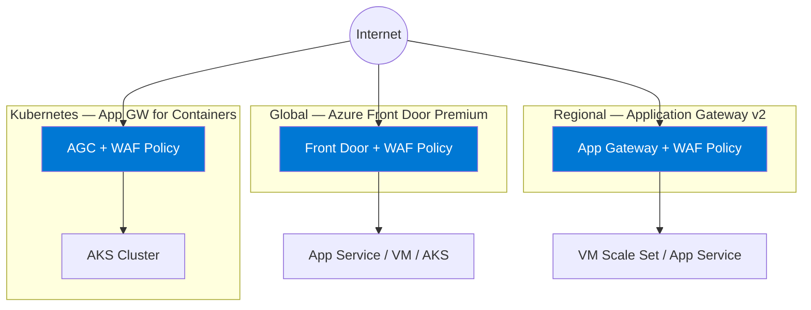
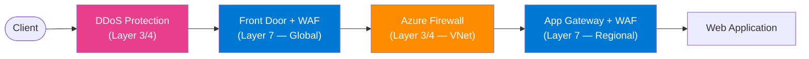

# :shield: Module 02 — Introduction to Azure WAF

!!! abstract "Azure WAF features, benefits, and the application delivery product suite"
    This module provides a comprehensive introduction to Azure Web Application Firewall — what it is, where it can be deployed, the features it offers in 2026, how it compares to other Azure security services, and how it evolved from the open-source ModSecurity engine. By the end you will have a clear mental model of Azure WAF's capabilities and be ready to create your first WAF policy in Module 03.

---

## :mag: What Is Azure Web Application Firewall?

Azure Web Application Firewall (WAF) is a **cloud-native, fully managed Layer 7 security service** that provides centralized protection for web applications against common exploits and vulnerabilities. It inspects every inbound HTTP and HTTPS request in real time, evaluates it against a set of managed and custom rules, and either allows, blocks, logs, or redirects the traffic based on the policy you define.

### How It Works

Azure WAF operates as a **reverse proxy** — it sits inline between the client and your backend application. Every request must pass through the WAF before it reaches your application code. This architecture means:

1. **All traffic is inspected.** There is no way for a client to bypass the WAF and reach the backend directly (assuming proper network configuration with Private Link or NSG restrictions).
2. **Responses can also be inspected.** While the primary focus is on inbound requests, WAF logs capture response codes and latency, which are critical for detecting successful attacks.
3. **TLS termination is handled upstream.** Application Gateway or Front Door terminates the TLS connection, and the WAF inspects the decrypted HTTP content. The connection to the backend can be re-encrypted.

### What Gets Inspected

Azure WAF evaluates multiple parts of every HTTP request:

| Request Component | Examples | Common Attacks Detected |
|---|---|---|
| **URI / Path** | `/api/users/../../etc/passwd` | Path traversal, SSRF |
| **Query String** | `?id=1 OR 1=1--` | SQL injection |
| **Request Headers** | `User-Agent`, `Referer`, `Cookie` | Protocol violations, XSS in headers |
| **Request Body** | POST form data, JSON payloads | SQL injection, command injection, XSS |
| **Cookies** | `session=<script>alert(1)</script>` | XSS, session fixation |
| **File Uploads** | Multipart form data | Malware upload, oversized payloads |

!!! info "Body Inspection Limits"
    The classic WAF engine inspects up to **128 KB** of the request body by default. The **Next-Gen WAF Engine** (covered later in this module) raises this limit to **2 MB** for request bodies and supports file uploads up to **4 GB**. See [Module 03](03-waf-policies.md) for engine configuration details.

### Inline vs. Out-of-Band

Azure WAF is an **inline** (synchronous) security control. Every request is inspected before it is forwarded. This differs from out-of-band solutions that analyze copies of traffic asynchronously. Inline inspection introduces a small amount of latency (typically 1–3 ms) but guarantees that malicious requests are blocked in real time, before they reach the application.

---

## :world_map: Where Can You Deploy Azure WAF?

Azure WAF is not a standalone service — it is a capability attached to one of several Azure application delivery platforms. Each platform serves a different architectural pattern, and the WAF feature set varies slightly across them.

### Platform Comparison

| Capability | Application Gateway v2 | Front Door Premium | App GW for Containers | CDN (Preview) |
|---|:---:|:---:|:---:|:---:|
| **Scope** | Regional | Global | Regional (K8s) | Global |
| **DRS 2.1 managed rules** | :white_check_mark: | :white_check_mark: | :white_check_mark: | CRS 3.x only |
| **Custom rules** | :white_check_mark: | :white_check_mark: | :white_check_mark: | Limited |
| **Bot protection** | :white_check_mark: | :white_check_mark: | :white_check_mark: | :x: |
| **JavaScript Challenge** | :white_check_mark: | :white_check_mark: | :x: | :x: |
| **Rate limiting** | :white_check_mark: | :white_check_mark: | :white_check_mark: | :x: |
| **Geo-filtering** | :white_check_mark: | :white_check_mark: | :white_check_mark: | :white_check_mark: |
| **Per-site policies** | :white_check_mark: | :white_check_mark: (per-endpoint) | :white_check_mark: | :x: |
| **Next-Gen Engine** | :white_check_mark: | :white_check_mark: | :white_check_mark: | :x: |
| **WAF Insights** | :white_check_mark: | :white_check_mark: | :white_check_mark: | :x: |
| **Private Link origins** | :x: | :white_check_mark: | :white_check_mark: | :x: |
| **Copilot for Security** | :white_check_mark: | :white_check_mark: | :white_check_mark: | :x: |
| **Max request body** | 2 MB (Next-Gen) | 2 MB (Next-Gen) | 2 MB (Next-Gen) | 128 KB |

### Choosing the Right Platform

=== "Application Gateway v2"

    Use Application Gateway v2 when you need a **regional** load balancer with WAF for workloads that reside in a single Azure region. Application Gateway v2 is the most mature WAF platform, supports per-site and per-listener WAF policies, and integrates tightly with VNet-hosted backends.

    **Typical use cases:**

    - Internal (private) web applications accessible only within a VNet or via ExpressRoute.
    - Multi-site hosting where each site requires a different WAF policy.
    - Workloads that require URL-based routing, cookie-based affinity, or connection draining.

    See [Module 08](08-application-gateway.md) for full details.

=== "Front Door Premium"

    Use Front Door Premium when you need a **global** entry point with anycast routing, CDN edge caching, and WAF. Front Door Premium distributes traffic across multiple regions and provides the lowest latency for geographically dispersed users.

    **Typical use cases:**

    - Public-facing SaaS applications with users worldwide.
    - Multi-region active-active deployments.
    - Applications that benefit from edge caching and acceleration.
    - Backends secured with Private Link (App Service, Storage, etc.).

    See [Module 09](09-front-door.md) for full details.

=== "App GW for Containers"

    Use Application Gateway for Containers (AGC) when your workloads run in **Azure Kubernetes Service (AKS)** and you want a Kubernetes-native Layer 7 load balancer with WAF. AGC integrates with the Kubernetes Gateway API and replaces traditional Ingress controllers.

    **Typical use cases:**

    - Microservices architectures on AKS that need per-route WAF policies.
    - Teams that prefer Kubernetes-native configuration (Gateway API CRDs) over Azure Portal workflows.
    - Canary and blue-green deployments with traffic splitting.

    See [Module 10](10-agc.md) for full details.

=== "CDN (Preview)"

    Azure CDN with WAF support is currently in **preview** and offers basic CRS-based protection at the CDN edge. It lacks many of the advanced features available on Application Gateway and Front Door. Use it only for simple static-content protection while the feature matures.

### Architecture Diagram

The following diagram shows the three primary deployment options and how traffic flows from clients to backends:



---

## :star2: Key Features (2026)

Azure WAF has evolved significantly. The 2026 feature set includes both mature capabilities and recent innovations. This section explains each feature in detail.

### DRS 2.1+ Managed Rules

The **Default Rule Set (DRS)** is Microsoft's curated collection of WAF rules, evolved from the OWASP Core Rule Set (CRS). DRS 2.1 includes over **300 rules** organized into rule groups that cover SQL injection, cross-site scripting, local file inclusion, remote code execution, protocol violations, and more.

DRS goes beyond the open-source CRS by adding **Microsoft Threat Intelligence (MSTIC)** rules — signatures derived from Microsoft's global threat intelligence network that protect against actively exploited zero-day vulnerabilities (for example, Log4Shell, Spring4Shell, and MOVEit). These rules are updated automatically by Microsoft without any customer action.

!!! tip "DRS vs. CRS"
    If you are coming from an older WAF configuration, note that DRS 2.1 **replaces** CRS 3.2 and is the recommended rule set for all new deployments. DRS 2.1 has better detection accuracy, lower false-positive rates, and includes MSTIC rules that CRS does not offer.

### Bot Protection

Azure WAF integrates with the **Microsoft Threat Intelligence bot feed** to classify traffic as good bots (search engines, monitoring services), bad bots (scrapers, credential stuffers), and unknown bots. You can configure per-category actions: allow, block, log, or redirect.

Bot protection is especially effective against:

- **Credential stuffing** — Automated login attempts using stolen password databases.
- **Content scraping** — Bots that harvest pricing, inventory, or proprietary content.
- **Inventory hoarding** — Bots that add items to shopping carts to deplete stock.

See [Module 07](07-bot-protection.md) for configuration details.

### JavaScript Challenge

The **JavaScript Challenge** is a client-side verification mechanism that distinguishes real browsers from headless automation tools. When enabled, Azure WAF serves a small JavaScript snippet that the client must execute. Legitimate browsers execute it transparently; simple bots that do not run JavaScript are blocked.

JavaScript Challenge is particularly useful for protecting:

- Login and registration pages.
- API endpoints that should only be accessed from browser-based SPAs.
- High-value transaction pages (checkout, payment).

!!! warning "API traffic"
    JavaScript Challenge requires a browser-like client. Do not enable it on endpoints consumed by mobile apps, IoT devices, or server-to-server API calls — these clients cannot execute JavaScript.

### Rate Limiting

Azure WAF supports **conditional rate limiting** that restricts the number of requests a client can send within a configurable time window. Rate-limit rules can group traffic by:

- **Client IP address** (including `X-Forwarded-For` header for clients behind proxies).
- **Socket address** (the direct connection IP).
- **Geo-location** of the client.
- **Custom match conditions** (URI path, header value, etc.).

When the threshold is exceeded, requests are blocked or logged for the remainder of the window. Rate limiting is essential for mitigating brute-force attacks, API abuse, and application-layer DDoS.

### Geo-Filtering

Geo-filtering rules allow you to restrict or allow traffic based on the **country/region** of the client's IP address. This is useful for regulatory compliance (restricting access to specific jurisdictions) and for reducing the attack surface by blocking traffic from regions where you have no legitimate users.

```bash
# Azure CLI — Create a custom rule that blocks traffic from two countries
az network front-door waf-policy custom-rule create \
  --policy-name myWafPolicy \
  --resource-group myRG \
  --name BlockCountries \
  --priority 100 \
  --rule-type MatchRule \
  --action Block \
  --match-condition "RemoteAddr GeoMatch CN RU"
```

### Custom Rules Engine

Beyond managed rules, Azure WAF provides a powerful **custom rules engine** that lets you define your own match conditions and actions. Custom rules are evaluated **before** managed rules, giving you fine-grained control over traffic that the managed rules might not cover.

Custom rules support:

- **Match variables:** IP address, URI, query string, headers, cookies, request body, geo-location.
- **Operators:** Equals, contains, regex, begins with, ends with, greater than, less than, geo-match, IP match.
- **Actions:** Allow, block, log, redirect, JavaScript Challenge.
- **Grouping:** Up to 10 match conditions per rule, combined with AND logic.

See [Module 06](06-custom-rules.md) for advanced custom-rule patterns.

### Next-Gen WAF Engine

The **Next-Gen WAF Engine** is a ground-up rewrite of the Azure WAF processing engine, delivering up to **8× faster** rule evaluation compared to the classic engine. Key improvements include:

| Feature | Classic Engine | Next-Gen Engine |
|---|---|---|
| Rule evaluation speed | Baseline | Up to **8× faster** |
| Max request body inspection | 128 KB | **2 MB** |
| Max file upload | 100 MB | **4 GB** |
| Engine architecture | ModSecurity-based | Azure-native, optimized |
| DRS 2.1 support | :white_check_mark: | :white_check_mark: |

!!! info "Migration"
    Existing WAF policies can be migrated to the Next-Gen Engine without rule changes. See [Module 03](03-waf-policies.md) for migration steps.

### WAF Insights

**WAF Insights** is an interactive dashboard built into the Azure Portal that provides visual analytics for WAF activity: top triggered rules, top blocked requests by URI, geographic distribution of attacks, and trend analysis over time. WAF Insights eliminates the need to write KQL queries for common monitoring scenarios.

### Copilot for Security Integration

Azure WAF integrates with **Microsoft Copilot for Security**, allowing SOC analysts to investigate WAF alerts using natural-language prompts. Example prompts:

- *"Show me the top SQL injection attempts blocked by my WAF in the last 24 hours."*
- *"Summarize the WAF activity for the /api/login endpoint this week."*
- *"Are there any new attack patterns targeting my application?"*

See [Module 13](13-copilot-sentinel.md) for Copilot configuration and prompt engineering.

---

## :trophy: Azure WAF Benefits

### Protection Benefits

Azure WAF provides layered, always-on protection that adapts to emerging threats:

- **Out-of-the-box OWASP Top 10 coverage** — DRS 2.1 managed rules protect against the most critical web application risks without any custom configuration.
- **Zero-day protection via MSTIC** — Microsoft's global threat intelligence network pushes rule updates within hours of a new vulnerability being disclosed. Customers are protected before they even know about the threat.
- **Bot management** — ML-based classification distinguishes good bots from malicious automation, protecting login pages, APIs, and high-value transaction flows.
- **DDoS integration** — Azure WAF works alongside Azure DDoS Protection to mitigate both volumetric (Layer 3/4) and application-layer (Layer 7) denial-of-service attacks.

### Operational Benefits

Beyond security, Azure WAF simplifies operations:

- **Centralized management** — A single WAF policy can protect multiple backends across Application Gateway listeners or Front Door endpoints.
- **Azure Monitor integration** — WAF diagnostic logs, metrics, and alerts flow natively into Azure Monitor, Log Analytics, and Event Hubs.
- **Sentinel SOAR** — WAF alerts can trigger automated playbooks in Microsoft Sentinel, enabling auto-remediation workflows such as IP banning or incident escalation.
- **Azure Policy governance** — Enforce WAF deployment standards across subscriptions using built-in and custom Azure Policy definitions.
- **Infrastructure as Code** — WAF policies can be fully defined in Bicep, ARM templates, or Terraform, enabling GitOps workflows and repeatable deployments.

=== "Azure CLI"

    ```bash
    # Create a WAF policy with DRS 2.1
    az network application-gateway waf-policy create \
      --name myWafPolicy \
      --resource-group myRG \
      --type OWASP \
      --version 2.1
    ```

=== "PowerShell"

    ```powershell
    # Create a WAF policy with DRS 2.1
    New-AzApplicationGatewayFirewallPolicy `
      -Name "myWafPolicy" `
      -ResourceGroupName "myRG" `
      -ManagedRule (
        New-AzApplicationGatewayFirewallPolicyManagedRule `
          -RuleSet (
            New-AzApplicationGatewayFirewallPolicyManagedRuleSet `
              -RuleSetType "Microsoft_DefaultRuleSet" `
              -RuleSetVersion "2.1"
          )
      )
    ```

---

## :package: Application Delivery Product Suite

Azure WAF does not operate in isolation. It is part of a broader **application delivery and network security product suite** that provides multi-layer protection. Understanding how these services complement each other is essential for designing a secure architecture.

### Product Comparison

| Service | Layer | Primary Function | WAF Capability | When to Use |
|---|:---:|---|:---:|---|
| **Azure Front Door Premium** | 7 | Global load balancing, CDN, WAF | :white_check_mark: Built-in | Public-facing apps with global users |
| **Application Gateway v2** | 7 | Regional load balancing, WAF | :white_check_mark: Built-in | Regional apps, private endpoints |
| **App GW for Containers** | 7 | Kubernetes-native L7 LB, WAF | :white_check_mark: Built-in | AKS workloads |
| **Azure Firewall Premium** | 3/4 | Network filtering, IDPS, TLS inspection | :x: | East-west traffic, outbound filtering |
| **DDoS Network Protection** | 3/4 | Volumetric DDoS mitigation | :x: | All public-facing workloads |
| **DDoS IP Protection** | 3/4 | Per-IP DDoS mitigation | :x: | Smaller deployments, per-IP billing |
| **Azure CDN** | 7 | Content delivery, basic WAF | Preview | Static content acceleration |

### How They Work Together

In a well-architected Azure deployment, these services form concentric rings of protection:



1. **DDoS Protection** absorbs volumetric attacks at the network edge.
2. **Front Door WAF** inspects Layer 7 traffic globally and routes it to the nearest healthy region.
3. **Azure Firewall** filters east-west traffic within the VNet and applies FQDN-based outbound rules.
4. **Application Gateway WAF** provides a second Layer 7 inspection point at the regional level (defense in depth).

!!! note "Do You Need Both WAFs?"
    In many architectures, either Front Door WAF **or** Application Gateway WAF is sufficient. Deploy both only when you need global entry with Front Door and per-site policies at the regional level, or when compliance requires two independent inspection points.

---

## :scroll: ModSecurity Heritage

### A Brief History

Azure WAF's rule engine traces its lineage back to **ModSecurity**, the open-source WAF engine originally created for the Apache HTTP Server in 2002. ModSecurity introduced the concept of a programmable rule language for inspecting HTTP traffic, and the **OWASP Core Rule Set (CRS)** became the de facto standard set of detection rules.

When Microsoft built Azure WAF, it adopted the ModSecurity engine and CRS as the foundation. This gave Azure WAF immediate access to a battle-tested rule set with broad community support.

### From CRS to DRS

Over time, Microsoft enhanced the rule set with proprietary additions:

| Rule Set | Maintainer | Key Characteristics |
|---|---|---|
| **CRS 3.0 / 3.1 / 3.2** | OWASP community | Open-source, broad coverage, community-contributed rules |
| **DRS 1.0 / 1.1 / 1.2** | Microsoft | CRS base + Microsoft-specific rules and optimizations |
| **DRS 2.1** | Microsoft | Significantly improved accuracy, lower false positives, MSTIC zero-day rules, new rule groups |

DRS 2.1 is the **recommended rule set** for all new deployments. It retains backward compatibility with CRS rule IDs where applicable, but adds Microsoft-managed rules that are updated automatically based on global threat intelligence.

### Next-Gen Engine: Beyond ModSecurity

The **Next-Gen WAF Engine** (announced in 2024 and generally available in 2025) replaces the ModSecurity-based processing pipeline with an Azure-native engine built from the ground up for performance and extensibility. While DRS rules are still defined in a CRS-compatible format, the evaluation engine is completely new — delivering up to 8× faster rule processing and support for larger request bodies.

!!! tip "Cross-reference"
    Module 03 covers how to enable the Next-Gen Engine on your WAF policy and migrate existing configurations. See [Module 03 — WAF Policy Configuration](03-waf-policies.md).

---

## :balance_scale: Azure WAF vs. Azure Firewall

One of the most common questions in Azure networking is: *"Do I need Azure WAF, Azure Firewall, or both?"* The answer depends on the traffic you need to protect and the layer at which you need to inspect it.

### Detailed Comparison

| Aspect | Azure WAF | Azure Firewall Premium |
|---|---|---|
| **OSI Layer** | Layer 7 (HTTP/HTTPS) | Layer 3/4 (Network), with L7 IDPS |
| **Traffic Direction** | North-south (inbound web traffic) | North-south & east-west (all network traffic) |
| **Deployment** | Attached to App GW, Front Door, or AGC | Standalone in a hub VNet |
| **Inspection Target** | HTTP requests: URI, headers, body, cookies | IP packets: source/dest IP, port, protocol |
| **Rule Types** | OWASP/DRS managed rules, custom rules, bot rules | Network rules, application rules (FQDN), NAT rules |
| **TLS Inspection** | Performed by upstream platform (App GW / FD) | Built-in TLS inspection for outbound traffic |
| **Threat Intelligence** | MSTIC rules for web exploits | MSTIC feed for known malicious IPs/domains |
| **IDPS** | Not applicable (application-layer focus) | Signature-based IDPS with 67,000+ signatures |
| **Bot Protection** | :white_check_mark: Built-in | :x: Not applicable |
| **Rate Limiting** | :white_check_mark: Per-rule configuration | :x: Not applicable |
| **Geo-Filtering** | :white_check_mark: Country-based rules | :x: Not applicable |
| **Use Case** | Protect web apps from OWASP Top 10, bots, DDoS L7 | Segment VNets, filter outbound, FQDN control |

### When to Use Each

!!! info "Decision Guide"
    - **Web-facing applications** (APIs, SPAs, portals) → **Azure WAF** on Application Gateway or Front Door.
    - **Network segmentation** between VNets or to on-premises → **Azure Firewall** in a hub VNet.
    - **Outbound traffic control** (restrict which FQDNs or IPs your VMs can reach) → **Azure Firewall**.
    - **Comprehensive protection** → Deploy **both**. Azure WAF handles Layer 7 web attacks; Azure Firewall handles Layer 3/4 segmentation and outbound filtering.

=== "WAF Only"

    Suitable for simple architectures where web applications are the only workload, all traffic enters through Application Gateway or Front Door, and there is no east-west traffic to filter.

=== "Firewall Only"

    Suitable for non-HTTP workloads (databases, message queues, custom TCP services) that need network-level segmentation and outbound control but do not expose web endpoints.

=== "Both (Recommended)"

    The recommended pattern for production environments. Azure Firewall in a hub VNet controls network-level traffic, while Azure WAF on Application Gateway or Front Door inspects application-layer traffic. This provides defense in depth across all layers.

---

## :test_tube: Related Labs

- [:octicons-beaker-24: LAB 01 — Deploy a WAF Policy on Application Gateway](../labs/lab01.md)

!!! example "Try It Yourself"
    In LAB 01 you will create a resource group, deploy an Application Gateway v2 with a WAF policy using Azure CLI, enable DRS 2.1 managed rules, and send a test SQL injection request to verify that the WAF blocks it. The lab takes approximately 30 minutes.

---

## :white_check_mark: Key Takeaways

!!! success "What You Learned"
    - Azure WAF is a **managed Layer 7 reverse-proxy** that inspects HTTP/HTTPS traffic against managed and custom rules.
    - WAF can be deployed on **Application Gateway v2** (regional), **Front Door Premium** (global), or **App GW for Containers** (Kubernetes-native).
    - Key 2026 features include **DRS 2.1** managed rules, **bot protection**, **JavaScript Challenge**, **rate limiting**, the **Next-Gen Engine** (8× faster), **WAF Insights**, and **Copilot for Security** integration.
    - Azure WAF complements — but does not replace — **Azure Firewall** (Layer 3/4) and **DDoS Protection** (volumetric).
    - The rule engine evolved from open-source **ModSecurity/CRS** to Microsoft-managed **DRS 2.1** with MSTIC threat intelligence.

---

## :books: References

- [Azure WAF Overview — Microsoft Learn](https://learn.microsoft.com/azure/web-application-firewall/overview)
- [Azure WAF on Application Gateway — Microsoft Learn](https://learn.microsoft.com/azure/web-application-firewall/ag/ag-overview)
- [Azure WAF on Front Door — Microsoft Learn](https://learn.microsoft.com/azure/web-application-firewall/afds/afds-overview)
- [Azure WAF on App GW for Containers — Microsoft Learn](https://learn.microsoft.com/azure/application-gateway/for-containers/overview)
- [Azure Firewall Overview — Microsoft Learn](https://learn.microsoft.com/azure/firewall/overview)
- [DDoS Protection Overview — Microsoft Learn](https://learn.microsoft.com/azure/ddos-protection/ddos-protection-overview)
- [OWASP ModSecurity Core Rule Set](https://coreruleset.org/)
- [What's New in Azure WAF — Microsoft Learn](https://learn.microsoft.com/azure/web-application-firewall/ag/ag-overview#whats-new)

---

<div style="display: flex; justify-content: space-between;">
<div><a href="01-security-fundamentals.md">:octicons-arrow-left-24: Module 01 — Security Fundamentals</a></div>
<div><a href="03-waf-policies.md">Module 03 — WAF Policies :octicons-arrow-right-24:</a></div>
</div>