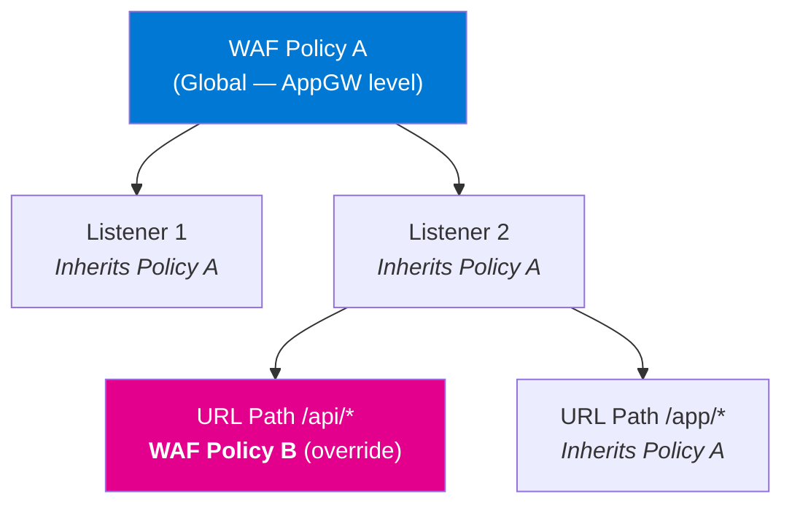
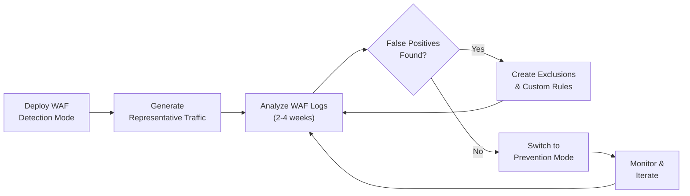
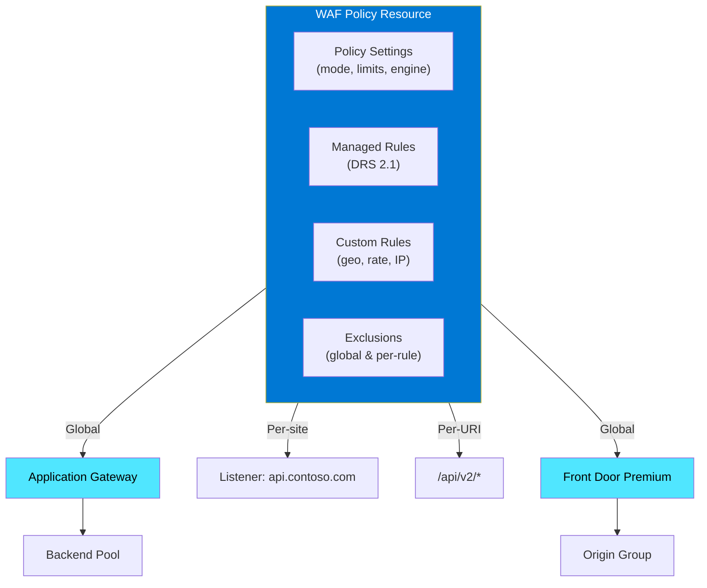

# :gear: Module 03 — WAF Policy Configuration & Next-Gen Engine

!!! abstract "Master the WAF Policy resource — the single configuration model for Azure WAF. Learn Detection vs Prevention modes, policy scoping, the revolutionary Next-Gen WAF engine, and every policy setting you can tune."

---

## 1 :briefcase: WAF Policy — The Single Pane of Glass

### Why WAF Policy Exists

Before WAF Policy was introduced, Application Gateway WAF settings were configured directly
inside the Application Gateway resource. That legacy model scattered configuration across
multiple blades, made it impossible to share settings between gateways, and received no new
feature investments. Microsoft deprecated the legacy WAF configuration in **March 2025** and
will **fully retire** it in **March 2027**. From that date onward, any Application Gateway
still referencing the old configuration will automatically be migrated.

**WAF Policy** (`Microsoft.Network/ApplicationGatewayWebApplicationFirewallPolicies`) is now
the **only** supported configuration model. It consolidates every WAF control into a single,
portable Azure Resource Manager (ARM) resource that you can version-control, deploy with IaC,
and associate with one or many endpoints.

!!! warning "Action Required Before March 2027"
    If you still have Application Gateways using the legacy WAF configuration, migrate to WAF
    Policy **now**. There is **no additional cost** to migrate, and the process can be done
    in-place through the Azure Portal or CLI. After retirement, legacy configurations will stop
    receiving security updates.

### What Lives Inside a WAF Policy

A WAF Policy is composed of four main sections:

| Section | Purpose |
|---|---|
| **Policy Settings** | Mode (Detection / Prevention), request body inspection, size limits, custom error responses |
| **Managed Rules** | Rule set selection (DRS 2.1, CRS 3.2, etc.), rule group overrides, per-rule exclusions |
| **Custom Rules** | User-authored match-condition rules for geo-filtering, rate limiting, IP allow/deny, and more |
| **Exclusions** | Global and per-rule exclusions that tell the WAF to skip specific request attributes |

Additionally, when associated with Azure Front Door Premium, the policy can include **Bot
Management** rules and **JavaScript Challenge** configuration.

### Creating a WAF Policy — Azure Portal

1. Navigate to **Create a resource → Web Application Firewall policy (WAF)**.
2. Select the **Policy for** target: *Application Gateway* or *Front Door*.
3. Choose a **Resource Group** and **Policy Name**.
4. On the **Policy Settings** tab, pick your desired **Mode** (Detection or Prevention).
5. On the **Managed Rules** tab, select your rule set (DRS 2.1 recommended).
6. Add any **Custom Rules** or **Exclusions** on their respective tabs.
7. Click **Review + Create**.

### Creating a WAF Policy — Azure CLI

=== "Application Gateway WAF Policy"

    ```bash
    # Create a resource group (if needed)
    az group create \
      --name rg-waf-workshop \
      --location eastus2

    # Create the WAF policy for Application Gateway
    az network application-gateway waf-policy create \
      --name waf-pol-appgw-prod \
      --resource-group rg-waf-workshop \
      --location eastus2 \
      --type OWASP \
      --version 3.2
    ```

=== "Front Door WAF Policy"

    ```bash
    # Create the WAF policy for Front Door Premium
    az network front-door waf-policy create \
      --name wafPolFdProd \
      --resource-group rg-waf-workshop \
      --sku Premium_AzureFrontDoor \
      --mode Prevention \
      --redirect-url "https://www.contoso.com/blocked"
    ```

=== "Bicep"

    ```bicep
    resource wafPolicy 'Microsoft.Network/ApplicationGatewayWebApplicationFirewallPolicies@2024-05-01' = {
      name: 'waf-pol-appgw-prod'
      location: resourceGroup().location
      properties: {
        policySettings: {
          mode: 'Detection'
          state: 'Enabled'
          requestBodyCheck: true
          maxRequestBodySizeInKb: 128
          fileUploadLimitInMb: 100
        }
        managedRules: {
          managedRuleSets: [
            {
              ruleSetType: 'Microsoft_DefaultRuleSet'
              ruleSetVersion: '2.1'
            }
          ]
        }
      }
    }
    ```

!!! tip "Infrastructure as Code"
    Always define your WAF Policy in Bicep, Terraform, or ARM templates. This lets you
    version-control changes, review them in pull requests, and roll back if a new exclusion
    causes unexpected behavior.

---

## 2 :world_map: Policy Scope & Association

One of the most powerful features of WAF Policy is its **flexible association model**. A single
policy can protect multiple endpoints, or you can layer policies at different scopes for
granular control.

### Application Gateway Association Hierarchy

On Application Gateway WAF v2, policies can be associated at three levels. A more specific
scope **always overrides** a broader scope for the traffic it covers.



| Scope | Applies To | Use Case |
|---|---|---|
| **Global** | Entire Application Gateway | Baseline policy for all traffic |
| **Per-site** | A specific HTTP/HTTPS listener | Different policy per hosted domain |
| **Per-URI** | A specific URL path-map rule | API endpoints vs static content |

When a request arrives, the WAF engine selects the **most specific** policy that matches.
If `/api/users` has its own policy, that policy is used — not the global one. Fields not
overridden in the child policy are **inherited** from the parent.

=== "Associate Policy to Application Gateway (Global)"

    ```bash
    az network application-gateway update \
      --name appgw-prod \
      --resource-group rg-waf-workshop \
      --set firewallPolicy.id="/subscriptions/<sub>/resourceGroups/rg-waf-workshop/providers/Microsoft.Network/ApplicationGatewayWebApplicationFirewallPolicies/waf-pol-appgw-prod"
    ```

=== "Associate Policy to a Specific Listener"

    ```bash
    az network application-gateway http-listener update \
      --gateway-name appgw-prod \
      --resource-group rg-waf-workshop \
      --name listener-api \
      --waf-policy waf-pol-api
    ```

### Front Door Premium Association

Azure Front Door Premium supports a similar hierarchy:

| Scope | How to Set |
|---|---|
| **Global** | Assign WAF policy to the entire Front Door profile |
| **Per-endpoint** | Assign policy to a specific endpoint (e.g., `api.contoso.com`) |
| **Per-route** | Assign policy to a specific routing rule within an endpoint |

```bash
# Associate WAF policy with a Front Door security policy
az afd security-policy create \
  --profile-name fd-prod \
  --resource-group rg-waf-workshop \
  --security-policy-name secpol-global \
  --waf-policy "/subscriptions/<sub>/resourceGroups/rg-waf-workshop/providers/Microsoft.Network/FrontDoorWebApplicationFirewallPolicies/wafPolFdProd" \
  --domains "/subscriptions/<sub>/resourceGroups/rg-waf-workshop/providers/Microsoft.Cdn/profiles/fd-prod/afdEndpoints/contoso"
```

### Sharing One Policy Across Multiple Resources

A single WAF Policy resource can be associated with **multiple** Application Gateways or
Front Door endpoints simultaneously. This means you can maintain one "gold standard" policy
and apply it everywhere. Changes propagate within minutes.

!!! info "Cross-Region Limitation"
    For Application Gateway, the WAF Policy must be in the **same region** as the gateway.
    Front Door WAF Policies are global resources and can be associated with any Front Door
    profile regardless of region.

---

## 3 :traffic_light: WAF Modes — Detection vs Prevention

Every WAF Policy operates in one of two modes. Choosing the right mode at the right time is
critical to a successful deployment.

### Detection Mode

In **Detection** mode the WAF evaluates every inbound request against all enabled rules and
**logs** every match — but it **never blocks** traffic. The request is forwarded to the
backend regardless of how many rules it triggers.

Detection mode is invaluable during the initial deployment phase because it lets you see
exactly what the WAF *would* block without risking an outage. You can analyze the diagnostic
logs (covered in Module 12), identify false positives, create exclusions, and build confidence
before enforcing.

!!! tip "How Long to Stay in Detection Mode"
    Microsoft recommends running in Detection mode for **2–4 weeks** (or at least one full
    business cycle) so that all traffic patterns — including batch jobs, monthly reports, and
    edge-case API calls — are captured in the logs.

### Prevention Mode

In **Prevention** mode the WAF **actively blocks** requests that trigger rules exceeding the
anomaly score threshold (or that match a custom rule with a Block action). Blocked requests
receive a **403 Forbidden** response by default, though you can customize both the status code
and the response body.

All blocked **and** detected events are still logged, giving you full visibility into what the
WAF is doing.

### Detection → Tuning → Prevention Workflow

The gold-standard deployment pattern is a phased approach:



| Phase | Mode | Duration | Goal |
|---|---|---|---|
| **1 — Baseline** | Detection | 2–4 weeks | Capture all traffic patterns |
| **2 — Tune** | Detection | 1–2 weeks | Eliminate false positives via exclusions |
| **3 — Enforce** | Prevention | Ongoing | Block malicious traffic |
| **4 — Maintain** | Prevention | Ongoing | Monitor, re-tune after app changes |

### Switching Modes via CLI

```bash
# Switch to Prevention mode
az network application-gateway waf-policy policy-setting update \
  --policy-name waf-pol-appgw-prod \
  --resource-group rg-waf-workshop \
  --mode Prevention \
  --state Enabled

# Switch back to Detection mode (if needed)
az network application-gateway waf-policy policy-setting update \
  --policy-name waf-pol-appgw-prod \
  --resource-group rg-waf-workshop \
  --mode Detection \
  --state Enabled
```

!!! warning "Prevention Mode Without Tuning"
    Switching to Prevention without proper tuning **will** break legitimate traffic. Always
    complete the Detection → Tune cycle first. Over **50 %** of WAF support cases are caused
    by false positives that could have been prevented with proper tuning.

---

## 4 :rocket: Next-Gen WAF Engine (NEW — 2025)

### The Problem with the Classic Engine

The original (classic) WAF engine was built on the open-source ModSecurity library. While
functional, it had significant limitations:

- Request body inspection capped at **128 KB**.
- File upload support maxed at **750 MB**.
- Regex evaluation was susceptible to **ReDoS** (Regular Expression Denial of Service) attacks.
- Throughput for POST-heavy workloads was a bottleneck.
- Custom rule logging did not differentiate between Log, Detected, and Blocked actions.

### What the Next-Gen Engine Delivers

Microsoft completely **redesigned** the WAF engine from the ground up. The Next-Gen engine is
written in performance-optimized code with a new regex library that is immune to catastrophic
backtracking.

| Capability | Classic Engine | Next-Gen Engine |
|---|---|---|
| POST request throughput | Baseline | **Up to 8x faster** |
| GET request throughput | Baseline | **Up to 4x faster** |
| Requests per second (same SKU) | Baseline | **Up to 8x higher** |
| Request body inspection | 128 KB | **2 MB** |
| File upload limit | 750 MB | **4 GB** |
| Regex engine | PCRE (ReDoS-vulnerable) | **RE2-compatible (ReDoS-safe)** |
| Custom rule log granularity | Single "Matched" action | **Log / Detected / Blocked** |
| New feature availability | Frozen | **All new features** |

!!! info "Feature Exclusivity"
    Starting in 2025, all new WAF capabilities — including enhanced bot protection, response
    body inspection improvements, and upcoming AI-driven tuning — are built **exclusively** on
    the Next-Gen engine. The classic engine is in maintenance-only mode.

### How to Check Which Engine You Are Running

```bash
# Check the engine version for an Application Gateway WAF policy
az network application-gateway waf-policy show \
  --name waf-pol-appgw-prod \
  --resource-group rg-waf-workshop \
  --query "policySettings" \
  --output table
```

Look for the `engine` property in the policy settings. If it is absent or set to `Classic`,
you are on the legacy engine.

### Migrating to the Next-Gen Engine

Migration is non-disruptive and can be performed in the Azure Portal or via CLI:

=== "Azure CLI"

    ```bash
    az network application-gateway waf-policy policy-setting update \
      --policy-name waf-pol-appgw-prod \
      --resource-group rg-waf-workshop \
      --request-body-inspect-limit-in-kb 2048 \
      --file-upload-limit-in-mb 4096 \
      --request-body-check true
    ```

=== "Azure Portal"

    1. Open the WAF Policy in the Azure Portal.
    2. Navigate to **Policy Settings**.
    3. Toggle the **WAF Engine** selector to **Next-Gen**.
    4. Adjust the new body inspection and file upload limits.
    5. Click **Save**.

!!! tip "Recommended Migration Steps"
    1. Enable the Next-Gen engine in **Detection** mode first.
    2. Run representative traffic for 1–2 weeks and compare logs against the classic engine.
    3. Verify no new false positives were introduced.
    4. Switch to **Prevention** mode once validated.

---

## 5 :gear: Policy Settings Reference

The `policySettings` object controls the overall behavior of the WAF. Below is a comprehensive
reference of every configurable field.

| Setting | Type | Default | Next-Gen Default | Description |
|---|---|---|---|---|
| `mode` | `string` | `Detection` | `Detection` | `Detection` logs only; `Prevention` blocks |
| `state` | `string` | `Enabled` | `Enabled` | `Enabled` or `Disabled` — master on/off switch |
| `requestBodyCheck` | `bool` | `true` | `true` | Whether the WAF inspects the request body |
| `maxRequestBodySizeInKb` | `int` | `128` | `128` | Max body size the WAF will inspect. Requests larger than this are passed uninspected (classic) or up to the inspect limit (Next-Gen) |
| `requestBodyInspectLimitInKB` | `int` | N/A | `2048` | *Next-Gen only.* Maximum body size the engine inspects. Content beyond this limit is passed through uninspected |
| `fileUploadLimitInMb` | `int` | `100` | `4096` | Max file upload size. Requests exceeding this are blocked if body enforcement is enabled |
| `requestBodyEnforcement` | `bool` | `true` | `true` | Block requests exceeding `maxRequestBodySizeInKb`. If `false`, oversized bodies are passed uninspected |
| `fileUploadEnforcement` | `bool` | `true` | `true` | Block file uploads exceeding `fileUploadLimitInMb` |
| `customBlockResponseStatusCode` | `int` | `403` | `403` | HTTP status code returned when a request is blocked (e.g., `403`, `405`, `429`, `499`) |
| `customBlockResponseBody` | `string` | `null` | `null` | Base64-encoded HTML body returned with blocked responses. Max 32 KB |
| `logScrubbing` | `object` | `null` | `null` | Rules for redacting sensitive data (e.g., credit card numbers, passwords) from WAF logs |

### Setting Custom Block Responses

You can brand your block pages so that end users see a helpful message instead of a generic
HTTP 403:

```bash
# Encode your custom HTML as base64
CUSTOM_BODY=$(echo '<html><body><h1>Request Blocked</h1><p>Your request was blocked by our WAF. Contact support@contoso.com if this is an error.</p></body></html>' | base64 -w0)

# Apply custom block response
az network application-gateway waf-policy policy-setting update \
  --policy-name waf-pol-appgw-prod \
  --resource-group rg-waf-workshop \
  --custom-block-response-status-code 403 \
  --custom-block-response-body "$CUSTOM_BODY"
```

### Enabling Log Scrubbing

Log scrubbing prevents sensitive data from appearing in WAF diagnostic logs:

```bash
az network application-gateway waf-policy policy-setting update \
  --policy-name waf-pol-appgw-prod \
  --resource-group rg-waf-workshop \
  --log-scrubbing-state Enabled
```

!!! note "Log Scrubbing Variables"
    You can scrub specific match variables such as `RequestHeaderNames`,
    `RequestCookieNames`, `RequestArgNames`, and `RequestPostArgNames`. Each scrubbing
    rule specifies a variable, an operator (`Equals` or `EqualsAny`), and an optional
    selector value.

---

## 6 :jigsaw: Putting It All Together

The diagram below shows how all the concepts in this module connect:



---

## :white_check_mark: Key Takeaways

1. **WAF Policy is mandatory.** Legacy WAF configuration is deprecated (March 2025) and will be retired in March 2027. Migrate now.
2. **Scope matters.** Associate policies at the global, per-site, or per-URI level to balance broad protection with application-specific tuning.
3. **Always start in Detection mode.** Run for 2–4 weeks, analyze logs, create exclusions, then switch to Prevention.
4. **Upgrade to the Next-Gen engine.** It is faster (up to 8x), inspects larger bodies (2 MB), supports 4 GB uploads, and is ReDoS-safe.
5. **Customize block responses.** Replace generic 403 pages with branded HTML so users know what happened and how to get help.
6. **Treat WAF Policy as code.** Store definitions in Bicep/Terraform, review in PRs, and deploy via CI/CD.

---

## :books: References

- [Azure WAF Policy overview — Microsoft Learn](https://learn.microsoft.com/azure/web-application-firewall/ag/policy-overview)
- [Application Gateway WAF configuration — Microsoft Learn](https://learn.microsoft.com/azure/web-application-firewall/ag/application-gateway-waf-configuration)
- [Front Door WAF Policy — Microsoft Learn](https://learn.microsoft.com/azure/web-application-firewall/afds/waf-front-door-policy-settings)
- [Next-Gen WAF engine — Microsoft Learn](https://learn.microsoft.com/azure/web-application-firewall/ag/waf-engine)
- [az network application-gateway waf-policy — CLI Reference](https://learn.microsoft.com/cli/azure/network/application-gateway/waf-policy)
- [Migrate to WAF Policy — Microsoft Learn](https://learn.microsoft.com/azure/web-application-firewall/ag/migrate-policy)

---

## :test_tube: Related Labs

- [:octicons-beaker-24: LAB01 — Deploy Application Gateway with WAF Policy](../labs/lab01.md)
- [:octicons-beaker-24: LAB02 — Configure WAF Policy Settings & Modes](../labs/lab02.md)

---

<div style="display: flex; justify-content: space-between;">
<div>[:octicons-arrow-left-24: Module 02 — Introduction to Azure WAF](02-waf-overview.md)</div>
<div>[Module 04 — Managed Rules :octicons-arrow-right-24:](04-managed-rules.md)</div>
</div>