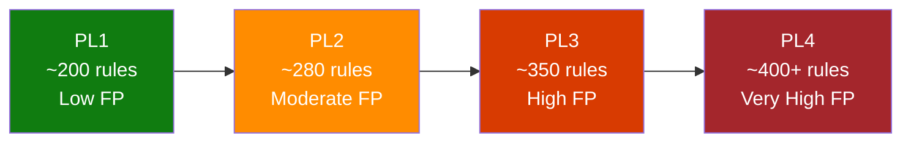
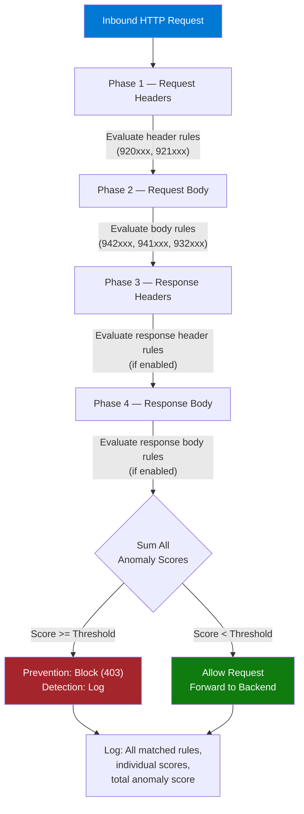

# :bookmark_tabs: Module 04 — Managed Rules: OWASP, DRS 2.1 & Anomaly Scoring

!!! abstract "Understand the Microsoft-managed rule sets that power Azure WAF — from OWASP CRS heritage to the modern Default Rule Set 2.1, anomaly scoring mathematics, paranoia levels, and the Microsoft Threat Intelligence rules that provide zero-day protection."

---

## 1 :shield: What Are Managed Rules?

Managed rules are **pre-built, Microsoft-maintained** detection signatures that the WAF engine
evaluates against every inbound HTTP request. They are the primary defense layer of Azure WAF
and cover the most common web application attacks catalogued by the [OWASP Top 10](https://owasp.org/www-project-top-ten/).

### Key Characteristics

- **Automatic updates.** Microsoft's security research team continuously improves the rule
  sets. Updates are deployed transparently — you do not need to take any action.
- **Immutable rules.** You **cannot** edit or delete the detection logic of a managed rule.
  This prevents accidental weakening of the security posture.
- **Flexible overrides.** Although you cannot change a rule's logic, you *can*:
    - **Disable** an individual rule or an entire rule group.
    - **Change the action** for a rule (e.g., from *Block* to *Log*).
    - **Create exclusions** so the rule skips a specific request attribute (covered in
      Module 05).
- **Based on OWASP CRS.** The rule sets descend from the OWASP Core Rule Set (CRS), with
  significant Microsoft-specific enhancements, additional detection logic, and the Microsoft
  Threat Intelligence Collection.

!!! info "Managed Rules ≠ Custom Rules"
    Managed rules are provided by Microsoft and updated automatically. **Custom rules** (Module 06)
    are authored by you for application-specific logic like geo-filtering and rate limiting.
    Custom rules are always evaluated **before** managed rules.

### Viewing Managed Rules via CLI

```bash
# List all available managed rule sets for Application Gateway
az network application-gateway waf-policy managed-rule rule-set list \
  --output table

# Show the managed rules configured on a specific policy
az network application-gateway waf-policy managed-rule rule-set show \
  --policy-name waf-pol-appgw-prod \
  --resource-group rg-waf-workshop \
  --output json
```

---

## 2 :bookmark: Ruleset Versions — CRS vs DRS

Azure WAF has offered several ruleset versions over the years. Understanding the differences
is important for choosing the right set and planning migrations.

### Comparison Table

| Ruleset | Based On | Scoring Mode | MSTIC Rules | Status | Platforms |
|---|---|---|---|---|---|
| **CRS 3.0** | OWASP CRS 3.0 | Traditional | :x: No | :warning: Retiring | App Gateway |
| **CRS 3.1** | OWASP CRS 3.1 | Traditional | :x: No | :warning: Retiring | App Gateway |
| **CRS 3.2** | OWASP CRS 3.2 | Anomaly | :x: No | :white_check_mark: Supported | App Gateway |
| **DRS 1.0** | Microsoft enhanced | Traditional | :white_check_mark: Yes | :warning: Legacy | Front Door |
| **DRS 1.1** | Microsoft enhanced | Traditional | :white_check_mark: Yes | :warning: Legacy | Front Door |
| **DRS 2.1** | Microsoft enhanced | **Anomaly** | :white_check_mark: Yes | :star: **Recommended** | App GW + FD |

### Rolling Support Policy

Starting **February 2026**, Microsoft enforces a **rolling support** policy:

1. Only the **latest three** ruleset versions are supported at any time.
2. When a new version is released, the oldest version enters a **12-month retirement window**.
3. After the 12-month window, the retired version stops receiving updates and may be removed.

!!! warning "Migration Deadline"
    If you are still on CRS 3.0 or 3.1, plan your migration to **DRS 2.1** immediately.
    These older rulesets will be among the first retired under the rolling support policy.

### Upgrading the Ruleset via CLI

=== "Application Gateway"

    ```bash
    # Add DRS 2.1 managed rule set to your policy
    az network application-gateway waf-policy managed-rule rule-set update \
      --policy-name waf-pol-appgw-prod \
      --resource-group rg-waf-workshop \
      --type Microsoft_DefaultRuleSet \
      --version 2.1
    ```

=== "Front Door"

    ```bash
    # Update managed ruleset on Front Door WAF policy
    az network front-door waf-policy managed-rule-definition list \
      --output table

    az network front-door waf-policy managed-rules add \
      --policy-name wafPolFdProd \
      --resource-group rg-waf-workshop \
      --type Microsoft_DefaultRuleSet \
      --version 2.1
    ```

---

## 3 :file_folder: DRS 2.1 Rule Groups

DRS 2.1 organizes its detection rules into **rule groups**, each targeting a specific attack
category. Every rule within a group shares a common ID prefix that makes it easy to identify
the attack type from log entries.

| Rule Group | ID Prefix | Rule Count (approx.) | Description |
|---|---|---|---|
| **Protocol Violations** | 920xxx | ~35 | Malformed HTTP requests, missing `Host` headers, HTTP request smuggling, multiline headers |
| **Protocol Anomalies** | 921xxx | ~15 | Invalid HTTP methods, split requests, HTTP/0.9 usage |
| **Request Body Limits** | 920xxx | ~5 | Oversized request bodies, multipart parsing issues |
| **Path Traversal** | 930xxx | ~10 | `../` sequences, null bytes in paths, OS file access (`/etc/passwd`, `\boot.ini`) |
| **Remote File Inclusion (RFI)** | 931xxx | ~8 | URL parameters containing `http://`, `ftp://`, `data:` schemes pointing to external resources |
| **Command Injection** | 932xxx | ~20 | OS command characters (`; | && \`` `), PowerShell keywords, Unix shell injection patterns |
| **PHP Injection** | 933xxx | ~15 | `<?php` tags, `eval()`, `base64_decode()`, PHP wrapper streams |
| **Node.js Injection** | 934xxx | ~8 | `require()`, `child_process`, `eval()` for Node environments |
| **Cross-Site Scripting (XSS)** | 941xxx | ~40 | `<script>` tags, event handlers (`onload`, `onerror`), `javascript:` URIs, SVG/MathML vectors |
| **SQL Injection (SQLi)** | 942xxx | ~60 | `UNION SELECT`, `OR 1=1`, comment sequences (`--`, `#`), blind SQLi timing functions, hex encoding |
| **Session Fixation** | 943xxx | ~5 | Cookie manipulation, forced session identifiers |
| **Java / Spring Attacks** | 944xxx | ~12 | Java serialization exploits, Spring expression injection, Log4Shell patterns |
| **MS Threat Intelligence** | 99001xx | ~10+ | Zero-day protection rules maintained by Microsoft Threat Intelligence Center (MSTIC) |

!!! tip "Viewing Rule Details in the Portal"
    Navigate to your WAF Policy → **Managed rules** → click on a rule set to expand its
    groups → click on a group to see every rule with its ID, description, and current state
    (Enabled / Disabled).

### Listing Rule Groups via CLI

```bash
# List all rule groups in DRS 2.1
az network application-gateway waf-policy managed-rule rule-set list \
  --query "[?ruleSetType=='Microsoft_DefaultRuleSet' && ruleSetVersion=='2.1'].ruleGroups[].{Group:ruleGroupName, Rules:rules | length(@)}" \
  --output table
```

---

## 4 :abacus: Anomaly Scoring (DRS 2.x) — Deep Dive

Anomaly scoring is the most important concept to understand when working with DRS 2.x rule
sets. It fundamentally changes how the WAF decides whether to block a request.

### The Mathematics

Every managed rule in DRS 2.x has a **severity level** that maps to a numeric **anomaly
score**:

| Severity | Score | Typical Rules |
|---|---|---|
| **Critical** | 5 | SQL injection, command injection, Java deserialization |
| **Error** | 4 | XSS, path traversal, protocol violations |
| **Warning** | 3 | Protocol anomalies, scanner detection |
| **Notice** | 2 | Informational matches, session fixation |

When a request is processed, the WAF engine evaluates it against **all** enabled rules. Each
rule that matches **adds** its score to a running total called the **inbound anomaly score**.
After all rules have been evaluated, the engine compares the accumulated score against the
**anomaly score threshold** (default: **5**).

$$
\text{Action} =
\begin{cases}
\text{Block (Prevention) or Log (Detection)} & \text{if } \sum_{i=1}^{n} \text{score}_i \geq \text{threshold} \\
\text{Allow} & \text{if } \sum_{i=1}^{n} \text{score}_i < \text{threshold}
\end{cases}
$$

### Worked Example

Consider a request to `GET /products?id=1 OR 1=1&search=<script>alert(1)</script>`:

| Step | Rule Matched | Rule ID | Severity | Score |
|---|---|---|---|---|
| 1 | SQL Injection — tautology detected in `id` | 942100 | Critical | +5 |
| 2 | SQL Injection — `OR` keyword with boolean | 942130 | Critical | +5 |
| 3 | XSS — `<script>` tag in `search` | 941110 | Error | +4 |
| 4 | XSS — `alert()` function in `search` | 941160 | Error | +4 |
| **Total** | | | | **18** |

The accumulated score of **18** far exceeds the default threshold of **5**. In Prevention mode
the request is blocked. In Detection mode the request is logged with all four matches and the
total score.

!!! note "Why This Matters"
    Under the **Traditional** scoring model (DRS 1.x), the request would have been blocked
    on the *first* rule match (942100). Under anomaly scoring, a single low-severity match
    (score 2 or 3) would **not** block the request by itself — only genuinely malicious
    requests that trigger enough rules are blocked. This dramatically reduces false positives.

### Anomaly Score Threshold Configuration

```bash
# View current anomaly score threshold
az network application-gateway waf-policy managed-rule rule-set show \
  --policy-name waf-pol-appgw-prod \
  --resource-group rg-waf-workshop \
  --query "managedRuleSets[0].ruleSetVersion"

# The threshold is configured at the rule-set level
# Default is 5 — lowering it increases sensitivity (more blocks)
# Raising it reduces sensitivity (fewer blocks, more risk)
```

!!! warning "Changing the Threshold"
    Lowering the threshold below 5 is almost never recommended — it reintroduces the false
    positive problems that anomaly scoring was designed to solve. Raising it above 5 may allow
    attacks through. Stick with the default unless you have a very specific reason to change it.

### Anomaly Scoring vs Traditional Mode — Side-by-Side

| Feature | Anomaly Scoring (DRS 2.x) | Traditional (DRS 1.x) |
|---|---|---|
| Evaluation | All rules evaluated, scores summed | Stops on first match |
| Blocking decision | Score >= threshold | Any single match |
| False positive rate | **Lower** | Higher |
| Visibility | Full list of matched rules per request | Only the first matched rule |
| Tuning difficulty | Easier — can tolerate low-severity matches | Harder — every match blocks |
| Recommended | :white_check_mark: **Yes** | :x: Migrate away |

---

## 5 :level_slider: Paranoia Levels (PL1 – PL4)

Paranoia Levels control **how many rules** within each rule group are active. Each level is
a superset of the previous one — enabling PL3 means PL1 + PL2 + PL3 rules are all active.

### Level Descriptions

=== "PL1 — Default"

    **Rule coverage:** Baseline rules that detect the most common and obvious attack
    patterns with minimal false positives.

    **False positive rate:** Low.

    **Use case:** General-purpose web applications, content sites, standard APIs.

    **Recommendation:** Start here for every deployment. Most organizations never need
    to go higher.

=== "PL2 — Moderate"

    **Rule coverage:** Adds rules for slightly more subtle attack patterns — encoded
    payloads, less common SQL syntax, additional XSS vectors.

    **False positive rate:** Moderate. Expect some tuning effort.

    **Use case:** Applications handling sensitive data (PII, financial) where the
    additional detection justifies the tuning cost.

=== "PL3 — Aggressive"

    **Rule coverage:** Adds rules with broader regex patterns and heuristic detections.
    Catches evasion techniques like double-encoding, mixed-case attacks, and comment
    insertion.

    **False positive rate:** High. Requires dedicated tuning.

    **Use case:** High-security applications (government, banking) with a dedicated
    security operations team.

=== "PL4 — Maximum"

    **Rule coverage:** Enables every available detection rule, including experimental
    signatures.

    **False positive rate:** Very high. Extensive exclusion lists required.

    **Use case:** Extremely sensitive environments or honeypot deployments used for
    threat research. Not recommended for production without significant tuning investment.



!!! tip "Practical Guidance"
    For most production workloads, **PL1 + DRS 2.1 + proper exclusions** provides excellent
    protection with minimal operational overhead. Only increase the paranoia level after you
    have fully tuned PL1 and determined that the additional detection is necessary.

---

## 6 :arrows_counterclockwise: Detection Process Flow

Understanding the order in which the WAF engine processes a request helps you reason about
log entries and design effective exclusions.



Key points about the flow:

1. **All phases execute** even if early rules match. The engine never short-circuits in
   anomaly scoring mode — it needs the full score to make a decision.
2. **Response inspection** (Phases 3 and 4) is optional and must be explicitly enabled in
   policy settings. It detects data leakage such as credit card numbers or SQL error messages
   in outbound responses.
3. **Logging happens regardless of the action.** Both blocked and allowed requests generate
   diagnostic entries that include every matched rule, its score, and the total anomaly score.

---

## 7 :mag: Rule Anatomy — Dissecting Rule 942100

To truly understand managed rules, let us dissect one of the most commonly triggered rules:
**942100 — SQL Injection Attack Detected via libinjection**.

### Rule Metadata

| Field | Value |
|---|---|
| **Rule ID** | 942100 |
| **Rule Group** | REQUEST-942-APPLICATION-ATTACK-SQLI |
| **Severity** | Critical (anomaly score = 5) |
| **Paranoia Level** | PL1 (always active at default settings) |
| **Description** | Detects SQL injection attempts using the libinjection fingerprinting engine |

### What It Inspects

The rule evaluates the following **match variables** (request components):

- `ARGS` — All query string and POST body parameter values
- `ARGS_NAMES` — Names of query string and POST body parameters
- `REQUEST_COOKIES` — All cookie values
- `REQUEST_HEADERS` — Specific headers (e.g., `Referer`, `User-Agent`)

### Detection Technique

Rule 942100 uses the **libinjection** library rather than a traditional regex. libinjection
tokenizes the input and compares the token sequence against a database of known SQL injection
fingerprints. This approach is faster and more accurate than regex alone because it
understands SQL grammar.

A simplified representation of the detection logic:

```
# Pseudocode — not the actual rule source
FOR each variable IN [ARGS, ARGS_NAMES, COOKIES, HEADERS]:
    tokens = libinjection_sqli_tokenize(variable.value)
    IF tokens MATCH known_sqli_fingerprint:
        ADD anomaly_score += 5   # Critical
        LOG rule_id=942100, variable=variable.name, value=variable.value
```

### Why It Might False-Positive

Common legitimate values that trigger 942100:

| Input | Why It Triggers | Resolution |
|---|---|---|
| `search=SELECT model FROM catalog` | Contains `SELECT ... FROM` | Exclude `search` param from rule 942100 |
| `note=Drop me a line` | Contains `Drop` keyword | Exclude `note` param from rule 942100 |
| `query=1 OR status='active'` | Contains `OR` with comparison | Exclude `query` param from SQLi group |

!!! tip "Tuning Rule 942100"
    Rather than disabling the rule entirely, create a **per-rule exclusion** for the specific
    parameter that triggers it. This keeps the protection active for all other parameters.
    See Module 05 for detailed exclusion instructions.

---

## 8 :detective: Microsoft Threat Intelligence (MSTIC) Rules

In addition to the OWASP-derived rules, DRS 2.1 includes a special rule group maintained by
the **Microsoft Threat Intelligence Center (MSTIC)**. These rules provide protection against
**zero-day** and **emerging** threats before they are added to the standard CRS.

### How MSTIC Rules Work

Unlike standard rules that match generic attack patterns, MSTIC rules target **specific
vulnerability exploits** identified by Microsoft's global threat intelligence network.
When Microsoft discovers a new vulnerability being actively exploited in the wild, the MSTIC
team can publish a detection rule within hours — long before the broader security community
releases patches.

### Notable MSTIC Rules

| Vulnerability | CVE | MSTIC Rule | Impact |
|---|---|---|---|
| **Log4Shell** | CVE-2021-44228 | 99001014 | Remote code execution via `${jndi:ldap://}` in any header/parameter. One of the most critical vulnerabilities in history. |
| **Spring4Shell** | CVE-2022-22965 | 99001015 | RCE in Spring Framework via class loader manipulation. Targeted Java-based backends. |
| **Text4Shell** | CVE-2022-42889 | 99001016 | RCE in Apache Commons Text via `${prefix:value}` interpolation. |
| **Confluence RCE** | CVE-2022-26134 | 99001017 | OGNL injection in Atlassian Confluence Server. |

### Enabling MSTIC Rules

MSTIC rules are included by default when you use DRS 2.1. You can verify they are active:

```bash
# Check MSTIC rules are enabled
az network application-gateway waf-policy managed-rule rule-set show \
  --policy-name waf-pol-appgw-prod \
  --resource-group rg-waf-workshop \
  --query "managedRuleSets[?ruleSetType=='Microsoft_DefaultRuleSet'].ruleGroups[?contains(ruleGroupName, 'KNOWN')]" \
  --output json
```

!!! warning "Do Not Disable MSTIC Rules"
    Unlike standard OWASP rules where disabling a rule might be acceptable to resolve a
    false positive, MSTIC rules should **never** be disabled. They protect against specific,
    high-severity vulnerabilities. If a MSTIC rule causes a false positive, create a
    targeted per-rule exclusion instead.

---

## 9 :hammer_and_wrench: Managing Managed Rules — Common Operations

### Disabling a Specific Rule

Sometimes you need to completely disable a rule (as a last resort when exclusions are not
sufficient):

```bash
# Disable rule 942130 (SQL Injection - OR keyword)
az network application-gateway waf-policy managed-rule rule-set rule-group-override set \
  --policy-name waf-pol-appgw-prod \
  --resource-group rg-waf-workshop \
  --rule-set-type Microsoft_DefaultRuleSet \
  --rule-set-version 2.1 \
  --group-name REQUEST-942-APPLICATION-ATTACK-SQLI \
  --rules "[{\"ruleId\":\"942130\",\"state\":\"Disabled\"}]"
```

### Changing a Rule's Action

Instead of disabling a rule, you can change its action to **Log** so it records matches
without contributing to the anomaly score:

```bash
# Change rule 941100 to Log action (instead of AnomalyScoring)
az network application-gateway waf-policy managed-rule rule-set rule-group-override set \
  --policy-name waf-pol-appgw-prod \
  --resource-group rg-waf-workshop \
  --rule-set-type Microsoft_DefaultRuleSet \
  --rule-set-version 2.1 \
  --group-name REQUEST-941-APPLICATION-ATTACK-XSS \
  --rules "[{\"ruleId\":\"941100\",\"action\":\"Log\"}]"
```

### Viewing Overridden Rules

```bash
# List all rule overrides on a policy
az network application-gateway waf-policy managed-rule rule-set show \
  --policy-name waf-pol-appgw-prod \
  --resource-group rg-waf-workshop \
  --query "managedRuleSets[].ruleGroupOverrides[]" \
  --output json
```

!!! note "Rule Overrides Survive Ruleset Upgrades"
    When you upgrade from CRS 3.2 to DRS 2.1 (or to a newer version), your rule overrides
    are preserved as long as the rule IDs still exist in the new version. Rules removed from
    the new version will have their overrides silently dropped.

---

## :white_check_mark: Key Takeaways

1. **Managed rules are your first line of defense.** They cover OWASP Top 10 attacks out of the box and are maintained by Microsoft — you do not need to write detection logic.
2. **Use DRS 2.1.** It is the recommended ruleset for both Application Gateway and Front Door, and the only one that includes anomaly scoring plus MSTIC rules.
3. **Anomaly scoring reduces false positives.** A single low-severity match will not block a request — only requests that accumulate enough score are actioned.
4. **Start at Paranoia Level 1.** Increase only after thorough tuning. Each level adds rules and false positive potential.
5. **Never disable MSTIC rules.** They protect against high-profile zero-day exploits. Use per-rule exclusions if they cause false positives.
6. **Plan for the rolling support policy.** Only the latest three ruleset versions are supported. Build ruleset upgrades into your operational cadence.

---

## :books: References

- [Azure WAF managed rule sets — Microsoft Learn](https://learn.microsoft.com/azure/web-application-firewall/ag/application-gateway-crs-rulegroups-rules)
- [DRS rule groups and rules — Microsoft Learn](https://learn.microsoft.com/azure/web-application-firewall/ag/application-gateway-crs-rulegroups-rules?tabs=drs21)
- [WAF anomaly scoring — Microsoft Learn](https://learn.microsoft.com/azure/web-application-firewall/ag/application-gateway-waf-request-size-limits)
- [OWASP CRS project](https://coreruleset.org/)
- [Microsoft Threat Intelligence — Microsoft Learn](https://learn.microsoft.com/azure/web-application-firewall/ag/waf-overview#microsoft-threat-intelligence)
- [Configure managed rules — CLI reference](https://learn.microsoft.com/cli/azure/network/application-gateway/waf-policy/managed-rule)

---

## :test_tube: Related Labs

- [:octicons-beaker-24: LAB03 — Analyze WAF Logs & Identify Matched Rules](../labs/lab03.md)
- [:octicons-beaker-24: LAB03B — Anomaly Scoring in Action](../labs/lab03b.md)

---

<div style="display: flex; justify-content: space-between;">
<div>[:octicons-arrow-left-24: Module 03 — WAF Policy Configuration](03-waf-policies.md)</div>
<div>[Module 05 — Exclusions & Tuning :octicons-arrow-right-24:](05-exclusions.md)</div>
</div>