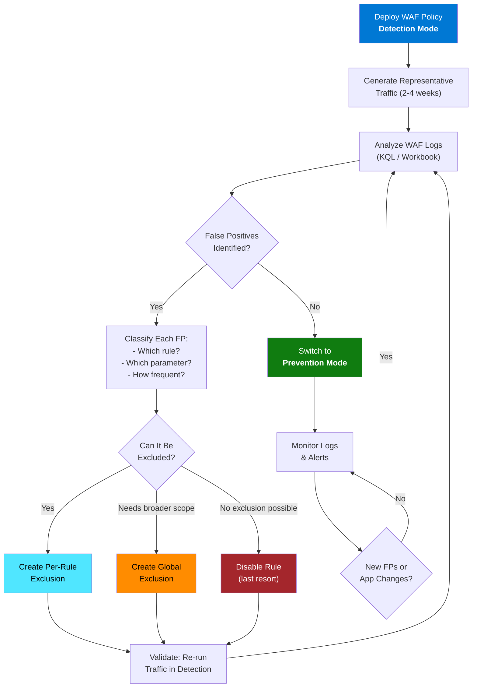
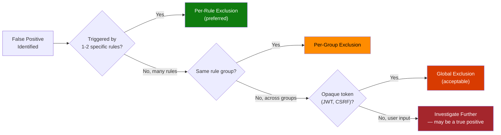

# :wrench: Module 05 — Exclusions & False Positive Tuning

!!! abstract "Learn the art and science of WAF tuning — why false positives happen, how to identify them in logs, and how to craft precise exclusions that eliminate noise without weakening protection. Master the complete tuning workflow from Detection mode through Prevention."

---

## 1 :dart: Why Tuning Matters

Every WAF — regardless of vendor — will produce **false positives** when first deployed.
A false positive occurs when the WAF flags a *legitimate* request as malicious because part
of the request matches a detection rule's pattern. For example, a search query containing
the word `SELECT` might trigger SQL injection rule 942100 even though the user is searching
a product catalog.

This is not a bug. Managed rules are intentionally broad to catch as many attack variants as
possible. The trade-off is that some legitimate traffic resembles attack patterns closely
enough to trigger detections. **Tuning is the process of teaching the WAF the difference.**

!!! warning "The Cost of Not Tuning"
    Over **50 %** of Azure WAF support cases are related to false positives. Switching to
    Prevention mode without tuning **will** break legitimate traffic, frustrate users, and
    generate urgent escalations. Fewer than **5 %** of cases are caused by actual bugs in
    managed rules — the rest are tuning issues.

### The Tuning Mindset

Tuning is not a one-time activity. It is an **ongoing operational practice** that should be
revisited whenever:

- Your application is updated (new endpoints, new parameters).
- The managed ruleset is upgraded (new rules may match existing traffic).
- Traffic patterns change (new integrations, new user behaviors).
- The paranoia level is increased.

Think of tuning as a feedback loop between your application's behavior and the WAF's
detection logic.

---

## 2 :arrows_counterclockwise: The Tuning Workflow

The diagram below illustrates the complete lifecycle of WAF tuning, from initial deployment
through ongoing maintenance.



### Workflow Steps in Detail

| Step | Action | Tools |
|---|---|---|
| **1. Deploy** | Create WAF Policy in Detection mode | Azure Portal, CLI, Bicep |
| **2. Baseline Traffic** | Ensure all normal traffic flows through the WAF for 2-4 weeks | Load testing, real users |
| **3. Analyze Logs** | Query `AzureDiagnostics` with KQL to find rule matches | Log Analytics, WAF Triage Workbook |
| **4. Classify FPs** | For each match, determine if it is a true positive or false positive | Manual review, application team input |
| **5. Create Exclusions** | Write exclusions for confirmed false positives | Azure Portal, CLI |
| **6. Validate** | Re-run traffic and confirm exclusions eliminated the FPs without gaps | Detection mode logs |
| **7. Enforce** | Switch to Prevention mode | CLI / Portal |
| **8. Monitor** | Continuously watch for new FPs or blocked legitimate traffic | Alerts, Workbook, Sentinel |

!!! tip "Use the WAF Triage Workbook"
    Azure provides a built-in **WAF Triage Workbook** in Azure Monitor that visualizes
    the most frequently triggered rules, the parameters that caused matches, and the
    source IPs. It dramatically speeds up the classification step. See Module 12 for
    setup instructions.

---

## 3 :toolbox: Types of Exclusions

Exclusions instruct the WAF engine to **skip inspection** of specific request attributes —
either for all rules or for individual rules. Azure WAF supports two scopes of exclusions.

### Global Exclusions

A global exclusion tells the WAF to **ignore** a specific request attribute during evaluation
of **all** managed rules. The attribute is effectively invisible to the entire rule engine.

**When to use:**

- The attribute **consistently** triggers false positives across multiple rule groups.
- The attribute contains data that is inherently "noisy" (e.g., JWT tokens, CSRF tokens,
  session cookies with encoded data).

!!! warning "Risk of Global Exclusions"
    Global exclusions completely remove the specified attribute from inspection. If an
    attacker discovers a globally excluded parameter, they can use it to inject payloads
    without detection. **Always prefer per-rule exclusions** when possible.

### Per-Rule Exclusions

A per-rule exclusion skips inspection of a specific attribute **only** for the specified rule
ID or rule group. All other rules still inspect the attribute normally.

**When to use:**

- A specific parameter triggers a **specific** rule, but the parameter should still be
  inspected by other rules.
- You want the narrowest possible exclusion to maintain maximum protection.

!!! tip "Per-Rule Is Always Preferred"
    Per-rule exclusions follow the principle of least privilege. A `search` parameter
    excluded from SQL injection rule 942100 is still inspected by XSS rules, command
    injection rules, and all other rule groups. This is far safer than a global exclusion.

### Match Variables

Match variables define **which part** of the request the exclusion applies to:

| Match Variable | What It Covers | Example |
|---|---|---|
| `RequestHeaderNames` | HTTP request header names and their values | `Authorization`, `X-Custom-Header` |
| `RequestHeaderKeys` | HTTP request header keys only (name, not value) | Header name contains special chars |
| `RequestCookieNames` | Cookie names and their values | `__RequestVerificationToken`, `session_id` |
| `RequestArgNames` | Query string parameter names and values | `?search=foo`, `?id=123` |
| `RequestBodyPostArgNames` | POST body parameter names and values (form-encoded) | Form field `username`, `comment` |
| `RequestBodyJsonArgNames` | JSON body property names and values | `{"query": "SELECT ..."}` |

### Match Operators

Operators define **how** the match variable's name is compared:

| Operator | Behavior | Example |
|---|---|---|
| `Equals` | Exact match on the attribute name | `search` matches only `search` |
| `Contains` | Attribute name contains the string | `token` matches `csrf_token`, `access_token` |
| `StartsWith` | Attribute name starts with the string | `x-custom` matches `x-custom-auth`, `x-custom-id` |
| `EndsWith` | Attribute name ends with the string | `_token` matches `csrf_token`, `auth_token` |
| `EqualsAny` | Matches **any** attribute of this type (no selector needed) | All cookies, all headers |

!!! note "Selector Case Sensitivity"
    Match variable selectors are **case-insensitive** on Application Gateway but
    **case-sensitive** on Front Door. Always verify the exact casing of your parameter
    names when creating exclusions for Front Door.

---

## 4 :test_tube: Exclusion Examples — Real-World Scenarios

Below are five commonly encountered false positive scenarios with the exact CLI commands to
create targeted exclusions.

### Example 1: Exclude CSRF Token from Rule 942130

**Scenario:** An ASP.NET application sends a `__RequestVerificationToken` cookie with every
POST request. The encoded token value contains characters that trigger SQL injection rule
942130 ("SQL Injection — keyword detected: OR, AND").

=== "Azure CLI (Application Gateway)"

    ```bash
    # Per-rule exclusion: skip __RequestVerificationToken for rule 942130 only
    az network application-gateway waf-policy managed-rule exclusion add \
      --policy-name waf-pol-appgw-prod \
      --resource-group rg-waf-workshop \
      --match-variable RequestCookieNames \
      --selector-match-operator Equals \
      --selector "__RequestVerificationToken" \
      --rule-set-type Microsoft_DefaultRuleSet \
      --rule-set-version 2.1 \
      --group-name REQUEST-942-APPLICATION-ATTACK-SQLI \
      --rule-id 942130
    ```

=== "Azure Portal"

    1. Open WAF Policy → **Managed rules**.
    2. Click on rule group **REQUEST-942-APPLICATION-ATTACK-SQLI**.
    3. Find rule **942130** and click the **...** menu → **Add exclusion**.
    4. Set Match variable = `RequestCookieNames`, Operator = `Equals`,
       Selector = `__RequestVerificationToken`.
    5. Click **Save**.

### Example 2: Exclude Authorization Header Globally

**Scenario:** The `Authorization` header carries a JWT bearer token with Base64-encoded
segments that trigger multiple rule groups (SQLi, XSS, command injection). Because tokens
appear in every request and trigger many different rules, a global exclusion is justified.

```bash
# Global exclusion: skip Authorization header for ALL managed rules
az network application-gateway waf-policy managed-rule exclusion add \
  --policy-name waf-pol-appgw-prod \
  --resource-group rg-waf-workshop \
  --match-variable RequestHeaderNames \
  --selector-match-operator Equals \
  --selector "Authorization"
```

!!! info "Why Global Is Acceptable Here"
    The `Authorization` header contains an opaque token — not user-supplied freeform input.
    Attackers cannot inject arbitrary payloads through this header unless they have already
    compromised the token issuer. The risk of a global exclusion here is low.

### Example 3: Exclude Search Query Parameter from XSS Rules

**Scenario:** A search page accepts user input in the `search` query string parameter. Users
frequently search for terms like `<bold>` or `style=` which trigger XSS rules 941110 and
941160.

```bash
# Per-rule exclusion for rule 941110 (XSS via script tag)
az network application-gateway waf-policy managed-rule exclusion add \
  --policy-name waf-pol-appgw-prod \
  --resource-group rg-waf-workshop \
  --match-variable RequestArgNames \
  --selector-match-operator Equals \
  --selector "search" \
  --rule-set-type Microsoft_DefaultRuleSet \
  --rule-set-version 2.1 \
  --group-name REQUEST-941-APPLICATION-ATTACK-XSS \
  --rule-id 941110

# Per-rule exclusion for rule 941160 (XSS via event handler)
az network application-gateway waf-policy managed-rule exclusion add \
  --policy-name waf-pol-appgw-prod \
  --resource-group rg-waf-workshop \
  --match-variable RequestArgNames \
  --selector-match-operator Equals \
  --selector "search" \
  --rule-set-type Microsoft_DefaultRuleSet \
  --rule-set-version 2.1 \
  --group-name REQUEST-941-APPLICATION-ATTACK-XSS \
  --rule-id 941160
```

### Example 4: Exclude JSON Body Field from SQL Injection Rules

**Scenario:** An API endpoint accepts a JSON body with a `query` field that contains
user-defined filter expressions like `status = 'active' AND region = 'us-east'`. These
legitimate expressions trigger SQL injection rules.

```bash
# Per-rule exclusion for JSON body field "query" against SQLi rule group
az network application-gateway waf-policy managed-rule exclusion add \
  --policy-name waf-pol-appgw-prod \
  --resource-group rg-waf-workshop \
  --match-variable RequestBodyJsonArgNames \
  --selector-match-operator Equals \
  --selector "query" \
  --rule-set-type Microsoft_DefaultRuleSet \
  --rule-set-version 2.1 \
  --group-name REQUEST-942-APPLICATION-ATTACK-SQLI
```

!!! tip "Group-Level vs Rule-Level"
    In this example, the exclusion targets the entire SQLi rule **group** rather than a
    single rule. This is appropriate when the parameter triggers multiple SQLi rules. It
    is still more specific than a global exclusion because other rule groups (XSS, command
    injection) still inspect the `query` parameter.

### Example 5: Exclude All Cookies Starting with `ai_` from Protocol Rules

**Scenario:** Application Insights injects cookies with names like `ai_session` and
`ai_user` that contain encoded tracking data triggering protocol violation rules.

```bash
# Per-rule exclusion using StartsWith operator
az network application-gateway waf-policy managed-rule exclusion add \
  --policy-name waf-pol-appgw-prod \
  --resource-group rg-waf-workshop \
  --match-variable RequestCookieNames \
  --selector-match-operator StartsWith \
  --selector "ai_" \
  --rule-set-type Microsoft_DefaultRuleSet \
  --rule-set-version 2.1 \
  --group-name General
```

---

## 5 :balance_scale: Application Gateway vs Front Door Exclusions

While both platforms support exclusions, there are important differences in capability and
syntax.

| Feature | Application Gateway | Front Door Premium |
|---|---|---|
| **Global exclusions** | :white_check_mark: Yes | :white_check_mark: Yes |
| **Per-rule exclusions** | :white_check_mark: Yes (DRS 2.1+) | :white_check_mark: Yes |
| **Per-rule-group exclusions** | :white_check_mark: Yes | :white_check_mark: Yes |
| **Match variables** | RequestHeaderNames, RequestCookieNames, RequestArgNames, RequestBodyPostArgNames | RequestHeaderNames, RequestCookieNames, QueryStringArgNames, RequestBodyPostArgNames, RequestBodyJsonArgNames |
| **JSON body variable** | `RequestBodyJsonArgNames` (Next-Gen) | `RequestBodyJsonArgNames` |
| **Operator support** | Equals, Contains, StartsWith, EndsWith, EqualsAny | Equals, Contains, StartsWith, EndsWith, EqualsAny |
| **Selector case sensitivity** | Case-insensitive | **Case-sensitive** |
| **Max exclusions per policy** | 100 (global) + 100 per rule override | 100 (global) + per-rule |
| **CLI command prefix** | `az network application-gateway waf-policy` | `az network front-door waf-policy` |

=== "Application Gateway Exclusion"

    ```bash
    az network application-gateway waf-policy managed-rule exclusion add \
      --policy-name waf-pol-appgw-prod \
      --resource-group rg-waf-workshop \
      --match-variable RequestHeaderNames \
      --selector-match-operator Equals \
      --selector "X-Custom-Auth"
    ```

=== "Front Door Exclusion"

    ```bash
    az network front-door waf-policy managed-rules exclusion add \
      --policy-name wafPolFdProd \
      --resource-group rg-waf-workshop \
      --match-variable RequestHeaderNames \
      --match-operator Equals \
      --value "X-Custom-Auth" \
      --type Microsoft_DefaultRuleSet
    ```

!!! note "Front Door JSON Support"
    Front Door natively supports `RequestBodyJsonArgNames` as a match variable, making it
    easier to create exclusions for API workloads that use JSON payloads. On Application
    Gateway, JSON body matching requires the **Next-Gen WAF engine** to be enabled.

---

## 6 :rotating_light: Common False Positive Scenarios

The table below catalogues the most frequently encountered false positive patterns, the rules
they typically trigger, and the recommended resolution.

| Scenario | Typical Rules Triggered | Root Cause | Recommended Resolution |
|---|---|---|---|
| **JWT / Bearer tokens** in `Authorization` header | 942100, 942130, 941100, 932100 | Base64-encoded token contains SQL/XSS-like character sequences | Global exclusion for `Authorization` header |
| **CSRF anti-forgery tokens** in cookies or form body | 942130, 942100 | Encoded token contains `OR`, `AND`, `SELECT` substrings | Per-rule exclusion for token cookie/param |
| **Rich text / HTML editors** (CKEditor, TinyMCE) | 941110, 941120, 941130, 941160 | User content contains `<script>`, `<iframe>`, event handlers | Per-rule exclusion for the editor's body parameter |
| **Search boxes** with free-text input | 942100, 942130, 941110 | Users type SQL/HTML keywords as search terms | Per-rule exclusion for `search` / `q` parameter |
| **API payloads** with filter expressions | 942100, 942200, 942260 | JSON fields contain SQL-like operators (`=`, `AND`, `IN`) | Per-rule exclusion for JSON body field |
| **File uploads** (binary content) | 920230, 920420, multiple groups | Binary data contains byte sequences matching rule patterns | Adjust `fileUploadLimitInMb`; exclude body for specific rules |
| **Application Insights cookies** (`ai_session`, `ai_user`) | 920230, 920300 | Encoded tracking data triggers protocol rules | Per-rule exclusion with `StartsWith` on `ai_` |
| **SAML / WS-Federation** responses | 942100, 941100, 932100 | XML assertions contain encoded attribute values | Per-rule exclusion for `SAMLResponse` POST param |
| **GraphQL queries** in request body | 942100, 942130 | Query syntax uses `SELECT`-like field selection | Per-rule exclusion for `query` body parameter |
| **Monitoring / health probes** with special headers | 920300, 920230 | Custom headers from load balancers contain internal metadata | Global exclusion for specific probe headers |

!!! tip "Systematic Approach"
    Do not try to fix all false positives at once. Start with the **most frequently
    triggered** rules (highest count in WAF Triage Workbook), create exclusions, validate,
    and then move to the next. Prioritize by impact — a rule blocking 1,000 requests/day
    is more urgent than one matching 5 requests/week.

---

## 7 :star: Best Practices for Exclusion Management

### 1. Always Prefer Per-Rule Exclusions

Global exclusions are tempting because they are simpler, but they leave blind spots. A
per-rule exclusion ensures the parameter is still inspected by all other rule groups.



### 2. Document Every Exclusion

Maintain a record of every exclusion you create, including:

- **Why** the exclusion was created (the false positive scenario).
- **When** it was created and by whom.
- **Which** rule(s) it targets.
- **Risk assessment** — what attacks could slip through this exclusion.

!!! tip "Use Azure Resource Tags"
    Tag your WAF Policy resource with metadata like `last-tuning-date` and
    `exclusion-count` to make it easy to track tuning status across multiple policies.

### 3. Use the WAF Triage Workbook

The Azure Monitor **WAF Triage Workbook** provides a visual dashboard that shows:

- Top triggered rules by frequency.
- Top parameters causing matches.
- Request distribution by action (blocked vs detected).
- Time-series trends of rule matches.

This workbook is the fastest way to identify which rules need exclusions and which parameters
are causing the most noise.

### 4. Re-Validate After Ruleset Upgrades

When you upgrade from one ruleset version to another (e.g., CRS 3.2 to DRS 2.1), new rules
may match traffic that was previously allowed. Always:

1. Switch to **Detection** mode before upgrading.
2. Run traffic for 1-2 weeks after the upgrade.
3. Check for new false positives.
4. Create additional exclusions if needed.
5. Switch back to **Prevention** mode.

### 5. Never Create Wildcard Exclusions for User Input

Excluding **all** query string parameters (`EqualsAny` on `RequestArgNames`) effectively
disables the WAF for query string attacks. This is never acceptable for parameters that
accept user-supplied input.

```bash
# DANGEROUS — never do this
az network application-gateway waf-policy managed-rule exclusion add \
  --policy-name waf-pol-appgw-prod \
  --resource-group rg-waf-workshop \
  --match-variable RequestArgNames \
  --selector-match-operator EqualsAny
  # No selector = excludes ALL query string parameters!
```

```bash
# CORRECT — exclude only the specific parameter that causes the FP
az network application-gateway waf-policy managed-rule exclusion add \
  --policy-name waf-pol-appgw-prod \
  --resource-group rg-waf-workshop \
  --match-variable RequestArgNames \
  --selector-match-operator Equals \
  --selector "search" \
  --rule-set-type Microsoft_DefaultRuleSet \
  --rule-set-version 2.1 \
  --group-name REQUEST-942-APPLICATION-ATTACK-SQLI \
  --rule-id 942100
```

### 6. Monitor After Switching to Prevention Mode

After switching to Prevention, set up **Azure Monitor alerts** for:

- Sudden spike in blocked requests (may indicate a new false positive).
- Sudden drop in blocked requests (may indicate the WAF was accidentally switched to
  Detection or disabled).
- Any new rule IDs appearing in logs that were not seen during the tuning phase.

```bash
# Example: Create an alert rule for blocked request spike
az monitor metrics alert create \
  --name "WAF-BlockedSpike" \
  --resource-group rg-waf-workshop \
  --scopes "/subscriptions/<sub>/resourceGroups/rg-waf-workshop/providers/Microsoft.Network/applicationGateways/appgw-prod" \
  --condition "total WebApplicationFirewallBlockedRequests > 100" \
  --window-size 5m \
  --evaluation-frequency 1m \
  --action "/subscriptions/<sub>/resourceGroups/rg-waf-workshop/providers/Microsoft.Insights/actionGroups/waf-ops-team"
```

---

## 8 :clipboard: Listing and Managing Existing Exclusions

### View All Exclusions on a Policy

```bash
# List all exclusions (global and per-rule)
az network application-gateway waf-policy managed-rule exclusion list \
  --policy-name waf-pol-appgw-prod \
  --resource-group rg-waf-workshop \
  --output table
```

### Remove an Exclusion

```bash
# Remove a specific exclusion by its properties
az network application-gateway waf-policy managed-rule exclusion remove \
  --policy-name waf-pol-appgw-prod \
  --resource-group rg-waf-workshop \
  --match-variable RequestHeaderNames \
  --selector-match-operator Equals \
  --selector "Authorization"
```

### Export Policy for Review

Exporting the full WAF Policy as JSON is useful for code review and documentation:

```bash
# Export entire WAF policy as JSON
az network application-gateway waf-policy show \
  --name waf-pol-appgw-prod \
  --resource-group rg-waf-workshop \
  --output json > waf-policy-export.json

# Count exclusions in the export
cat waf-policy-export.json | python3 -c "
import json, sys
policy = json.load(sys.stdin)
exclusions = policy.get('managedRules', {}).get('exclusions', [])
print(f'Total global exclusions: {len(exclusions)}')
"
```

---

## :white_check_mark: Key Takeaways

1. **Tuning is not optional.** Every WAF deployment needs tuning. Start in Detection mode, analyze logs, and create exclusions before switching to Prevention.
2. **Per-rule exclusions are always preferred.** They are the narrowest possible override and maintain protection from all other rules.
3. **Global exclusions are for opaque tokens only.** Only use global exclusions for machine-generated values (JWTs, CSRF tokens) — never for user-supplied input fields.
4. **Document and review exclusions regularly.** Treat exclusions like security exceptions — each one should have a justification and a periodic review date.
5. **Re-tune after every ruleset upgrade.** New rules in an updated ruleset may match previously-allowed traffic.
6. **Use the WAF Triage Workbook.** It is the fastest path from "lots of log data" to "targeted exclusions."
7. **Monitor continuously.** Set up alerts for spikes in blocked requests after switching to Prevention mode.

---

## :books: References

- [WAF exclusion lists — Microsoft Learn](https://learn.microsoft.com/azure/web-application-firewall/ag/application-gateway-waf-configuration?tabs=portal#exclusion-lists)
- [Per-rule exclusions — Microsoft Learn](https://learn.microsoft.com/azure/web-application-firewall/ag/application-gateway-waf-configuration?tabs=portal#per-rule-exclusions)
- [Tune Azure WAF for Application Gateway — Microsoft Learn](https://learn.microsoft.com/azure/web-application-firewall/ag/web-application-firewall-troubleshoot)
- [Tune Azure WAF for Front Door — Microsoft Learn](https://learn.microsoft.com/azure/web-application-firewall/afds/waf-front-door-tuning)
- [WAF Triage Workbook — Microsoft Learn](https://learn.microsoft.com/azure/web-application-firewall/waf-triage-workbook)
- [az network application-gateway waf-policy managed-rule exclusion — CLI reference](https://learn.microsoft.com/cli/azure/network/application-gateway/waf-policy/managed-rule/exclusion)

---

## :test_tube: Related Labs

- [:octicons-beaker-24: LAB04 — Create Exclusions for False Positives](../labs/lab04.md)
- [:octicons-beaker-24: LAB03B — Analyze WAF Logs & Identify FPs](../labs/lab03b.md)

---

<div style="display: flex; justify-content: space-between;">
<div>[:octicons-arrow-left-24: Module 04 — Managed Rules](04-managed-rules.md)</div>
<div>[Module 06 — Custom Rules :octicons-arrow-right-24:](06-custom-rules.md)</div>
</div>