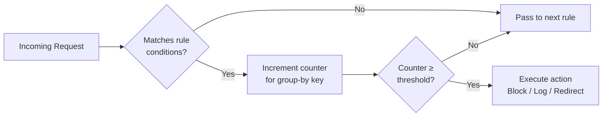
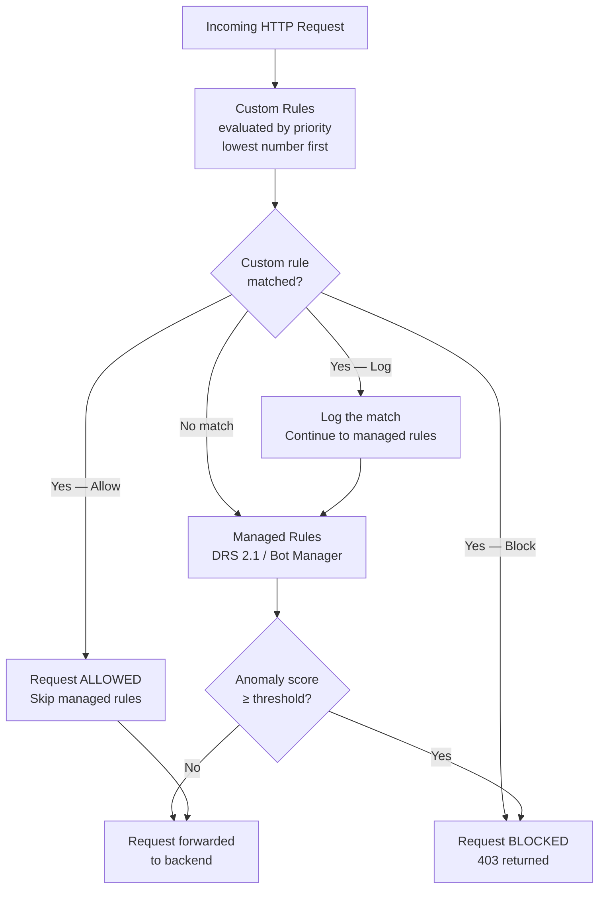

# :pencil2: Module 06 — Custom Rules, Rate Limiting & Geo-Filtering

!!! abstract "Application-specific protection beyond managed rules"

    Custom rules let you craft policies tailored to your application's unique traffic patterns.
    They are evaluated **before** managed rules and cover scenarios such as IP access
    control, geographic restrictions, rate limiting, and request-size constraints.
    This module walks through every component of custom rules and provides
    production-ready Azure CLI examples you can adapt to your own environment.

---

## When Managed Rules Are Not Enough

Managed rules—DRS 2.1 and the OWASP Core Rule Set—do an excellent job of
catching generic web attacks like SQL injection and cross-site scripting.
However, every application has its own business logic, and that logic creates
threat surfaces that no generic ruleset can anticipate.

Consider a few real-world examples:

- An **e-commerce checkout API** that should only accept traffic from your own
  front-end domain, never from unknown sources.
- A **partner portal** that must be reachable only from a handful of known
  corporate IP ranges.
- A **login endpoint** that needs rate limiting to stop credential-stuffing
  campaigns.
- An application that must comply with **data-residency regulations** and
  therefore must block requests originating from certain countries.

Custom rules address all of these gaps. They sit in front of the managed-rule
engine, so any request that matches a custom rule is resolved immediately—either
allowed, blocked, logged, or (on Front Door) redirected or challenged—without
ever reaching the managed ruleset evaluation.

!!! info "Evaluation order"

    Custom rules are always evaluated **first**, in ascending priority order
    (lowest number = highest priority). Only if no custom rule matches does
    the engine move on to managed rules.

---

## Custom Rule Components

Every custom rule is built from four fundamental pieces: **match conditions**,
a **priority**, an **action**, and an optional **rule type** (match or rate-limit).

### Match Conditions

A match condition specifies *what* to inspect, *how* to compare it, and *what*
value to look for. You can attach multiple conditions to a single rule; when you
do, they are combined with **AND** logic—every condition must match for the rule
to fire.

### Priority

Priority is an integer from 1 to 100. Lower numbers evaluate first. If two
rules could both match a request, the one with the lower priority number wins.

### Action Types

The action tells the WAF what to do when the rule fires:

| Action | Application Gateway | Front Door | Description |
|---|:---:|:---:|---|
| **Allow** | :white_check_mark: | :white_check_mark: | Stop evaluation — permit the request |
| **Block** | :white_check_mark: | :white_check_mark: | Return 403 Forbidden |
| **Log** | :white_check_mark: | :white_check_mark: | Record the match, continue evaluation |
| **Redirect** | :x: | :white_check_mark: | 302 redirect to a specified URL |
| **JSChallenge** | :x: | :white_check_mark: | Issue a JavaScript challenge (NEW 2025) |

!!! tip "Allow rules as allow-lists"

    Because **Allow** stops all further evaluation (both custom and managed
    rules), you can use a high-priority Allow rule to *whitelist* known-good
    traffic—like health-check probes or internal monitoring—before any
    blocking logic runs.

---

## Match Variables Reference

The table below lists every match variable available in custom rules, together
with the operators you can pair with each one.

| Match Variable | Description | Typical Operators |
|---|---|---|
| `RemoteAddr` | Client IP seen by the WAF (may be proxy IP) | IPMatch, GeoMatch |
| `SocketAddr` | TCP socket source address | IPMatch, GeoMatch |
| `RequestMethod` | HTTP method (GET, POST, …) | Equal |
| `QueryString` | Full query string after `?` | Contains, Equal, Regex, BeginsWith, EndsWith |
| `PostArgs` | Form-encoded body parameters | Contains, Equal, Regex |
| `RequestUri` | Full request URI including path + query | Contains, Equal, Regex, BeginsWith, EndsWith |
| `RequestHeaders` | Specific header by key (e.g. `User-Agent`) | Contains, Equal, Regex, BeginsWith, EndsWith |
| `RequestBody` | Entire request body (up to size limit) | Contains, Equal, Regex |
| `RequestCookies` | Specific cookie by name | Contains, Equal, Regex |

### Operators

| Operator | Description | Example |
|---|---|---|
| `Any` | Matches any value (always true for that variable) | Match all POST requests |
| `IPMatch` | Matches a list of IP addresses or CIDR ranges | `10.0.0.0/8` |
| `GeoMatch` | Matches ISO 3166-1 alpha-2 country codes | `US`, `BR`, `DE` |
| `Equal` | Exact string comparison | Method equals `DELETE` |
| `Contains` | Substring match | URI contains `/admin` |
| `LessThan` | Numeric / lexicographic comparison | Content-Length < 0 |
| `GreaterThan` | Numeric / lexicographic comparison | Content-Length > 8192 |
| `Regex` | Regular-expression match | `^Bearer\s[A-Za-z0-9\-._~+/]+=*$` |
| `BeginsWith` | Prefix match | URI begins with `/api/v2` |
| `EndsWith` | Suffix match | URI ends with `.php` |

!!! warning "Transforms"

    Transforms such as `Lowercase`, `UrlDecode`, and `HtmlEntityDecode` are
    applied **before** the operator comparison. Always apply `Lowercase` when
    using `Equal` or `Contains` on user-supplied values to avoid case-sensitivity
    bypasses.

---

## IP Allow/Block Lists

One of the most common custom-rule scenarios is restricting access to a known
set of source IPs. You might need this for an internal admin portal, a staging
environment, or a B2B API that only your partner's network should reach.

### Blocking a list of malicious IPs

The following rule blocks requests coming from two suspicious CIDR ranges and
assigns them priority 10 (very high).

=== "Application Gateway"

    ```bash
    az network application-gateway waf-policy custom-rule create \
      --resource-group rg-waf-workshop \
      --policy-name waf-policy-appgw \
      --name BlockMaliciousIPs \
      --priority 10 \
      --rule-type MatchRule \
      --action Block

    az network application-gateway waf-policy custom-rule match-condition add \
      --resource-group rg-waf-workshop \
      --policy-name waf-policy-appgw \
      --name BlockMaliciousIPs \
      --match-variables RemoteAddr \
      --operator IPMatch \
      --values "203.0.113.0/24" "198.51.100.0/24"
    ```

=== "Front Door"

    ```bash
    az network front-door waf-policy custom-rule create \
      --resource-group rg-waf-workshop \
      --policy-name wafPolicyFD \
      --name BlockMaliciousIPs \
      --priority 10 \
      --rule-type MatchRule \
      --action Block

    az network front-door waf-policy custom-rule match-condition add \
      --resource-group rg-waf-workshop \
      --policy-name wafPolicyFD \
      --name BlockMaliciousIPs \
      --match-variables RemoteAddr \
      --operator IPMatch \
      --values "203.0.113.0/24" "198.51.100.0/24"
    ```

### Allowing only trusted IPs (allow-list pattern)

To restrict an admin path to your corporate network, create an **Allow** rule
at a high priority and then a catch-all **Block** rule for everything else on
that path.

```bash
# Rule 1 — Allow corporate network
az network application-gateway waf-policy custom-rule create \
  --resource-group rg-waf-workshop \
  --policy-name waf-policy-appgw \
  --name AllowCorpNetwork \
  --priority 5 \
  --rule-type MatchRule \
  --action Allow

az network application-gateway waf-policy custom-rule match-condition add \
  --resource-group rg-waf-workshop \
  --policy-name waf-policy-appgw \
  --name AllowCorpNetwork \
  --match-variables RemoteAddr \
  --operator IPMatch \
  --values "10.1.0.0/16" "172.16.0.0/12"

az network application-gateway waf-policy custom-rule match-condition add \
  --resource-group rg-waf-workshop \
  --policy-name waf-policy-appgw \
  --name AllowCorpNetwork \
  --match-variables RequestUri \
  --operator BeginsWith \
  --values "/admin"

# Rule 2 — Block everyone else on /admin
az network application-gateway waf-policy custom-rule create \
  --resource-group rg-waf-workshop \
  --policy-name waf-policy-appgw \
  --name BlockAdminOthers \
  --priority 6 \
  --rule-type MatchRule \
  --action Block

az network application-gateway waf-policy custom-rule match-condition add \
  --resource-group rg-waf-workshop \
  --policy-name waf-policy-appgw \
  --name BlockAdminOthers \
  --match-variables RequestUri \
  --operator BeginsWith \
  --values "/admin"
```

!!! note "Why two rules?"

    Custom rules do not support an *else* branch. To express "allow X, block
    everyone else" you create two rules: a lower-numbered Allow rule and a
    higher-numbered Block rule that covers the same path. Because the Allow
    rule has a lower priority number, it evaluates first and lets trusted IPs
    through before the Block rule triggers for everyone else.

---

## Geo-Filtering

Geo-filtering leverages the `GeoMatch` operator on `RemoteAddr` (or
`SocketAddr`) to allow or deny requests based on the country of origin. Azure
WAF resolves the source IP to a country using a continuously updated IP
geolocation database.

### Blocking specific countries

```bash
az network application-gateway waf-policy custom-rule create \
  --resource-group rg-waf-workshop \
  --policy-name waf-policy-appgw \
  --name GeoBlockCountries \
  --priority 20 \
  --rule-type MatchRule \
  --action Block

az network application-gateway waf-policy custom-rule match-condition add \
  --resource-group rg-waf-workshop \
  --policy-name waf-policy-appgw \
  --name GeoBlockCountries \
  --match-variables RemoteAddr \
  --operator GeoMatch \
  --values "CN" "RU" "KP"
```

### Allowing only specific countries (negate)

If your application is meant exclusively for users in Brazil and the United
States, you can negate the GeoMatch condition: "if the country is **not** BR
and **not** US, then block."

```bash
az network application-gateway waf-policy custom-rule create \
  --resource-group rg-waf-workshop \
  --policy-name waf-policy-appgw \
  --name GeoAllowBRUS \
  --priority 25 \
  --rule-type MatchRule \
  --action Block

az network application-gateway waf-policy custom-rule match-condition add \
  --resource-group rg-waf-workshop \
  --policy-name waf-policy-appgw \
  --name GeoAllowBRUS \
  --match-variables RemoteAddr \
  --operator GeoMatch \
  --negate \
  --values "BR" "US"
```

!!! tip "Compliance considerations"

    Geo-filtering is useful for **data-residency** and **regulatory compliance**
    (e.g., LGPD, GDPR). However, keep in mind that VPNs and proxies can
    circumvent country-based restrictions, so geo-filtering should be one layer
    of a defense-in-depth strategy, not the sole control.

---

## Rate Limiting Rules

Rate-limit rules are a special type of custom rule that counts matching
requests over a sliding window and takes action only when a threshold is
exceeded. They are your first line of defense against credential stuffing,
API abuse, and application-layer DDoS.

### Core Concepts

| Parameter | Description | Allowed Values |
|---|---|---|
| **Threshold** | Maximum requests before the action triggers | 1 – 5 000 |
| **Duration** | Counting window | 1 minute or 5 minutes |
| **Group By** | How to bucket requests for counting | `ClientAddr`, `SocketAddr`, `GeoLocation`, `None` |

When `GroupBy` is set to `None`, the threshold applies to the aggregate of all
matching traffic—useful for protecting a single endpoint against floods from
distributed botnets.

!!! info "NEW in 2026 — X-Forwarded-For grouping"

    Applications behind a CDN, reverse proxy, or NAT gateway all appear to
    originate from the proxy's IP. The new **XFF-based grouping** option allows
    the WAF to extract the real client IP from the `X-Forwarded-For` header and
    rate-limit per original client. This prevents a single abusive client from
    exhausting the quota that would otherwise be shared by every user behind the
    same proxy.

### Rate-limit flow



### CLI example — Rate-limit login endpoint

=== "Application Gateway"

    ```bash
    az network application-gateway waf-policy custom-rule create \
      --resource-group rg-waf-workshop \
      --policy-name waf-policy-appgw \
      --name RateLimitLogin \
      --priority 30 \
      --rule-type RateLimitRule \
      --rate-limit-duration FiveMinutes \
      --rate-limit-threshold 50 \
      --group-by-user-session "ClientAddr" \
      --action Block

    az network application-gateway waf-policy custom-rule match-condition add \
      --resource-group rg-waf-workshop \
      --policy-name waf-policy-appgw \
      --name RateLimitLogin \
      --match-variables RequestUri \
      --operator BeginsWith \
      --values "/auth/login"

    az network application-gateway waf-policy custom-rule match-condition add \
      --resource-group rg-waf-workshop \
      --policy-name waf-policy-appgw \
      --name RateLimitLogin \
      --match-variables RequestMethod \
      --operator Equal \
      --values "POST"
    ```

=== "Front Door"

    ```bash
    az network front-door waf-policy custom-rule create \
      --resource-group rg-waf-workshop \
      --policy-name wafPolicyFD \
      --name RateLimitLogin \
      --priority 30 \
      --rule-type RateLimitRule \
      --rate-limit-duration FiveMinutes \
      --rate-limit-threshold 50 \
      --group-by-user-session "SocketAddr" \
      --action Block

    az network front-door waf-policy custom-rule match-condition add \
      --resource-group rg-waf-workshop \
      --policy-name wafPolicyFD \
      --name RateLimitLogin \
      --match-variables RequestUri \
      --operator BeginsWith \
      --values "/auth/login"

    az network front-door waf-policy custom-rule match-condition add \
      --resource-group rg-waf-workshop \
      --policy-name wafPolicyFD \
      --name RateLimitLogin \
      --match-variables RequestMethod \
      --operator Equal \
      --values "POST"
    ```

!!! warning "Choose the right group-by key"

    If your application sits behind a CDN or shared proxy, grouping by
    `ClientAddr` may rate-limit *all* users sharing that proxy IP. In those
    scenarios, use `SocketAddr` on Front Door or the new **XFF grouping**
    where available, so each real client is tracked individually.

---

## Request Size Constraints

Oversized request bodies can be used to exploit buffer-overflow
vulnerabilities, upload malicious files, or simply overwhelm your backend.
A custom rule with a `GreaterThan` operator on the `RequestBody` length lets
you reject requests before they reach your application.

```bash
az network application-gateway waf-policy custom-rule create \
  --resource-group rg-waf-workshop \
  --policy-name waf-policy-appgw \
  --name BlockLargeBody \
  --priority 15 \
  --rule-type MatchRule \
  --action Block

az network application-gateway waf-policy custom-rule match-condition add \
  --resource-group rg-waf-workshop \
  --policy-name waf-policy-appgw \
  --name BlockLargeBody \
  --match-variables RequestBody \
  --operator GreaterThan \
  --values "102400" \
  --transforms ""
```

In this example any request whose body exceeds 100 KB is immediately blocked.
Adjust the threshold according to your application's expected payload sizes—
a file-upload endpoint might need a more generous limit than a JSON API.

!!! tip "Complement with WAF engine body limits"

    The WAF engine itself has a **request body inspection limit** (128 KB by
    default on Application Gateway, 2 MB with the Next-Gen WAF engine). The
    custom rule size check runs *before* the managed-rule body inspection, so
    combining both gives you defence in depth.

---

## Combining Conditions

Within a single custom rule, every match condition is joined by **AND** logic:
all conditions must be true for the rule to fire. To express **OR** logic
between values, list multiple values in a single condition—the WAF treats them
as "match any of these."

### Example — Block suspicious user-agents on the API path

This rule fires only when *both* of the following are true:

1. The request URI starts with `/api/`.
2. The `User-Agent` header contains one of the suspicious strings.

```bash
az network application-gateway waf-policy custom-rule create \
  --resource-group rg-waf-workshop \
  --policy-name waf-policy-appgw \
  --name BlockSuspiciousUA \
  --priority 35 \
  --rule-type MatchRule \
  --action Block

# Condition 1 — URI starts with /api/
az network application-gateway waf-policy custom-rule match-condition add \
  --resource-group rg-waf-workshop \
  --policy-name waf-policy-appgw \
  --name BlockSuspiciousUA \
  --match-variables "RequestUri" \
  --operator BeginsWith \
  --values "/api/"

# Condition 2 — User-Agent contains any of these strings (OR within condition)
az network application-gateway waf-policy custom-rule match-condition add \
  --resource-group rg-waf-workshop \
  --policy-name waf-policy-appgw \
  --name BlockSuspiciousUA \
  --match-variables "RequestHeaders['User-Agent']" \
  --operator Contains \
  --values "python-requests" "curl/" "sqlmap" "nikto" \
  --transforms Lowercase
```

!!! info "Negation for OR across conditions"

    If you need OR logic *between* separate conditions (e.g., block if the IP
    is suspicious **or** the user-agent is suspicious), create two rules with
    consecutive priorities. Each rule handles one condition independently.

---

## Custom Rule Priority & Evaluation Order

Understanding evaluation order is critical for building a correct rule set.
The diagram below shows how the WAF engine processes every inbound request.



Key points to remember:

1. **Allow stops everything.** If an Allow rule matches, neither subsequent
   custom rules nor managed rules are evaluated.
2. **Block stops everything.** The request is rejected immediately.
3. **Log is transparent.** The match is recorded, but the request continues
   through the rest of the pipeline.
4. **Priority ties are undefined.** Always assign unique priority values to
   guarantee a deterministic evaluation order.

---

## Putting It All Together — A Complete Rule Set

The table below shows a realistic, layered rule set for a production web
application. Notice how the priority numbers create a logical evaluation order.

| Priority | Name | Type | Conditions | Action |
|:---:|---|---|---|---|
| 1 | AllowHealthProbes | Match | RemoteAddr IPMatch `168.63.129.16` | Allow |
| 5 | AllowCorpVPN | Match | RemoteAddr IPMatch `10.0.0.0/8` | Allow |
| 10 | BlockBadIPs | Match | RemoteAddr IPMatch (threat-intel list) | Block |
| 20 | GeoBlockCountries | Match | RemoteAddr GeoMatch `CN`, `RU`, `KP` | Block |
| 30 | RateLimitLogin | RateLimit | URI BeginsWith `/auth/login` AND Method = POST, 50 req / 5 min | Block |
| 35 | BlockSuspiciousUA | Match | URI BeginsWith `/api/` AND UA Contains `sqlmap`, `nikto` | Block |
| 40 | BlockLargeBody | Match | RequestBody > 100 KB | Block |
| — | *Managed rules* | — | DRS 2.1 anomaly scoring | Block/Log |

This layered approach ensures that known-good traffic is cleared first (priorities 1–5),
then known-bad traffic is rejected (priorities 10–35), then size constraints are
enforced (priority 40), and finally the managed ruleset catches any remaining
attack patterns.

---

## :test_tube: Related Labs

- [:octicons-beaker-24: LAB04 — Exclusions & Tuning](../labs/lab04.md)
- [:octicons-beaker-24: LAB08 — Rate Limiting](../labs/lab08.md)

---

## :white_check_mark: Key Takeaways

1. Custom rules fill the gaps that managed rules cannot cover—IP restrictions,
   geo-filtering, rate limiting, and application-specific logic.
2. Custom rules evaluate **before** managed rules, in ascending priority order.
3. **Allow** and **Block** actions stop all further evaluation; **Log** lets the
   request continue.
4. Use **AND** logic within a rule (multiple conditions) and separate rules for
   **OR** logic.
5. Rate-limit rules support sliding windows of 1 or 5 minutes, with grouping
   by client IP, socket IP, geo-location, or the new XFF header.
6. Always assign unique, well-spaced priority numbers so you can insert new
   rules later without renumbering.

---

## :books: References

- [Azure WAF custom rules overview — Microsoft Learn](https://learn.microsoft.com/azure/web-application-firewall/ag/custom-waf-rules-overview)
- [Configure WAF rate-limit rules — Microsoft Learn](https://learn.microsoft.com/azure/web-application-firewall/ag/rate-limiting-overview)
- [Geo-filtering on Azure Front Door — Microsoft Learn](https://learn.microsoft.com/azure/web-application-firewall/afds/waf-front-door-geo-filtering)
- [az network application-gateway waf-policy custom-rule — CLI Reference](https://learn.microsoft.com/cli/azure/network/application-gateway/waf-policy/custom-rule)
- [az network front-door waf-policy custom-rule — CLI Reference](https://learn.microsoft.com/cli/azure/network/front-door/waf-policy/custom-rule)

---

<div style="display: flex; justify-content: space-between;">
<div>[:octicons-arrow-left-24: Module 05 — Exclusions & Tuning](05-exclusions.md)</div>
<div>[Module 07 — Bot Protection :octicons-arrow-right-24:](07-bot-protection.md)</div>
</div>