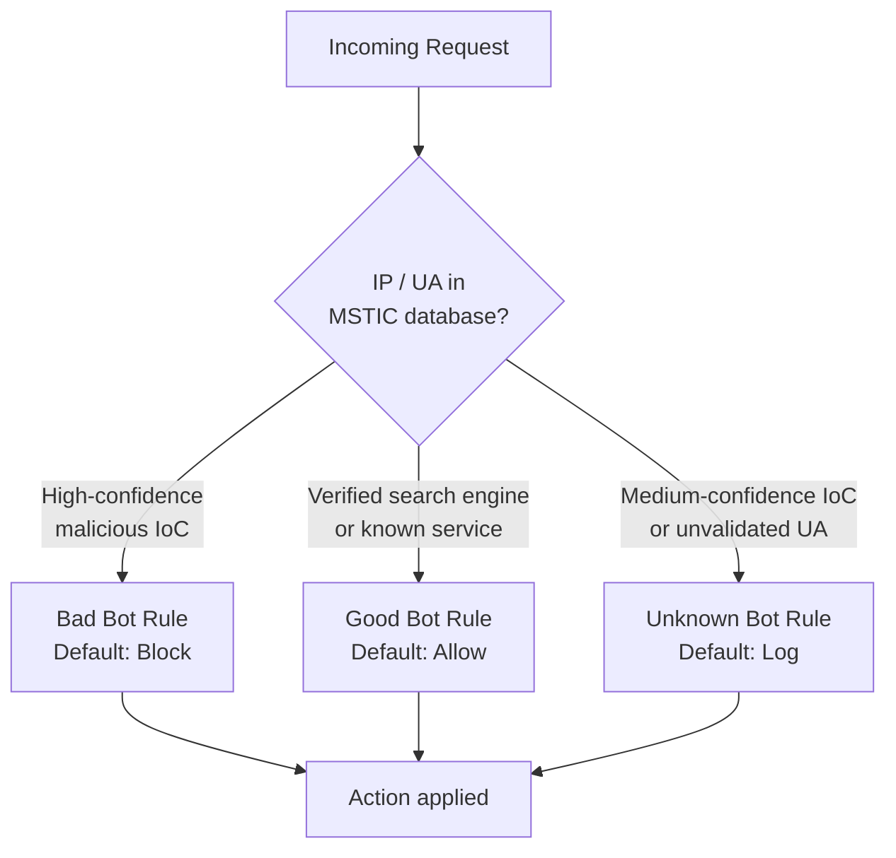
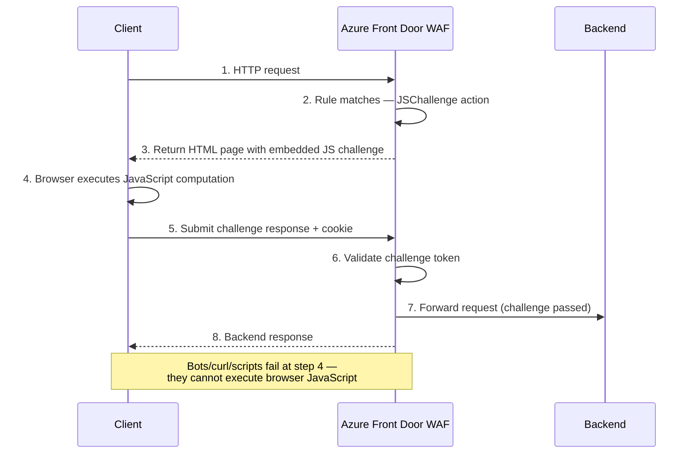

# :robot: Module 07 — Bot Protection & JavaScript Challenge

!!! abstract "Defending against automated threats with Microsoft Bot Manager"

    Approximately 30 % of all internet traffic is generated by bots. Some bots
    are beneficial—search-engine crawlers, uptime monitors, link checkers—but
    a significant share is malicious: credential stuffers, content scrapers,
    inventory hoarders, and Layer-7 DDoS tools. This module explains how Azure
    WAF's **Bot Manager ruleset**, powered by Microsoft Threat Intelligence,
    classifies and controls bot traffic, and introduces the **JavaScript
    Challenge**—a new, frictionless verification mechanism that separates real
    browsers from automated scripts.

---

## The Bot Problem

Bots are software programs that send HTTP requests without a human behind the
keyboard. Industry analyses consistently report that **30–40 % of all web
traffic** originates from bots, and the share is growing year over year.

### The cost to businesses

| Impact | Description |
|---|---|
| **Credential stuffing** | Bots replay stolen username/password pairs against login endpoints at high speed. |
| **Content scraping** | Competitors harvest pricing, inventory, or proprietary content. |
| **Inventory hoarding** | Bots add high-demand items to carts, preventing real customers from purchasing. |
| **Ad fraud** | Bots generate fake clicks or impressions, wasting advertising budgets. |
| **Application-layer DDoS** | High-volume bot requests exhaust backend resources without triggering network-layer protections. |
| **Skewed analytics** | Bot traffic pollutes business metrics, leading to flawed decisions. |

Without dedicated bot management, organisations end up over-provisioning
infrastructure to absorb bot load, mis-reading engagement data, and exposing
sensitive business logic to automated abuse.

---

## Good Bots vs. Bad Bots

Not all bots are harmful. A healthy bot-management strategy **protects** good
bots while **blocking** or **challenging** bad ones.

| Category | Examples | Desired Treatment |
|---|---|---|
| **Good bots** | Googlebot, Bingbot, Facebook crawler, LinkedIn bot, Pingdom, UptimeRobot | Allow (verified) |
| **Bad bots** | Credential stuffers, vulnerability scanners, spam bots, scraper frameworks | Block |
| **Unknown bots** | Unvalidated user agents claiming to be browsers, headless Chrome, custom scripts | Challenge or Log |

!!! tip "Verify, don't just trust"

    A request with a `User-Agent` header claiming to be *Googlebot* is not
    necessarily from Google. Azure WAF's Bot Manager performs **reverse DNS
    verification** on known good-bot IP ranges to confirm the bot's identity
    before allowing it through.

---

## Microsoft Bot Manager Ruleset

Azure WAF's bot protection is delivered through the **Bot Manager ruleset
version 1.1**, available on both Application Gateway WAF_v2 and Front Door
Premium. The ruleset is powered by **Microsoft Threat Intelligence (MSTIC)**
and is updated continuously without requiring any customer action.

### Three rule categories



#### Bad bots

Bad-bot rules match against IP addresses and user-agent strings sourced from
MSTIC's **high-confidence Indicators of Compromise (IoCs)**. These include
known command-and-control infrastructure, credential-stuffing networks, and
hosts with a history of malicious scanning.

The default action is **Block**, but you can override it to **Log** during
initial tuning or to **JSChallenge** on Front Door for a softer response.

#### Good bots

Good-bot rules identify traffic from **verified** search engines and
well-known services. Subcategories allow granular control:

| Subcategory | Includes |
|---|---|
| Search engines | Googlebot, Bingbot, Yandexbot, Baidubot |
| Social media | Facebook external hit, LinkedInBot, Twitterbot |
| Content verifiers | W3C validators, feed readers |
| Link checkers | Monitoring services, SEO tools |
| Miscellaneous | Apple ATS, WhatsApp link preview |

The default action is **Allow**. You can override individual subcategories—for
example, you might block a search engine you do not want indexing your internal
application.

#### Unknown bots

Unknown-bot rules cover traffic that exhibits bot-like characteristics—
unvalidated user-agent strings, requests from medium-confidence IoC
addresses—but cannot be definitively classified as good or bad.

The default action is **Log**. After reviewing logs you can escalate to
**Block** or use **JSChallenge** to let real browsers through while stopping
headless scripts.

---

## Bot Detection Mechanisms

The Bot Manager ruleset does not rely on a single signal. It combines multiple
detection techniques:

1. **IP reputation** — Each source IP is checked against MSTIC's continuously
   updated threat-intelligence database. Addresses associated with botnets,
   open proxies, and Tor exit nodes receive higher risk scores.

2. **User-agent validation** — The ruleset maintains a catalogue of known bot
   user-agent patterns. When a request claims to be from a recognised bot
   (e.g., `Googlebot/2.1`), the WAF performs a reverse DNS lookup to verify
   that the request truly originates from the expected IP range.

3. **Behavioural analysis** — Abnormal request patterns—high request rates
   from a single source, sequential crawling of every page, or requests
   lacking standard browser headers—raise the likelihood that traffic is
   automated.

4. **Fingerprinting (JS Challenge)** — When a JavaScript challenge is issued,
   the WAF evaluates whether the client can execute JavaScript, interact with
   the DOM, and return a valid challenge token. This is the strongest signal
   for separating real browsers from headless automation.

---

## Configuring Bot Protection

Bot protection must be explicitly enabled on your WAF policy. The steps differ
slightly between Application Gateway and Front Door.

=== "Application Gateway — Portal"

    1. Open your WAF policy in the Azure portal.
    2. Navigate to **Managed rules**.
    3. Under **Additional rule sets**, select **Microsoft_BotManagerRuleSet** version **1.1**.
    4. Expand each category (BadBots, GoodBots, UnknownBots) and review the
       default actions.
    5. Override individual rules as needed (e.g., set UnknownBots to Block).
    6. Click **Save**.

=== "Application Gateway — CLI"

    ```bash
    # Enable Bot Manager 1.1 on an existing WAF policy
    az network application-gateway waf-policy managed-rule rule-set add \
      --resource-group rg-waf-workshop \
      --policy-name waf-policy-appgw \
      --type Microsoft_BotManagerRuleSet \
      --version 1.1

    # Override the Unknown Bots category to Block
    az network application-gateway waf-policy managed-rule rule-set \
      rule-group-override set \
      --resource-group rg-waf-workshop \
      --policy-name waf-policy-appgw \
      --type Microsoft_BotManagerRuleSet \
      --version 1.1 \
      --group-name UnknownBots \
      --rules rule-id=300700 action=Block state=Enabled
    ```

=== "Front Door — CLI"

    ```bash
    # Enable Bot Manager 1.1 on a Front Door WAF policy
    az network front-door waf-policy managed-rule-definition add \
      --resource-group rg-waf-workshop \
      --policy-name wafPolicyFD \
      --type Microsoft_BotManagerRuleSet \
      --version 1.1

    # Override Bad Bots to JSChallenge instead of Block
    az network front-door waf-policy managed-rule-definition override add \
      --resource-group rg-waf-workshop \
      --policy-name wafPolicyFD \
      --type Microsoft_BotManagerRuleSet \
      --version 1.1 \
      --rule-group-id BadBots \
      --rule-id 100100 \
      --action JSChallenge
    ```

!!! warning "Enable diagnostics"

    Bot Manager rules generate log entries in the **WebApplicationFirewallLog**
    (Application Gateway) or **FrontDoorWebApplicationFirewallLog** (Front Door).
    Make sure you have diagnostic settings configured to send these logs to a
    Log Analytics workspace so you can analyse bot traffic patterns.

---

## JavaScript Challenge (NEW 2025/2026)

The **JavaScript Challenge (JSChallenge)** is a new action type available on
**Front Door** custom rules and bot-protection rule overrides. It provides a
frictionless way to distinguish real browsers from automated clients.

### How it works



1. A request arrives that matches a custom rule or bot-protection rule
   configured with the **JSChallenge** action.
2. Instead of blocking or allowing the request, the WAF returns an **HTML page**
   containing a lightweight JavaScript computation.
3. A real browser executes the script automatically—**no user interaction is
   required** (unlike a CAPTCHA).
4. The browser submits the computed result back to Front Door along with a
   **cookie**.
5. Front Door validates the result. If correct, the original request is
   forwarded to the backend, and the cookie is set so that **subsequent
   requests from the same session pass without re-challenge**.
6. Automated tools (curl, Python `requests`, headless scrapers without full
   JS engines) **fail** the challenge and never reach the backend.

### When to use JSChallenge

| Scenario | Why JSChallenge? |
|---|---|
| Unknown bot traffic | Avoid false-positive blocks while still filtering automation |
| Login / registration pages | Stop credential-stuffing bots without affecting real users |
| High-value API endpoints | Verify clients before granting access |
| Flash-sale / limited-stock pages | Prevent inventory-hoarding bots |

!!! info "JSChallenge availability"

    As of 2026, **JSChallenge** is available as an action on **Front Door**
    custom rules and bot-protection overrides. Application Gateway support
    may follow in a future release.

### CLI example — JSChallenge on a custom rule

```bash
az network front-door waf-policy custom-rule create \
  --resource-group rg-waf-workshop \
  --policy-name wafPolicyFD \
  --name ChallengeUnknownClients \
  --priority 15 \
  --rule-type MatchRule \
  --action JSChallenge

az network front-door waf-policy custom-rule match-condition add \
  --resource-group rg-waf-workshop \
  --policy-name wafPolicyFD \
  --name ChallengeUnknownClients \
  --match-variables RequestUri \
  --operator BeginsWith \
  --values "/checkout" "/login"
```

---

## Bot Protection & Zero Trust

Bot management is a natural extension of the **Zero Trust** security model.
The three Zero Trust principles map directly to bot-protection practices:

| Zero Trust Principle | Bot Protection Practice |
|---|---|
| **Verify explicitly** | Challenge unknown traffic with JSChallenge; verify good-bot identity with reverse DNS. |
| **Use least-privilege access** | Block bad bots by default; allow good bots only after verification. |
| **Assume breach** | Log everything — even allowed bot traffic — so you can detect anomalies and respond quickly. |

A mature bot-protection posture follows a continuous cycle:

1. **Enable** the Bot Manager ruleset in Detection mode.
2. **Analyse** logs for 1–2 weeks to understand baseline bot traffic.
3. **Tune** — override Unknown Bots to JSChallenge or Block based on findings.
4. **Switch** to Prevention mode.
5. **Monitor** continuously and refine rules as bot tactics evolve.

---

## Complete Configuration Example

The following end-to-end example creates a WAF policy on Application Gateway
with bot protection enabled and a custom rate-limit rule to further throttle
suspected bot traffic.

```bash
# Step 1 — Create the WAF policy
az network application-gateway waf-policy create \
  --resource-group rg-waf-workshop \
  --name waf-policy-bots \
  --type OWASP \
  --version 3.2

# Step 2 — Add the DRS 2.1 managed ruleset
az network application-gateway waf-policy managed-rule rule-set add \
  --resource-group rg-waf-workshop \
  --policy-name waf-policy-bots \
  --type Microsoft_DefaultRuleSet \
  --version 2.1

# Step 3 — Enable Bot Manager 1.1
az network application-gateway waf-policy managed-rule rule-set add \
  --resource-group rg-waf-workshop \
  --policy-name waf-policy-bots \
  --type Microsoft_BotManagerRuleSet \
  --version 1.1

# Step 4 — Switch policy to Prevention mode
az network application-gateway waf-policy policy-setting update \
  --resource-group rg-waf-workshop \
  --policy-name waf-policy-bots \
  --state Enabled \
  --mode Prevention

# Step 5 — Add a rate-limit rule targeting bot-heavy endpoints
az network application-gateway waf-policy custom-rule create \
  --resource-group rg-waf-workshop \
  --policy-name waf-policy-bots \
  --name RateLimitBotEndpoints \
  --priority 10 \
  --rule-type RateLimitRule \
  --rate-limit-duration OneMinute \
  --rate-limit-threshold 30 \
  --group-by-user-session "ClientAddr" \
  --action Block

az network application-gateway waf-policy custom-rule match-condition add \
  --resource-group rg-waf-workshop \
  --policy-name waf-policy-bots \
  --name RateLimitBotEndpoints \
  --match-variables RequestUri \
  --operator BeginsWith \
  --values "/api/products" "/api/pricing"
```

---

## :test_tube: Related Labs

- [:octicons-beaker-24: LAB07 — Bot Protection](../labs/lab07.md)

---

## :white_check_mark: Key Takeaways

1. **30 %+ of web traffic is bots** — without dedicated protection, your
   application bears the cost of automated abuse.
2. The **Bot Manager ruleset 1.1**, powered by Microsoft Threat Intelligence,
   classifies traffic into bad, good, and unknown bots.
3. Good bots are verified through **reverse DNS lookups**, not just user-agent
   strings.
4. **JSChallenge** (Front Door) offers frictionless browser verification—no
   CAPTCHA required—and is ideal for reducing false positives on unknown or
   rate-limited traffic.
5. Treat bot management as a **continuous process**: enable, log, analyse,
   tune, enforce, repeat.
6. Bot protection aligns with **Zero Trust** — verify explicitly, apply least
   privilege, and assume breach.

---

## :books: References

- [Azure WAF bot protection overview — Microsoft Learn](https://learn.microsoft.com/azure/web-application-firewall/ag/bot-protection-overview)
- [Configure bot protection on Application Gateway — Microsoft Learn](https://learn.microsoft.com/azure/web-application-firewall/ag/bot-protection)
- [Bot protection on Azure Front Door — Microsoft Learn](https://learn.microsoft.com/azure/web-application-firewall/afds/waf-front-door-bot-protection)
- [JavaScript Challenge action — Microsoft Learn](https://learn.microsoft.com/azure/web-application-firewall/afds/waf-front-door-jschallenge)
- [Microsoft Threat Intelligence — Microsoft Security](https://www.microsoft.com/en-us/security/business/threat-intelligence)

---

<div style="display: flex; justify-content: space-between;">
<div>[:octicons-arrow-left-24: Module 06 — Custom Rules](06-custom-rules.md)</div>
<div>[Module 08 — Application Gateway :octicons-arrow-right-24:](08-application-gateway.md)</div>
</div>