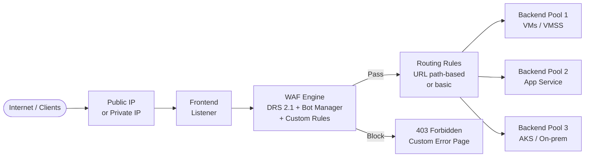
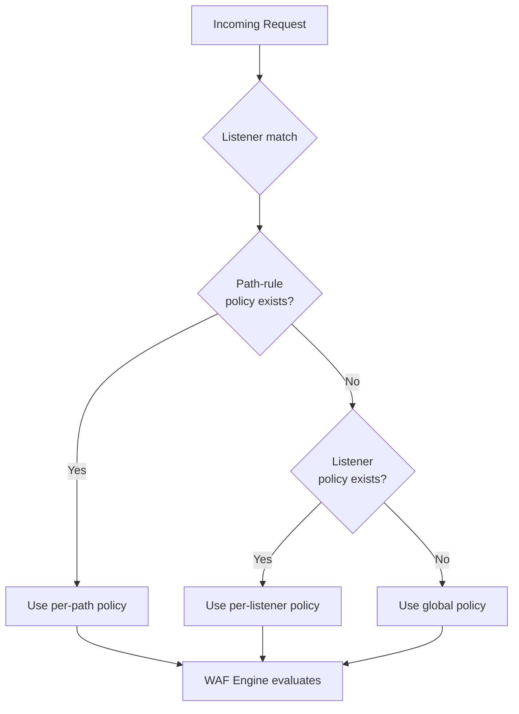

# :globe_with_meridians: Module 08 — Azure WAF on Application Gateway

!!! abstract "Regional Layer-7 protection for public and private web applications"

    Azure Application Gateway is a regional, fully managed **Layer-7 load
    balancer** and application delivery controller. When deployed with the
    **WAF_v2 SKU**, it embeds the Azure WAF engine directly into the request
    pipeline, giving you managed-rule protection, custom rules, bot management,
    and rate limiting for every HTTP/HTTPS request—without deploying a separate
    security appliance. This module explores the architecture, key features,
    and deployment considerations for running WAF on Application Gateway.

---

## What Is Application Gateway?

Azure Application Gateway is a **reverse proxy** that sits between clients and
your backend servers. It operates at **Layer 7 (HTTP/HTTPS)** and provides:

- **Load balancing** — distributes incoming requests across a pool of backend
  targets using round-robin, least-connections, or cookie-based affinity.
- **SSL/TLS termination** — offloads encryption so backends can serve plain
  HTTP, reducing compute overhead.
- **URL-based routing** — routes requests to different backend pools based on
  the URL path (e.g., `/images/*` → media pool, `/api/*` → API pool).
- **Multi-site hosting** — hosts multiple domains on a single gateway by
  matching the `Host` header.
- **WebSocket and HTTP/2 support** — full protocol support for modern
  applications.
- **Web Application Firewall** — the WAF_v2 SKU adds the Azure WAF engine
  inline, inspecting every request before it reaches the backend.

!!! info "Regional resource"

    Unlike Azure Front Door, which is a global service, Application Gateway is
    deployed into a **specific Azure region** and a **dedicated subnet**. This
    makes it ideal for applications that must remain within a single region for
    data-residency or latency reasons, and for **private/internal** applications
    that are not exposed to the internet.

---

## Application Gateway v2 Architecture

The diagram below shows the end-to-end request flow through an Application
Gateway with WAF enabled.



### Component breakdown

| Component | Role |
|---|---|
| **Public / Private IP** | Entry point. v2 supports public-only, private-only, or both. |
| **Frontend & Listener** | Defines the port, protocol (HTTP/HTTPS), and hostname to listen on. Multi-site listeners use SNI to route by `Host` header. |
| **WAF Engine** | Inline security layer. Evaluates custom rules, then managed rules (DRS 2.1), then Bot Manager. Runs only on the WAF_v2 SKU. |
| **Routing Rules** | Maps a listener to a backend pool. Path-based rules enable microservice-style routing. |
| **Backend Pool** | Group of targets: VMs, VM Scale Sets, App Services, AKS ingress, or on-premises servers via private connectivity. |
| **HTTP Settings** | Defines how the gateway communicates with backends: port, protocol, cookie affinity, connection draining, custom probe. |
| **Health Probes** | Periodically check backend health. Unhealthy targets are automatically removed from rotation. |

---

## SKU Comparison

Application Gateway is available in two v2 SKUs. Only the **WAF_v2** SKU
includes the WAF engine.

| Feature | Standard_v2 | WAF_v2 |
|---|:---:|:---:|
| Layer-7 load balancing | :white_check_mark: | :white_check_mark: |
| SSL/TLS termination | :white_check_mark: | :white_check_mark: |
| URL-based routing | :white_check_mark: | :white_check_mark: |
| Multi-site hosting | :white_check_mark: | :white_check_mark: |
| Autoscaling | :white_check_mark: | :white_check_mark: |
| Zone redundancy | :white_check_mark: | :white_check_mark: |
| WebSocket & HTTP/2 | :white_check_mark: | :white_check_mark: |
| Private Link | :white_check_mark: | :white_check_mark: |
| **WAF engine** | :x: | :white_check_mark: |
| **Managed rules (DRS 2.1)** | :x: | :white_check_mark: |
| **Bot Manager** | :x: | :white_check_mark: |
| **Custom rules** | :x: | :white_check_mark: |
| **Rate limiting** | :x: | :white_check_mark: |
| Pricing model | Fixed + capacity units | Fixed + capacity units (higher base) |

!!! warning "Upgrade path"

    You cannot add WAF to a Standard_v2 gateway after deployment. If you
    anticipate needing WAF, deploy with the **WAF_v2 SKU** from the start.
    Migration from Standard_v2 to WAF_v2 requires redeployment.

---

## WAF Integration

When you associate a **WAF policy** with an Application Gateway, the WAF
engine is injected into the request pipeline between the listener and the
routing rules. Every inbound request is inspected before it can reach a
backend server.

### Policy association scopes

WAF policies can be attached at three levels, from broadest to most specific:

| Scope | Description | Use case |
|---|---|---|
| **Global (gateway)** | Applies to all listeners and paths | Baseline protection for every app on the gateway |
| **Per-listener** | Applies to a specific listener (hostname) | Different policies for different domains on a multi-site gateway |
| **Per-path (URI)** | Applies to a specific URL-path rule | Stricter policy for `/admin`, relaxed policy for `/api/public` |

A more specific policy **overrides** a broader one. For example, a per-path
policy on `/api/*` takes precedence over the global policy for requests
matching that path.



!!! tip "Multi-tenant gateways"

    Per-listener and per-path policies are essential for **multi-tenant** or
    **multi-application** gateways. Each tenant can have its own WAF policy
    with tailored exclusions, custom rules, and even a different WAF mode
    (Detection vs. Prevention).

---

## Key Features for WAF (2026)

The Application Gateway WAF platform has matured significantly. Here is a
summary of the features available as of 2026:

| Feature | Details |
|---|---|
| **DRS 2.1** | Default managed ruleset with anomaly scoring. Recommended for all deployments. |
| **Bot Manager 1.1** | Microsoft Threat Intelligence–powered bot classification. |
| **Custom rules** | Up to 100 rules per policy — IP filtering, geo-blocking, header matching, etc. |
| **Rate limiting** | Threshold-based rules with 1- or 5-minute windows. Group by ClientAddr, SocketAddr, or XFF. |
| **Per-rule exclusions** | Skip specific request attributes for individual managed rules. |
| **Anomaly scoring** | Cumulative scoring across rule matches — reduces false positives. |
| **Request body inspection** | Default: up to 128 KB. Next-Gen WAF engine: up to 2 MB. |
| **Response inspection** | Evaluate response headers and body for data-leakage patterns. |
| **JavaScript Challenge** | Coming soon — currently available on Front Door. |
| **Private Link** | Secure, private connectivity to backends. |
| **Next-Gen WAF engine** | Opt-in engine with higher body limits and improved performance. |

---

## TLS Termination & End-to-End TLS

One of the most important roles of Application Gateway is **TLS termination**:
the gateway decrypts incoming HTTPS traffic at the frontend, inspects it with
the WAF engine, and then re-encrypts it (or forwards it as plain HTTP) to the
backend.

### Why TLS termination matters for WAF

The WAF engine can only inspect **decrypted** traffic. Without TLS termination,
the request payload is an opaque encrypted stream and the WAF cannot evaluate
it against managed or custom rules. Application Gateway handles this
transparently: it terminates TLS at the listener, feeds the plaintext request
through the WAF engine, and then optionally re-encrypts it for the backend
connection.

=== "TLS offload (frontend HTTPS → backend HTTP)"

    The gateway terminates TLS and forwards plaintext HTTP to the backend.
    This is the simplest configuration and reduces backend CPU usage.

    ```
    Client ──HTTPS──▶ App Gateway ──HTTP──▶ Backend
                       (TLS terminated,
                        WAF inspects
                        plaintext)
    ```

=== "End-to-end TLS (frontend HTTPS → backend HTTPS)"

    The gateway terminates the client TLS session, inspects the request with
    WAF, and then establishes a **new** TLS session to the backend. This
    provides encryption in transit across the entire path.

    ```
    Client ──HTTPS──▶ App Gateway ──HTTPS──▶ Backend
                       (TLS terminated,        (new TLS session)
                        WAF inspects
                        plaintext,
                        re-encrypts)
    ```

!!! note "Certificate management"

    Upload your TLS certificates to the gateway's listener (PFX format) or
    reference them from **Azure Key Vault** for automated rotation. For
    end-to-end TLS, the backend servers also need valid certificates that
    the gateway trusts (you can upload trusted root CAs in the HTTP settings).

---

## Security Headers via Header Rewrite

Application Gateway's **rewrite rules** let you inject, modify, or remove HTTP
headers on both request and response paths. This is a powerful complement to
WAF rules: while the WAF blocks malicious input, rewrite rules ensure the
**response** includes the security headers that modern browsers expect.

| Header | Value | Purpose |
|---|---|---|
| `Strict-Transport-Security` | `max-age=31536000; includeSubDomains` | Forces HTTPS for 1 year (HSTS) |
| `X-Content-Type-Options` | `nosniff` | Prevents MIME-type sniffing |
| `X-Frame-Options` | `DENY` or `SAMEORIGIN` | Prevents clickjacking |
| `Content-Security-Policy` | `default-src 'self'` | Controls resource loading sources |
| `X-XSS-Protection` | `1; mode=block` | Legacy XSS filter (older browsers) |
| `Referrer-Policy` | `strict-origin-when-cross-origin` | Controls referrer information leakage |

### Example — Add HSTS and remove server information

=== "Portal"

    1. Open Application Gateway → **Rewrites**.
    2. Click **+ Rewrite set** → name it `SecurityHeaders`.
    3. Associate it with a routing rule.
    4. **Add rewrite rule** → Action type: *Response header* → Set →
       Header name: `Strict-Transport-Security` →
       Value: `max-age=31536000; includeSubDomains`.
    5. Add another action → Delete → Header: `Server` (removes version info).
    6. Save.

=== "PowerShell"

    ```powershell
    # Define rewrite actions
    $hsts = New-AzApplicationGatewayRewriteRuleHeaderConfiguration `
      -HeaderName "Strict-Transport-Security" `
      -HeaderValue "max-age=31536000; includeSubDomains"

    $removeServer = New-AzApplicationGatewayRewriteRuleHeaderConfiguration `
      -HeaderName "Server"

    $actionSet = New-AzApplicationGatewayRewriteRuleActionSet `
      -ResponseHeaderConfiguration $hsts `
      -ResponseHeaderConfiguration $removeServer

    $rule = New-AzApplicationGatewayRewriteRule `
      -Name "AddSecurityHeaders" `
      -ActionSet $actionSet

    $rewriteSet = New-AzApplicationGatewayRewriteRuleSet `
      -Name "SecurityHeaders" `
      -RewriteRule $rule
    ```

!!! tip "Defence in depth"

    Rewrite-based security headers protect against **client-side attacks**
    (clickjacking, MIME confusion, insecure referrer leakage). WAF rules
    protect against **server-side attacks** (SQLi, XSS, RCE). Together they
    form a complete defence-in-depth strategy.

---

## Health Probes

Application Gateway uses **health probes** to monitor the availability of
backend servers. If a backend fails health checks, the gateway removes it from
rotation until it recovers.

### Default vs. custom probes

| Aspect | Default Probe | Custom Probe |
|---|---|---|
| Path | `/` | Any path (e.g., `/health`) |
| Interval | 30 seconds | Configurable (5–300 s) |
| Timeout | 30 seconds | Configurable |
| Unhealthy threshold | 3 consecutive failures | Configurable |
| Protocol | Same as HTTP setting | HTTP or HTTPS |
| Match conditions | 200–399 status code | Custom status codes + body match |

!!! info "Health probes and WAF"

    Health-probe requests originate from the Application Gateway infrastructure
    IP `168.63.129.16`. If your WAF policy has restrictive custom rules (e.g.,
    an IP allow-list), make sure to create a high-priority **Allow** rule for
    this IP so that probes are not blocked.

---

## Deployment Considerations

### Subnet requirements

Application Gateway v2 requires a **dedicated subnet** with no other resources.
The subnet size determines the maximum number of gateway instances:

| Subnet Size | Usable IPs | Recommended For |
|---|---|---|
| `/28` | 11 | Dev/test (limited scaling) |
| `/26` | 59 | Small production workloads |
| `/24` | 251 | Large production workloads with autoscaling |

!!! warning "Plan subnet size early"

    Changing the subnet after deployment requires redeploying the gateway. Use
    at least `/26` for production to allow room for autoscaling.

### Network Security Group (NSG) rules

The gateway subnet requires specific inbound rules:

| Source | Ports | Purpose |
|---|---|---|
| `GatewayManager` | `65200-65535` | Azure infrastructure management |
| `Internet` (or your sources) | `80`, `443` | Client traffic |
| `AzureLoadBalancer` | Any | Health probes |

### Autoscaling and capacity units

Application Gateway v2 supports **autoscaling** between a minimum and maximum
number of capacity units. Each capacity unit provides approximately:

- 2 500 persistent connections
- 2 500 new connections per second
- 2.22 Mbps throughput

Set a minimum instance count of **2** for production to ensure high availability
during scale-in events.

### Availability zones

Deploy across **multiple availability zones** (e.g., zones 1, 2, 3) for
regional resilience. Zone-redundant deployment survives the failure of an
entire data centre within the region.

---

## When to Use Application Gateway WAF

Application Gateway WAF is the right choice when your requirements include:

| Requirement | Why Application Gateway |
|---|---|
| **Regional deployment** | Gateway lives in a single Azure region—ideal for data-residency compliance. |
| **Private / internal applications** | Supports private-only frontends (no public IP). |
| **URL-based routing** | Route `/api/*` and `/web/*` to different backend pools. |
| **Multi-site hosting** | Host multiple domains on one gateway with per-listener WAF policies. |
| **WebSocket support** | Full WebSocket pass-through with WAF inspection. |
| **Backend variety** | Backends can be VMs, VMSS, App Service, AKS, or on-premises via ExpressRoute / VPN. |
| **SSL offloading** | Reduce compute load on backends. |
| **Combined with Front Door** | Use Front Door for global routing + Application Gateway for regional WAF and routing. |

!!! note "When to choose Front Door instead"

    If your application is globally distributed, requires edge caching, or
    needs Anycast-based DDoS absorption, **Azure Front Door with WAF** is a
    better fit. Many organisations use **both**: Front Door at the edge and
    Application Gateway in the region.

---

## Deploying Application Gateway with WAF — Complete CLI Example

The following script creates a resource group, virtual network, WAF policy,
and Application Gateway WAF_v2 from scratch.

```bash
# Variables
RG="rg-waf-workshop"
LOCATION="eastus2"
VNET="vnet-waf"
SUBNET_AG="snet-appgw"
SUBNET_BE="snet-backend"
POLICY="waf-policy-appgw"
APPGW="appgw-waf-workshop"
PIP="pip-appgw"

# 1. Resource group
az group create --name $RG --location $LOCATION

# 2. Virtual network with two subnets
az network vnet create \
  --resource-group $RG \
  --name $VNET \
  --address-prefix 10.0.0.0/16

az network vnet subnet create \
  --resource-group $RG \
  --vnet-name $VNET \
  --name $SUBNET_AG \
  --address-prefix 10.0.1.0/24

az network vnet subnet create \
  --resource-group $RG \
  --vnet-name $VNET \
  --name $SUBNET_BE \
  --address-prefix 10.0.2.0/24

# 3. Public IP
az network public-ip create \
  --resource-group $RG \
  --name $PIP \
  --sku Standard \
  --allocation-method Static \
  --zone 1 2 3

# 4. WAF policy with DRS 2.1
az network application-gateway waf-policy create \
  --resource-group $RG \
  --name $POLICY

az network application-gateway waf-policy managed-rule rule-set add \
  --resource-group $RG \
  --policy-name $POLICY \
  --type Microsoft_DefaultRuleSet \
  --version 2.1

az network application-gateway waf-policy managed-rule rule-set add \
  --resource-group $RG \
  --policy-name $POLICY \
  --type Microsoft_BotManagerRuleSet \
  --version 1.1

az network application-gateway waf-policy policy-setting update \
  --resource-group $RG \
  --policy-name $POLICY \
  --state Enabled \
  --mode Prevention

# 5. Application Gateway WAF_v2
az network application-gateway create \
  --resource-group $RG \
  --name $APPGW \
  --location $LOCATION \
  --sku WAF_v2 \
  --capacity 2 \
  --vnet-name $VNET \
  --subnet $SUBNET_AG \
  --public-ip-address $PIP \
  --http-settings-port 80 \
  --http-settings-protocol Http \
  --frontend-port 80 \
  --routing-rule-type Basic \
  --servers 10.0.2.4 10.0.2.5 \
  --waf-policy $POLICY \
  --zones 1 2 3 \
  --priority 100
```

!!! tip "Add HTTPS listener"

    The example above creates an HTTP listener for simplicity. In production,
    always configure an **HTTPS listener** with a TLS certificate and add an
    HTTP-to-HTTPS redirect rule. You can reference a Key Vault certificate
    using `--ssl-cert-name` and a managed identity.

---

## :test_tube: Related Labs

- [:octicons-beaker-24: LAB01 — Deploy Application Gateway WAF](../labs/lab01.md)
- [:octicons-beaker-24: LAB02 — Detection Mode](../labs/lab02.md)
- [:octicons-beaker-24: LAB05 — Prevention Mode](../labs/lab05.md)

---

## :white_check_mark: Key Takeaways

1. Application Gateway is a **regional Layer-7 load balancer** with built-in
   WAF when deployed with the **WAF_v2** SKU.
2. The WAF engine sits **inline** between the listener and the routing rules,
   inspecting every decrypted request.
3. WAF policies can be scoped **globally**, **per-listener**, or **per-path**
   for multi-tenant and multi-app scenarios.
4. TLS termination is essential — the WAF can only inspect plaintext traffic.
   Use end-to-end TLS for encryption in transit to backends.
5. Header **rewrite rules** complement WAF by injecting security response
   headers (HSTS, CSP, X-Frame-Options).
6. Deploy into a **dedicated subnet** (at least `/26`) with proper NSG rules
   and enable **zone redundancy** for production.
7. Use Application Gateway WAF for **regional**, **private**, or **multi-site**
   workloads. Pair with Front Door for **global** coverage.

---

## :books: References

- [Azure Application Gateway documentation — Microsoft Learn](https://learn.microsoft.com/azure/application-gateway/overview)
- [Application Gateway WAF overview — Microsoft Learn](https://learn.microsoft.com/azure/web-application-firewall/ag/ag-overview)
- [WAF policy per-site configuration — Microsoft Learn](https://learn.microsoft.com/azure/web-application-firewall/ag/per-site-policies)
- [Application Gateway v2 autoscaling — Microsoft Learn](https://learn.microsoft.com/azure/application-gateway/application-gateway-autoscaling-zone-redundant)
- [TLS termination and end-to-end TLS — Microsoft Learn](https://learn.microsoft.com/azure/application-gateway/ssl-overview)
- [Rewrite HTTP headers — Microsoft Learn](https://learn.microsoft.com/azure/application-gateway/rewrite-http-headers-url)
- [az network application-gateway — CLI Reference](https://learn.microsoft.com/cli/azure/network/application-gateway)

---

<div style="display: flex; justify-content: space-between;">
<div>[:octicons-arrow-left-24: Module 07 — Bot Protection](07-bot-protection.md)</div>
<div>[Module 09 — Front Door :octicons-arrow-right-24:](09-front-door.md)</div>
</div>