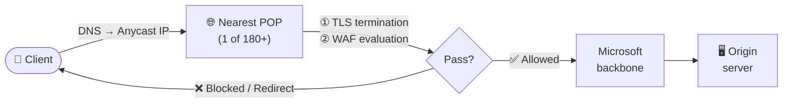

# :earth_americas: Module 09 — Azure WAF on Front Door Premium

!!! abstract "Global edge WAF protection with Azure Front Door Premium"
    Azure Front Door is Microsoft's cloud-native, global content-delivery and application-acceleration platform. When paired with the **Premium** tier, it delivers a fully managed Web Application Firewall that inspects every request at the edge—long before traffic ever touches your origin servers. This module explains how Front Door works, how WAF evaluation happens at more than 180 Points of Presence (POPs), and how to lock down your backend so that attackers cannot bypass the WAF.

---

## 1 — What Is Azure Front Door?

Azure Front Door is a **global, Anycast-based** application delivery network that combines content caching, dynamic site acceleration, intelligent routing, and built-in security services into a single managed platform.

When a user sends a request, DNS resolution returns the IP address of the nearest Microsoft POP. Because Front Door uses **Anycast**, every POP advertises the same IP range, and BGP automatically steers the user to the geographically closest location. The POP terminates the TLS connection, evaluates WAF rules, serves cached content if possible, and—only when necessary—forwards the request to the origin over Microsoft's private backbone.

This architecture gives you three immediate benefits:

1. **Lower latency** — TLS handshake and WAF inspection happen at the edge, not at your data centre.
2. **Higher resilience** — attacks are absorbed across the global edge network before they can concentrate on a single origin.
3. **Simpler operations** — one Front Door profile can route to origins in multiple Azure regions, on-premises data centres, or even other cloud providers.

!!! info "Front Door vs Application Gateway"
    Application Gateway is a **regional** Layer-7 load balancer deployed inside a single Azure Virtual Network. Front Door is **global**—it has no region, no VNet, and no public IP that you manage. Use Application Gateway when you need to protect private workloads or require per-site/per-URI WAF policies. Use Front Door when your application is public-facing and serves a geographically distributed audience.

---

## 2 — Front Door Tiers: Standard vs Premium

Azure Front Door is offered in two tiers. The choice of tier directly determines which WAF capabilities are available.

| Capability | Standard | Premium |
|---|---|---|
| Global load balancing & failover | :white_check_mark: | :white_check_mark: |
| SSL offload & custom domains | :white_check_mark: | :white_check_mark: |
| Static content caching | :white_check_mark: | :white_check_mark: |
| Dynamic site acceleration | :white_check_mark: | :white_check_mark: |
| **WAF — custom rules** | :white_check_mark: | :white_check_mark: |
| **WAF — managed rules (DRS 2.1)** | :x: | :white_check_mark: |
| **WAF — bot protection managed rule set** | :x: | :white_check_mark: |
| **WAF — JavaScript Challenge action** | :x: | :white_check_mark: |
| Private Link to origins | :x: | :white_check_mark: |
| Enhanced analytics & reports | :x: | :white_check_mark: |

!!! warning "Standard tier limitations"
    If you deploy a WAF policy on the Standard tier you can only write **custom rules** (IP allow/deny, geo-filtering, rate limiting, etc.). Managed rule sets that protect against OWASP Top-10 attacks and bot traffic are **exclusive to Premium**. For production workloads that require comprehensive Layer-7 protection, always choose **Premium**.

Upgrading from Standard to Premium is supported as a non-disruptive operation and is now generally available.

---

## 3 — How WAF Works at the Edge

The single most important concept to understand about Front Door WAF is **where** inspection happens. Unlike a regional WAF on Application Gateway, Front Door WAF evaluates every request at the POP closest to the client. This means an attacker in São Paulo is blocked in São Paulo, and the malicious traffic never traverses the transatlantic backbone toward your origin in West Europe.



**Evaluation order inside the POP:**

1. **Custom rules** are evaluated first, in priority order (lowest number = highest priority).
2. **Rate-limit rules** are evaluated next.
3. **Bot protection managed rules** follow.
4. **Managed rules (DRS 2.1)** are evaluated last, using anomaly scoring.

If any rule triggers a terminating action (Block, Redirect, JSChallenge), evaluation stops and the configured response is returned to the client immediately.

!!! tip "Performance impact"
    WAF evaluation at the edge adds **less than 2 ms of latency** on average. Because caching also happens at the POP, requests for static assets that are served from cache never reach the WAF engine at all—they are returned even faster.

---

## 4 — Creating and Associating a WAF Policy

A WAF policy on Front Door is an independent Azure resource of type `Microsoft.Network/FrontDoorWebApplicationFirewallPolicies`. You create the policy, configure its rules, and then **associate** it with one or more Front Door endpoints or custom domains through a *security policy* resource.

### Creating a WAF policy

=== "Azure CLI"

    ```bash
    # Create a resource group (if not already present)
    az group create \
      --name rg-waf-workshop \
      --location eastus2

    # Create a WAF policy for Front Door Premium in Detection mode
    az network front-door waf-policy create \
      --name wafpolicyFrontDoor \
      --resource-group rg-waf-workshop \
      --sku Premium_AzureFrontDoor \
      --mode Detection \
      --redirect-url "https://www.contoso.com/blocked.html"
    ```

=== "Azure PowerShell"

    ```powershell
    # Create WAF policy for Front Door Premium
    New-AzFrontDoorWafPolicy `
      -Name "wafpolicyFrontDoor" `
      -ResourceGroupName "rg-waf-workshop" `
      -Sku "Premium_AzureFrontDoor" `
      -Mode "Detection" `
      -RedirectUrl "https://www.contoso.com/blocked.html"
    ```

### Adding managed rules (DRS 2.1)

=== "Azure CLI"

    ```bash
    # Add DRS 2.1 managed rule set
    az network front-door waf-policy managed-rules add \
      --policy-name wafpolicyFrontDoor \
      --resource-group rg-waf-workshop \
      --type Microsoft_DefaultRuleSet \
      --version 2.1 \
      --action Block

    # Add bot protection managed rule set
    az network front-door waf-policy managed-rules add \
      --policy-name wafpolicyFrontDoor \
      --resource-group rg-waf-workshop \
      --type Microsoft_BotManagerRuleSet \
      --version 1.1 \
      --action Block
    ```

=== "Azure PowerShell"

    ```powershell
    # Add DRS 2.1 managed rule set
    $drs = New-AzFrontDoorWafManagedRuleObject `
      -Type "Microsoft_DefaultRuleSet" `
      -Version "2.1"

    # Add bot protection managed rule set
    $bot = New-AzFrontDoorWafManagedRuleObject `
      -Type "Microsoft_BotManagerRuleSet" `
      -Version "1.1"

    # Update the policy with both rule sets
    Update-AzFrontDoorWafPolicy `
      -Name "wafpolicyFrontDoor" `
      -ResourceGroupName "rg-waf-workshop" `
      -ManagedRule $drs, $bot
    ```

### Associating the WAF policy with a Front Door endpoint

After the policy exists, you link it to your Front Door profile through a **security policy**. A security policy binds a WAF policy to one or more domains (endpoints or custom domains).

```bash
# Get the WAF policy resource ID
WAF_ID=$(az network front-door waf-policy show \
  --name wafpolicyFrontDoor \
  --resource-group rg-waf-workshop \
  --query id -o tsv)

# Create a security policy that binds the WAF to an endpoint
az afd security-policy create \
  --profile-name myFrontDoor \
  --resource-group rg-waf-workshop \
  --security-policy-name secpol-waf \
  --domains /subscriptions/<sub>/resourceGroups/rg-waf-workshop/providers/Microsoft.Cdn/profiles/myFrontDoor/afdEndpoints/myEndpoint \
  --waf-policy $WAF_ID
```

!!! note "One policy per domain"
    Each Front Door domain (endpoint or custom domain) can be associated with **at most one** WAF policy at a time. If you need different rule configurations for different domains, create separate WAF policies.

---

## 5 — Key WAF Capabilities on Front Door

### 5.1 DRS 2.1 Managed Rules

The Default Rule Set 2.1 provides protection against the OWASP Top-10 categories including SQL injection, cross-site scripting, local file inclusion, remote code execution, and protocol violations. It also includes **Microsoft Threat Intelligence Collection** rules that leverage Microsoft's global threat-intelligence feeds to block known-malicious IP addresses and zero-day attack patterns.

DRS 2.1 uses **anomaly scoring**. Each rule that matches adds a severity-based score (Critical = 5, Error = 4, Warning = 3, Notice = 2). The request is only blocked when the cumulative score meets or exceeds the **anomaly score threshold**, which defaults to **5**. This dramatically reduces false positives compared with the legacy "block-on-first-match" mode of DRS 1.x.

### 5.2 Bot Protection

The Bot Manager Rule Set classifies bots into three categories: **good bots** (e.g., Googlebot), **bad bots** (known scrapers and attack tools), and **unknown bots**. You can configure different actions for each category—for example, allow good bots, block bad bots, and issue a JavaScript Challenge to unknown bots.

### 5.3 JavaScript Challenge (JSChallenge)

The JavaScript Challenge action is exclusive to Front Door Premium. When triggered, Front Door returns a small JavaScript snippet that a real browser executes automatically and transparently. Automated bots that cannot execute JavaScript are blocked. Unlike a CAPTCHA, the JS Challenge is **invisible to the end user** and does not degrade the user experience.

### 5.4 Custom Rules

Custom rules let you define match conditions on virtually any part of the HTTP request: IP address, geo-location, URI path, query string, request headers, cookies, HTTP method, and request body. Each custom rule has a priority (0–999) and an action. Conditions can be combined with logical AND/OR operators.

### 5.5 Rate Limiting

Rate-limit rules are a special type of custom rule. You define a match condition, a time window (1 or 5 minutes), and a threshold (the maximum number of requests). When a client exceeds the threshold, the configured action applies for the remainder of the window. Rate limiting on Front Door is applied **per POP**, which means a globally distributed attacker may exceed the effective limit by the number of POPs involved.

### 5.6 Geo-Filtering

Geo-filtering custom rules let you allow or block traffic based on the originating country/region code. Front Door resolves the client IP to a country using its own GeoIP database. This is useful for compliance scenarios where an application must not be accessible from certain jurisdictions.

### 5.7 Redirect Action

The **Redirect** action is unique to Front Door WAF—it is not available on Application Gateway. When a rule triggers a redirect, Front Door returns an HTTP 302 response pointing the client to a URL that you specify (the `redirectUrl` property on the policy). This is ideal for directing blocked users to a custom "access denied" page or a CAPTCHA challenge hosted on a separate domain.

### 5.8 Anomaly Scoring

As described above, DRS 2.1 uses anomaly scoring with a configurable threshold. You can lower the threshold (e.g., to 3) for stricter security or raise it (e.g., to 10) to reduce false positives while you tune exclusions. Microsoft recommends starting at the default of 5.

---

## 6 — Origin Lockdown

!!! danger "Critical security practice"
    If your origin (App Service, VM, Container App, etc.) is publicly reachable, an attacker who discovers its IP address or hostname can send requests **directly**, completely bypassing Front Door and its WAF. Origin lockdown is not optional—it is essential.

Origin lockdown ensures that your backend accepts traffic **only** from Azure Front Door. There are three complementary methods, and Microsoft recommends combining at least two.

### Method 1 — Front Door Service Tag on App Service Access Restrictions

If your origin is an Azure App Service, you can configure **access restrictions** to allow only the `AzureFrontDoor.Backend` service tag.

```bash
# Add an access restriction rule that allows only Front Door traffic
az webapp config access-restriction add \
  --name myWebApp \
  --resource-group rg-waf-workshop \
  --priority 100 \
  --rule-name "AllowFrontDoor" \
  --service-tag AzureFrontDoor.Backend \
  --action Allow \
  --http-header x-azure-fdid=<your-front-door-id>
```

The `--http-header x-azure-fdid` filter is crucial. Without it, any Azure Front Door instance—not just yours—could reach the backend, because all Front Door profiles share the same service tag IP ranges.

### Method 2 — NSG Rules with Front Door IP Ranges

For VM-based or AKS-based origins behind a load balancer, use a Network Security Group (NSG) rule with the `AzureFrontDoor.Backend` service tag.

```bash
# Create an NSG rule allowing only Front Door backend IPs
az network nsg rule create \
  --nsg-name myOriginNSG \
  --resource-group rg-waf-workshop \
  --name AllowFrontDoor \
  --priority 100 \
  --direction Inbound \
  --access Allow \
  --protocol Tcp \
  --destination-port-ranges 80 443 \
  --source-address-prefixes AzureFrontDoor.Backend
```

!!! warning "NSG alone is not enough"
    The `AzureFrontDoor.Backend` service tag includes IP ranges for **all** Front Door instances. You must also validate the `X-Azure-FDID` header in your application code or reverse proxy to ensure the request came from **your** specific Front Door profile.

### Method 3 — X-Azure-FDID Header Validation

Every request that Front Door sends to the origin includes an `X-Azure-FDID` header containing the unique identifier of the Front Door profile. You can validate this header at your web server, application code, or reverse proxy.

```bash
# Retrieve your Front Door profile ID
az afd profile show \
  --profile-name myFrontDoor \
  --resource-group rg-waf-workshop \
  --query frontDoorId -o tsv
```

An example NGINX validation snippet:

```nginx
# Block requests that are not from our Front Door instance
if ($http_x_azure_fdid != "xxxxxxxx-xxxx-xxxx-xxxx-xxxxxxxxxxxx") {
    return 403;
}
```

### Method 4 — Private Link (Strongest)

Front Door Premium supports **Private Link** connections to App Service, Storage, Azure Functions, and internal load balancers. When Private Link is configured, the origin has no public endpoint at all—traffic flows entirely over the Microsoft backbone. This is the **strongest** form of origin lockdown because there is no public IP for an attacker to target.

```bash
# Enable Private Link origin in Front Door
az afd origin create \
  --profile-name myFrontDoor \
  --resource-group rg-waf-workshop \
  --origin-group-name myOriginGroup \
  --origin-name myPrivateOrigin \
  --host-name mywebapp.azurewebsites.net \
  --enable-private-link true \
  --private-link-location eastus2 \
  --private-link-resource /subscriptions/<sub>/resourceGroups/rg-waf-workshop/providers/Microsoft.Web/sites/myWebApp \
  --private-link-request-message "Front Door Private Link"
```

!!! tip "Approve the private endpoint"
    After creating the Private Link origin, you must **approve** the pending private-endpoint connection on the backend resource before traffic can flow.

---

## 7 — WAF Actions on Front Door

Front Door WAF supports a richer set of actions than Application Gateway WAF. Understanding each action is key to designing effective policies.

| Action | Behavior | Available On |
|---|---|---|
| **Allow** | Permit the request without further rule evaluation | Custom rules |
| **Block** | Return a 403 Forbidden response (or custom error body) | Custom & managed rules |
| **Log** | Record the match in diagnostics but take no blocking action | Custom & managed rules |
| **Redirect** | Return an HTTP 302 to the configured `redirectUrl` | Custom rules (FD only) |
| **JSChallenge** | Present an invisible JavaScript challenge to the client | Custom & managed rules (Premium) |
| **AnomalyScoring** | Add the rule's severity score to the running total | Managed rules (DRS 2.1) |

The **Redirect** action is unique to Front Door and does not exist on Application Gateway. It is especially useful for directing users to a branded "you have been blocked" page hosted on a separate static site, rather than showing a generic 403 page.

The **AnomalyScoring** action is the default for individual managed rules under DRS 2.1. It does not block or log by itself; instead, it increments the anomaly score. The final block decision is made only when the cumulative score meets the threshold.

---

## 8 — Front Door WAF vs Application Gateway WAF

The following table provides a detailed comparison to help you choose the right WAF platform for a given workload.

| Dimension | Front Door WAF | Application Gateway WAF |
|---|---|---|
| **Scope** | Global (180+ POPs worldwide) | Regional (single Azure region) |
| **Deployment** | Cloud-native, no VNet | Inside a VNet and subnet |
| **Protects** | Public endpoints only | Public **and** private endpoints |
| **Managed rules** | DRS 2.1 (Premium only) | DRS 2.1, CRS 3.2 |
| **Bot protection** | Yes (Premium) | Yes |
| **JS Challenge** | Yes (Premium) | No |
| **Redirect action** | Yes | No |
| **Per-site / per-URI policy** | No (per-domain only) | Yes |
| **Private Link to origin** | Yes (Premium) | Yes |
| **SSL termination** | At the edge (POP) | At the gateway |
| **Caching** | Yes (built-in CDN) | No |
| **DDoS protection** | Built-in at edge | Requires DDoS Protection plan on VNet |
| **Rate limiting grouping** | Per POP | Per gateway instance |
| **Pricing model** | Per request + data transfer | Per gateway-hour + capacity units |
| **Best for** | Global public apps, CDN + WAF | Regional apps, private apps, multi-site |

!!! info "Using both together"
    For maximum protection on globally distributed applications, you can place **Front Door Premium** in front of **Application Gateway v2**. Front Door handles global load balancing, edge caching, and first-pass WAF filtering. Application Gateway provides regional load balancing, per-site policies, and a second WAF inspection layer. This "WAF sandwich" architecture is recommended by Microsoft for high-security scenarios.

---

## 9 — When to Use Front Door WAF

Front Door WAF is the right choice when your scenario matches one or more of the following patterns:

- **Public-facing web applications** — the origin must be accessible from the internet, and you want Layer-7 protection before traffic reaches it.
- **Global user base** — your audience is geographically distributed, and you need low-latency TLS termination and WAF inspection at the edge.
- **CDN + WAF combined** — you need content caching and application security in a single service, without managing separate CDN and WAF resources.
- **Multi-region backends** — you have origins in two or more Azure regions and need global failover with health probing.
- **DDoS protection at the edge** — Front Door's Anycast architecture and global capacity provide inherent volumetric DDoS mitigation without a separate DDoS Protection plan.
- **Bot mitigation with JavaScript Challenge** — you need transparent, user-friendly bot detection that does not require CAPTCHAs.
- **Compliance-driven geo-filtering** — you need to restrict access by country at the network edge, before any traffic reaches your data sovereignty boundary.

!!! tip "Quick decision guide"
    Ask yourself: *"Is my application public, and do I need global reach?"* If yes, start with Front Door Premium. If the application is private or region-locked, start with Application Gateway WAF v2.

---

## :test_tube: Related Labs

| Lab | Description |
|---|---|
| [:octicons-beaker-24: LAB 06](../labs/lab06.md) | Deploy a Front Door Premium WAF policy and test managed rules at the edge |

---

## :white_check_mark: Key Takeaways

1. Azure Front Door is a **global, Anycast-based** platform that evaluates WAF rules at 180+ edge locations before traffic reaches your origin.
2. The **Premium** tier is required for managed rules (DRS 2.1), bot protection, and JavaScript Challenge—Standard only supports custom rules.
3. WAF evaluation order is: custom rules → rate-limit rules → bot protection → managed rules (DRS 2.1 with anomaly scoring).
4. **Origin lockdown** is essential. Use at least two methods: service tag/NSG restrictions **plus** `X-Azure-FDID` header validation—or use Private Link for the strongest guarantee.
5. Front Door WAF offers **Redirect** and **JSChallenge** actions that are not available on Application Gateway WAF.
6. For high-security global applications, consider a **layered architecture** with Front Door WAF at the edge and Application Gateway WAF in the region.

---

## :books: References

- [What is Azure Front Door?](https://learn.microsoft.com/azure/frontdoor/front-door-overview)
- [Azure Web Application Firewall on Azure Front Door](https://learn.microsoft.com/azure/web-application-firewall/afds/afds-overview)
- [WAF policy settings for Front Door](https://learn.microsoft.com/azure/web-application-firewall/afds/waf-front-door-policy-settings)
- [Tutorial: Create a WAF policy on Azure Front Door](https://learn.microsoft.com/azure/web-application-firewall/afds/waf-front-door-create-portal)
- [DRS rule sets for Front Door](https://learn.microsoft.com/azure/web-application-firewall/afds/waf-front-door-drs)
- [Bot protection on Azure Front Door](https://learn.microsoft.com/azure/web-application-firewall/afds/waf-front-door-policy-configure-bot-protection)
- [Secure your origin with Private Link in Azure Front Door Premium](https://learn.microsoft.com/azure/frontdoor/private-link)
- [Azure Front Door — Standard vs Premium tier comparison](https://learn.microsoft.com/azure/frontdoor/standard-premium/tier-comparison)

---

<div style="display: flex; justify-content: space-between;">
<div>[:octicons-arrow-left-24: Module 08 — Application Gateway](08-application-gateway.md)</div>
<div>[Module 10 — AGC :octicons-arrow-right-24:](10-agc.md)</div>
</div>