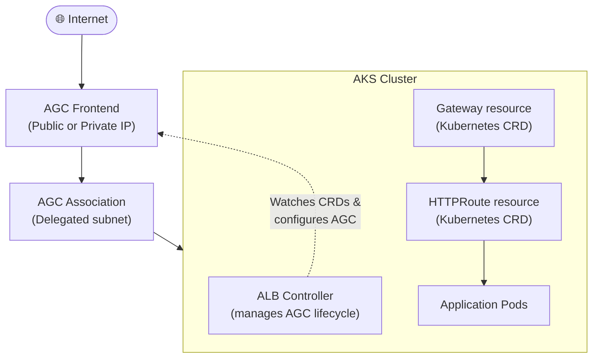

# :whale: Module 10 — Azure WAF on Application Gateway for Containers

!!! abstract "Application Gateway for Containers — Kubernetes-native WAF"
    Application Gateway for Containers (AGC) is Microsoft's next-generation, Kubernetes-native Layer-7 load balancer built specifically for containerised workloads running on Azure Kubernetes Service (AKS). It replaces the legacy AGIC (Application Gateway Ingress Controller) add-on with a modern architecture that uses the Kubernetes **Gateway API** and **Ingress API** natively, while still letting you attach the same Azure WAF policies you use on Application Gateway v2. This module walks you through AGC's architecture, its differences from traditional Application Gateway, how to attach WAF policies through Kubernetes CRDs, and a complete deployment example.

---

## 1 — What Is Application Gateway for Containers?

Application Gateway for Containers (AGC) is a **first-party, fully managed** Azure service purpose-built for Kubernetes. It serves as an application load balancer that understands Kubernetes primitives—Gateways, HTTPRoutes, Ingresses—without requiring you to manage infrastructure, scaling, or patching.

AGC is built on a next-generation application load-balancing platform that Microsoft operates at scale. Unlike the traditional Application Gateway, which is an Azure resource you deploy into a virtual network and manage through ARM templates, AGC is provisioned and configured **declaratively from inside your AKS cluster** using standard Kubernetes custom resource definitions (CRDs). The ALB Controller, a Microsoft-maintained component running as a pod inside the cluster, watches for Gateway API and Ingress API resources and translates them into AGC configuration changes in real time.

Key characteristics of AGC:

- **Kubernetes-native** — configuration lives alongside your application manifests, version-controlled in Git.
- **Supports Gateway API** — the official Kubernetes successor to the Ingress API, providing richer routing capabilities.
- **Supports Ingress API** — backward-compatible with existing Ingress resources for migration scenarios.
- **Fully managed** — Microsoft handles infrastructure, scaling, availability zones, and OS patching.
- **Elastic scaling** — AGC scales up and down automatically based on traffic, with no manual VMSS management.
- **WAF integration** — Azure WAF policies can be attached to AGC, bringing DRS 2.1 managed rules, bot protection, and custom rules to your Kubernetes workloads.

!!! info "NGINX Ingress Controller retirement"
    Microsoft has announced the retirement of the NGINX-based Ingress Controller add-on for AKS, effective **March 2026**. AGC is the recommended replacement path. Teams that currently use NGINX should plan their migration now.

---

## 2 — AGC Architecture

The following diagram shows how AGC fits into a typical AKS deployment. Traffic from the internet enters the AGC frontend (a public or private IP managed by Azure), passes through an AGC **association** (a delegated subnet in your VNet), and is load-balanced to pods inside the AKS cluster.



### Key components

**ALB Controller** — a Kubernetes controller deployed as a pod in the `azure-alb-system` namespace. It watches for changes to Gateway, HTTPRoute, and Ingress resources, and reconciles the desired state against the AGC resource in Azure through the ARM API. The ALB Controller requires a **managed identity** or **workload identity** with permissions to manage AGC resources.

**AGC resource** — the Azure resource (`Microsoft.ServiceNetworking/trafficControllers`) that represents the load balancer. It is created either through the Azure CLI / Bicep / Terraform, or automatically by the ALB Controller when it detects a matching Gateway resource.

**AGC Association** — links the AGC resource to a **delegated subnet** in your VNet. This subnet must be delegated to the `Microsoft.ServiceNetworking/trafficControllers` resource provider. The association enables AGC to inject its data-plane components into your network.

**AGC Frontend** — represents a public or private IP address and port combination. Each frontend can host one or more listeners, each of which can be associated with an HTTPRoute that defines routing rules and, optionally, a WAF policy.

!!! warning "Subnet delegation"
    The subnet used for the AGC association must be **exclusively delegated** to `Microsoft.ServiceNetworking/trafficControllers`. No other resources (VMs, Application Gateways, etc.) may reside in this subnet. A `/24` is recommended for production workloads.

---

## 3 — AGC vs Traditional Application Gateway / AGIC

Teams already using Application Gateway with the AGIC add-on often ask how AGC differs. The table below summarises the most important distinctions.

| Dimension | AGC | Traditional AppGW + AGIC |
|---|---|---|
| **Deployment model** | CRD-native (Gateway API / Ingress API) | AGIC add-on translates Ingress → ARM |
| **Infrastructure** | Fully managed by Azure | Customer-managed AppGW in VNet |
| **Scaling** | Elastic, automatic | Manual or VMSS auto-scale rules |
| **Update mechanism** | ALB Controller reconciles CRDs in real time | AGIC polls and pushes full config |
| **Conflict resolution** | Built-in merge semantics in Gateway API | Last-write-wins in AGIC |
| **Gateway API support** | Yes (native) | No |
| **Ingress API support** | Yes (backward-compatible) | Yes |
| **WAF support** | Yes — WAF policy via CRD annotation | Yes — WAF policy via ARM/Portal |
| **Per-site / per-URI policies** | Per-route (HTTPRoute) | Per-site, per-URI |
| **Private Link to backends** | Via cluster networking | Via AppGW private endpoints |
| **Maturity** | GA (some features in preview) | Mature, battle-tested |
| **Recommended for** | New Kubernetes deployments | Existing AppGW investments |

!!! note "Migration path"
    Microsoft provides a migration guide for moving from AGIC to AGC. The two can coexist during a transition period—AGIC manages the existing Application Gateway while the ALB Controller manages the new AGC resource.

---

## 4 — WAF on Application Gateway for Containers

WAF integration with AGC uses the **same Azure WAF Policy resource** (`Microsoft.Network/ApplicationGatewayWebApplicationFirewallPolicies`) that you already know from Application Gateway v2. This means:

- You can reuse existing WAF policies or create new ones with the same CLI, PowerShell, Bicep, or Portal workflows.
- DRS 2.1 managed rules, bot protection, custom rules, and exclusions are all supported.
- The WAF policy is an Azure resource identified by its **resource ID**; Kubernetes references it by that ID.

The key difference is **how** the policy is associated. Instead of linking the policy to an Application Gateway resource through ARM, you annotate your Kubernetes Gateway or HTTPRoute resource with the WAF policy's resource ID. The ALB Controller reads the annotation and configures the AGC data plane to enforce the policy.

=== "Detection mode"

    In Detection mode the WAF evaluates all traffic against the configured rules and logs matches, but does **not** block any requests. This is ideal during initial rollout so you can review logs and create exclusions before switching to Prevention mode.

=== "Prevention mode"

    In Prevention mode the WAF actively blocks requests that match rules whose action is set to Block. Ensure you have tuned exclusions in Detection mode first to minimise false positives.

### Creating a WAF policy for AGC

```bash
# Create a WAF policy (same resource type as Application Gateway)
az network application-gateway waf-policy create \
  --name waf-policy-agc \
  --resource-group rg-waf-workshop \
  --location eastus2

# Add DRS 2.1 managed rule set
az network application-gateway waf-policy managed-rule rule-set add \
  --policy-name waf-policy-agc \
  --resource-group rg-waf-workshop \
  --type Microsoft_DefaultRuleSet \
  --version 2.1

# Switch to Prevention mode when ready
az network application-gateway waf-policy policy-setting update \
  --policy-name waf-policy-agc \
  --resource-group rg-waf-workshop \
  --mode Prevention \
  --state Enabled
```

---

## 5 — WAF Policy as Kubernetes CRD

The real power of AGC is that your entire application stack—including WAF protection—is declared in Kubernetes YAML and can be version-controlled, reviewed, and deployed through GitOps pipelines.

### 5.1 Gateway resource referencing an AGC frontend

The Gateway resource defines the listener (protocol, port, hostname) and references the AGC infrastructure through the `gatewayClassName`.

```yaml
apiVersion: gateway.networking.k8s.io/v1
kind: Gateway
metadata:
  name: waf-gateway
  namespace: default
  annotations:
    alb.networking.azure.io/alb-id: /subscriptions/<sub>/resourceGroups/rg-waf-workshop/providers/Microsoft.ServiceNetworking/trafficControllers/myAGC
spec:
  gatewayClassName: azure-alb-external
  listeners:
    - name: https-listener
      protocol: HTTPS
      port: 443
      hostname: "app.contoso.com"
      tls:
        mode: Terminate
        certificateRefs:
          - name: contoso-tls
            kind: Secret
```

### 5.2 HTTPRoute with WAF policy annotation

The HTTPRoute defines routing rules (path matches, header matches, backend references) and attaches the WAF policy via an annotation.

```yaml
apiVersion: gateway.networking.k8s.io/v1
kind: HTTPRoute
metadata:
  name: app-route
  namespace: default
  annotations:
    alb.networking.azure.io/alb-waf-policy-id: /subscriptions/<sub>/resourceGroups/rg-waf-workshop/providers/Microsoft.Network/ApplicationGatewayWebApplicationFirewallPolicies/waf-policy-agc
spec:
  parentRefs:
    - name: waf-gateway
      sectionName: https-listener
  rules:
    - matches:
        - path:
            type: PathPrefix
            value: /
      backendRefs:
        - name: myapp-service
          port: 80
```

### 5.3 Applying different WAF policies per route

One of AGC's strengths is that you can attach **different WAF policies to different HTTPRoutes**. This lets you enforce strict WAF rules on sensitive paths (like `/login` or `/admin`) while using a more relaxed policy on high-throughput API paths.

```yaml
# Strict policy for admin paths
apiVersion: gateway.networking.k8s.io/v1
kind: HTTPRoute
metadata:
  name: admin-route
  namespace: default
  annotations:
    alb.networking.azure.io/alb-waf-policy-id: /subscriptions/<sub>/resourceGroups/rg-waf-workshop/providers/Microsoft.Network/ApplicationGatewayWebApplicationFirewallPolicies/waf-policy-strict
spec:
  parentRefs:
    - name: waf-gateway
      sectionName: https-listener
  rules:
    - matches:
        - path:
            type: PathPrefix
            value: /admin
      backendRefs:
        - name: admin-service
          port: 80
---
# Relaxed policy for public API paths
apiVersion: gateway.networking.k8s.io/v1
kind: HTTPRoute
metadata:
  name: api-route
  namespace: default
  annotations:
    alb.networking.azure.io/alb-waf-policy-id: /subscriptions/<sub>/resourceGroups/rg-waf-workshop/providers/Microsoft.Network/ApplicationGatewayWebApplicationFirewallPolicies/waf-policy-relaxed
spec:
  parentRefs:
    - name: waf-gateway
      sectionName: https-listener
  rules:
    - matches:
        - path:
            type: PathPrefix
            value: /api/public
      backendRefs:
        - name: api-service
          port: 80
```

!!! tip "GitOps workflow"
    Store these YAML manifests in a Git repository alongside your application code. Use a GitOps tool like Flux or Argo CD to automatically reconcile changes. When a security team updates a WAF policy in Azure, the Kubernetes annotation stays the same—only the policy's rules change in the cloud, and AGC picks up the new version automatically.

---

## 6 — Deployment Example: AKS + AGC + WAF End-to-End

This section walks through a complete deployment, from creating the AKS cluster to testing WAF protection against a sample SQL injection attack.

### Step 1 — Create the AKS cluster with ALB Controller

=== "Azure CLI"

    ```bash
    # Register the required feature flag (one-time)
    az feature register \
      --namespace Microsoft.ContainerService \
      --name EnableWorkloadIdentityPreview

    # Create an AKS cluster with OIDC and workload identity
    az aks create \
      --name aks-waf-workshop \
      --resource-group rg-waf-workshop \
      --location eastus2 \
      --network-plugin azure \
      --enable-oidc-issuer \
      --enable-workload-identity \
      --generate-ssh-keys

    # Install the ALB Controller via Helm (managed by Microsoft)
    az aks approuting enable \
      --name aks-waf-workshop \
      --resource-group rg-waf-workshop
    ```

=== "Bicep (excerpt)"

    ```bicep
    resource aksCluster 'Microsoft.ContainerService/managedClusters@2024-06-01' = {
      name: 'aks-waf-workshop'
      location: 'eastus2'
      properties: {
        networkProfile: {
          networkPlugin: 'azure'
        }
        oidcIssuerProfile: { enabled: true }
        securityProfile: {
          workloadIdentity: { enabled: true }
        }
      }
    }
    ```

### Step 2 — Deploy the AGC resource and association

```bash
# Create a delegated subnet for AGC
az network vnet subnet create \
  --name snet-agc \
  --vnet-name vnet-aks \
  --resource-group rg-waf-workshop \
  --address-prefixes 10.1.1.0/24 \
  --delegations Microsoft.ServiceNetworking/trafficControllers

# Create the AGC resource
az network traffic-controller create \
  --name myAGC \
  --resource-group rg-waf-workshop \
  --location eastus2

# Create an association linking AGC to the subnet
AGC_ID=$(az network traffic-controller show \
  --name myAGC \
  --resource-group rg-waf-workshop \
  --query id -o tsv)

SUBNET_ID=$(az network vnet subnet show \
  --name snet-agc \
  --vnet-name vnet-aks \
  --resource-group rg-waf-workshop \
  --query id -o tsv)

az network traffic-controller association create \
  --name assoc-agc \
  --traffic-controller-name myAGC \
  --resource-group rg-waf-workshop \
  --association-type subnets \
  --subnet $SUBNET_ID
```

### Step 3 — Create the WAF policy

```bash
# Create and configure the WAF policy (as shown in Section 4)
az network application-gateway waf-policy create \
  --name waf-policy-agc \
  --resource-group rg-waf-workshop \
  --location eastus2

az network application-gateway waf-policy managed-rule rule-set add \
  --policy-name waf-policy-agc \
  --resource-group rg-waf-workshop \
  --type Microsoft_DefaultRuleSet \
  --version 2.1

az network application-gateway waf-policy policy-setting update \
  --policy-name waf-policy-agc \
  --resource-group rg-waf-workshop \
  --mode Prevention \
  --state Enabled
```

### Step 4 — Deploy Gateway, HTTPRoute, and a sample application

```bash
# Deploy a simple NGINX echo server
kubectl create deployment echoserver --image=ealen/echo-server:latest --port=80
kubectl expose deployment echoserver --port=80 --target-port=80

# Apply the Gateway and HTTPRoute manifests (from Section 5)
kubectl apply -f gateway.yaml
kubectl apply -f httproute.yaml
```

### Step 5 — Test WAF protection

Wait for AGC to provision the frontend IP (this may take 2–3 minutes), then test:

```bash
# Get the AGC frontend IP
FRONTEND_IP=$(kubectl get gateway waf-gateway -o jsonpath='{.status.addresses[0].value}')

# Normal request — should return 200
curl -s -o /dev/null -w "%{http_code}" https://$FRONTEND_IP/ -k

# SQL injection attempt — should return 403 (blocked by WAF)
curl -s -o /dev/null -w "%{http_code}" "https://$FRONTEND_IP/?id=1%20OR%201=1" -k
```

!!! note "Expected results"
    The first `curl` should return `200`. The second `curl` contains a SQL injection pattern (`1 OR 1=1`) that matches DRS 2.1 rule 942100, so the WAF should block it and return `403`.

---

## 7 — Current Limitations

AGC is generally available, but some WAF-related capabilities are still in preview or have feature gaps compared with the full Application Gateway v2 WAF. Keep the following in mind when planning production deployments:

| Area | Status |
|---|---|
| DRS 2.1 managed rules | :white_check_mark: GA |
| Custom rules | :white_check_mark: GA |
| Bot protection managed rule set | :white_check_mark: GA |
| Exclusions | :white_check_mark: GA |
| Per-route WAF policies | :white_check_mark: GA |
| Per-site / per-URI policies | :x: Not supported (use per-route) |
| Rate limiting | :white_check_mark: GA |
| Mutual TLS (mTLS) | :construction: Preview |
| Response body inspection | :x: Not supported |
| Custom error pages | :construction: Preview |
| Private frontend (internal LB) | :white_check_mark: GA |

!!! warning "Check the latest documentation"
    AGC is evolving rapidly. Features may move from preview to GA between the time this module was written and when you read it. Always consult the [official AGC documentation](https://learn.microsoft.com/azure/application-gateway/for-containers/overview) for the latest status.

---

## 8 — When to Use AGC

AGC is the right choice when your workload and team profile match these patterns:

- **Kubernetes-native workloads** — your application runs on AKS and you want infrastructure configuration to live alongside application manifests.
- **Microservices architectures** — you have many services behind different routes and need per-route WAF policies without managing multiple Application Gateways.
- **Teams using Gateway API** — you want to adopt the Kubernetes Gateway API standard for richer routing semantics (header-based routing, traffic splitting, request mirroring).
- **Need for rapid, elastic scaling** — AGC scales automatically without the capacity planning required for Application Gateway v2 VMSS instances.
- **GitOps and DevOps pipelines** — you deploy infrastructure through Flux, Argo CD, or GitHub Actions and want WAF configuration as code.
- **Replacing NGINX Ingress Controller** — with the NGINX add-on retiring in March 2026, AGC is the Microsoft-recommended replacement.

!!! info "When to keep Application Gateway"
    If you need per-URI WAF policies, mutual TLS (GA), custom error pages, or your workload does not run on Kubernetes, Application Gateway v2 remains the better fit. AGC and Application Gateway can coexist in the same environment—use each where it excels.

---

## :test_tube: Related Labs

| Lab | Description |
|---|---|
| [:octicons-beaker-24: LAB 09](../labs/lab09.md) | Deploy an AKS cluster with AGC and WAF, test managed rules on a containerised workload |

---

## :white_check_mark: Key Takeaways

1. Application Gateway for Containers (AGC) is a **fully managed, Kubernetes-native** Layer-7 load balancer that replaces AGIC and NGINX Ingress.
2. The ALB Controller running inside AKS watches Gateway API and Ingress API resources and configures AGC through ARM automatically.
3. WAF policies are the **same Azure resource** used by Application Gateway v2—you reference them by resource ID in an HTTPRoute annotation.
4. AGC supports **per-route WAF policies**, letting you enforce different security postures on `/admin` vs `/api/public`.
5. A typical deployment involves: AKS cluster → ALB Controller → AGC resource → delegated subnet → Gateway + HTTPRoute + WAF policy.
6. AGC is evolving rapidly; always check the latest documentation for feature GA status before production deployment.

---

## :books: References

- [What is Application Gateway for Containers?](https://learn.microsoft.com/azure/application-gateway/for-containers/overview)
- [ALB Controller for AKS](https://learn.microsoft.com/azure/application-gateway/for-containers/alb-controller-install)
- [Gateway API support in AGC](https://learn.microsoft.com/azure/application-gateway/for-containers/api-specification-kubernetes)
- [WAF on Application Gateway for Containers](https://learn.microsoft.com/azure/web-application-firewall/ag/application-gateway-for-containers-waf)
- [Quickstart: Deploy AGC with ALB Controller](https://learn.microsoft.com/azure/application-gateway/for-containers/quickstart-deploy-application-gateway-for-containers-alb-controller)
- [Migrate from AGIC to AGC](https://learn.microsoft.com/azure/application-gateway/for-containers/migrate-from-agic-to-agc)
- [Kubernetes Gateway API specification](https://gateway-api.sigs.k8s.io/)

---

<div style="display: flex; justify-content: space-between;">
<div>[:octicons-arrow-left-24: Module 09 — Front Door](09-front-door.md)</div>
<div>[Module 11 — DDoS Protection :octicons-arrow-right-24:](11-ddos.md)</div>
</div>