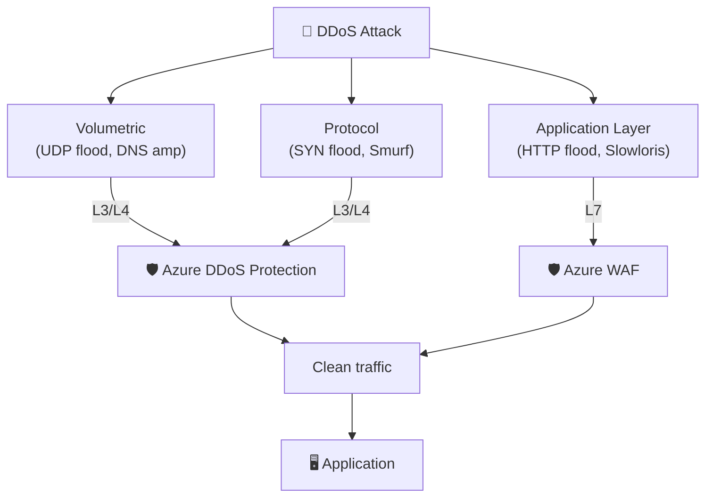
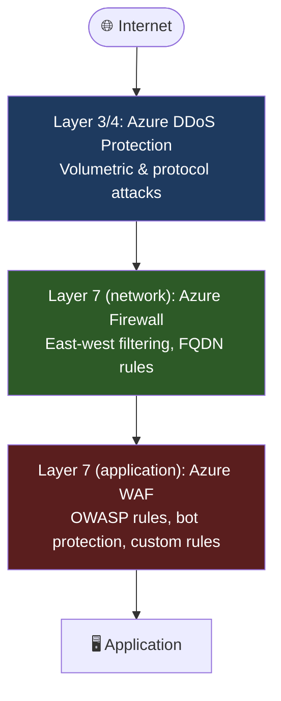

# :no_entry_sign: Module 11 — DDoS Protection & Layered Defense

!!! abstract "Azure DDoS Protection and layered defense strategy"
    Distributed Denial-of-Service (DDoS) attacks remain one of the most common and disruptive threats to internet-facing applications. Azure DDoS Protection provides always-on, automatic mitigation at Layers 3 and 4 of the network stack, while Azure WAF handles Layer 7 application attacks. Together they form a **layered defense** that covers the full attack surface. This module explains how Azure DDoS Protection works, compares its two tiers, classifies the types of DDoS attacks, and shows how to build a comprehensive defense-in-depth architecture using DDoS Protection, Azure Firewall, and Azure WAF.

---

## 1 — What Is Azure DDoS Protection?

Azure DDoS Protection is a managed service that continuously monitors traffic destined for Azure public IP addresses, automatically detects volumetric and protocol-layer attacks, and mitigates them **without any manual intervention**. It is built into the Azure global network fabric, which spans more than 185 data centres and over 200,000 km of fibre, giving it the capacity to absorb even the largest recorded attacks.

The service operates in three phases:

1. **Profiling** — DDoS Protection continuously learns the normal traffic patterns of each protected public IP. Over time it builds a baseline profile that distinguishes legitimate traffic spikes (e.g., a flash sale) from attack traffic.
2. **Detection** — when incoming traffic deviates from the learned profile beyond configurable thresholds, the system classifies it as a potential attack and triggers the mitigation pipeline.
3. **Mitigation** — attack traffic is scrubbed at the Azure network edge. Legitimate traffic continues to flow to the application with minimal impact. The entire process is automatic and typically completes within **seconds** of detection.

!!! info "Always-on vs on-demand"
    Unlike some third-party DDoS solutions that require you to manually "swing" traffic to a scrubbing centre during an attack, Azure DDoS Protection is **always on**. Profiling, detection, and mitigation happen continuously—there is no activation delay, no DNS change, and no BGP re-route required.

Key capabilities of DDoS Protection:

- Automatic attack detection and mitigation at Layers 3 and 4 (TCP, UDP, ICMP)
- Adaptive tuning that learns your application's traffic patterns
- Near real-time attack metrics and diagnostic logs through Azure Monitor
- Integration with Azure WAF for comprehensive Layer 3–7 protection
- 99.99% SLA during active attacks (Network Protection tier)

### How DDoS Protection complements WAF

DDoS Protection and WAF operate at **different layers** and are designed to work together:

| Layer | Threat | Protection |
|---|---|---|
| **L3 / L4** | Volumetric floods (UDP, ICMP), protocol attacks (SYN flood) | Azure DDoS Protection |
| **L7** | HTTP floods, Slowloris, SQL injection, XSS, bot attacks | Azure WAF |

DDoS Protection absorbs massive traffic volumes **before** they reach the WAF engine. If a volumetric attack were to hit a WAF-enabled Application Gateway directly, the gateway could become overwhelmed before it even evaluates a single rule. DDoS Protection prevents this by scrubbing attack traffic at the network edge, ensuring that only clean traffic arrives at the WAF for Layer-7 inspection.

---

## 2 — DDoS Protection Tiers

Azure offers two tiers of DDoS Protection. Both use the **same mitigation engine** and the same global scrubbing infrastructure. The difference lies in scope, additional services, and cost.

### 2.1 DDoS Network Protection

DDoS Network Protection is a **per-VNet** offering. When you enable it on a virtual network, **every public IP resource** inside that VNet is automatically protected—no per-resource configuration is needed. This makes it the simplest option for organisations with many public-facing services in a single VNet.

Key features:

- **Adaptive tuning** — mitigation policies are automatically calibrated to each public IP's traffic profile.
- **Attack analytics** — detailed attack reports including traffic vectors, duration, and peak bandwidth are available in the Azure portal and via Azure Monitor.
- **Near real-time metrics** — attack metrics (bytes dropped, packets forwarded, etc.) stream to Azure Monitor with approximately 1-minute granularity.
- **DDoS Rapid Response (DRR)** — during an active attack you can engage the Microsoft DDoS Rapid Response team for expert assistance (see Section 6).
- **SLA guarantee** — 99.99% availability SLA during attacks, backed by financial credits.
- **Cost protection** — if a DDoS attack causes your application to scale out (e.g., additional VMSS instances or Application Gateway capacity units), Microsoft provides credits to cover the scaling costs.
- **WAF integration** — attack telemetry flows to the same Log Analytics workspace as WAF logs, enabling unified analysis.

**Pricing:** approximately **$2,944 per month** per DDoS protection plan (covers up to 100 public IP resources). Additional public IPs beyond 100 incur an overage charge.

=== "Enable via Azure CLI"

    ```bash
    # Create a DDoS protection plan
    az network ddos-protection create \
      --name ddos-plan-workshop \
      --resource-group rg-waf-workshop \
      --location eastus2

    # Associate the plan with a virtual network
    DDOS_PLAN_ID=$(az network ddos-protection show \
      --name ddos-plan-workshop \
      --resource-group rg-waf-workshop \
      --query id -o tsv)

    az network vnet update \
      --name vnet-appgw \
      --resource-group rg-waf-workshop \
      --ddos-protection-plan $DDOS_PLAN_ID \
      --ddos-protection true
    ```

=== "Azure PowerShell"

    ```powershell
    # Create a DDoS protection plan
    $ddosPlan = New-AzDdosProtectionPlan `
      -Name "ddos-plan-workshop" `
      -ResourceGroupName "rg-waf-workshop" `
      -Location "eastus2"

    # Associate with a virtual network
    $vnet = Get-AzVirtualNetwork `
      -Name "vnet-appgw" `
      -ResourceGroupName "rg-waf-workshop"

    $vnet.DdosProtectionPlan = @{ Id = $ddosPlan.Id }
    $vnet.EnableDdosProtection = $true
    Set-AzVirtualNetwork -VirtualNetwork $vnet
    ```

### 2.2 DDoS IP Protection

DDoS IP Protection is a **per-IP** offering designed for smaller deployments that only need to protect a handful of public IP addresses. It uses the same mitigation engine as Network Protection but is scoped to individual IPs rather than an entire VNet.

Key features:

- Same Layer 3/4 mitigation engine as Network Protection
- Attack telemetry through Azure Monitor
- Per-IP adaptive tuning

Key limitations compared with Network Protection:

- **No** DDoS Rapid Response team access
- **No** cost protection credits
- **No** attack analytics reports (only metrics)
- **No** VNet-wide automatic coverage

**Pricing:** approximately **$199 per month per protected IP address**.

=== "Enable via Azure CLI"

    ```bash
    # Enable DDoS IP Protection on a public IP
    az network public-ip update \
      --name pip-appgw \
      --resource-group rg-waf-workshop \
      --ddos-protection-mode Enabled \
      --ddos-protection-plan ""
    ```

=== "Azure PowerShell"

    ```powershell
    # Enable DDoS IP Protection on a public IP
    $pip = Get-AzPublicIpAddress `
      -Name "pip-appgw" `
      -ResourceGroupName "rg-waf-workshop"

    $pip.DdosSettings = @{
        ProtectionMode = "Enabled"
    }
    Set-AzPublicIpAddress -PublicIpAddress $pip
    ```

### Tier Comparison

| Feature | Network Protection | IP Protection |
|---|---|---|
| **Scope** | Per-VNet (all public IPs) | Per-IP |
| **Mitigation engine** | Azure global scrubbing | Azure global scrubbing |
| **Adaptive tuning** | :white_check_mark: | :white_check_mark: |
| **Near real-time metrics** | :white_check_mark: | :white_check_mark: |
| **Attack analytics reports** | :white_check_mark: | :x: |
| **DDoS Rapid Response (DRR)** | :white_check_mark: | :x: |
| **Cost protection credits** | :white_check_mark: | :x: |
| **SLA during attacks** | 99.99% | 99.99% |
| **WAF integration** | :white_check_mark: | :white_check_mark: |
| **Approximate cost** | ~$2,944/month (up to 100 IPs) | ~$199/month/IP |
| **Best for** | Production VNets with many public IPs | Dev/test, small deployments |

!!! tip "Cost breakeven"
    At approximately **15 public IPs**, DDoS Network Protection becomes more cost-effective than IP Protection. If you have more than 15 public IPs in a VNet, choose Network Protection.

---

## 3 — Types of DDoS Attacks

Understanding the taxonomy of DDoS attacks helps you reason about which layer of your defense stack handles each threat.

### 3.1 Volumetric Attacks

Volumetric attacks aim to **saturate the network bandwidth** between the internet and your application. They generate massive amounts of traffic—often measured in hundreds of Gbps or even Tbps—using techniques like:

- **UDP flood** — sends large numbers of UDP packets to random ports, forcing the target to process and respond with ICMP "Destination Unreachable" messages.
- **ICMP flood** — overwhelms the target with ICMP Echo Request (ping) packets.
- **DNS amplification** — spoofs the victim's IP address in DNS queries to open DNS resolvers, which return amplified responses to the victim.

**Mitigated by:** Azure DDoS Protection (Layer 3/4). The global scrubbing infrastructure absorbs the volumetric traffic at the network edge, far upstream from your application.

### 3.2 Protocol Attacks

Protocol attacks exploit weaknesses in Layer 3 and Layer 4 protocols to exhaust server resources (connection tables, CPU, memory) without necessarily consuming large amounts of bandwidth:

- **SYN flood** — sends a high volume of TCP SYN packets without completing the three-way handshake, exhausting the server's connection table.
- **Smurf attack** — sends ICMP Echo Requests to a broadcast address with the victim's spoofed IP, causing all hosts on the subnet to reply to the victim.
- **Fragmented packet attacks** — sends malformed or overlapping IP fragments that crash or slow down the target's IP stack.

**Mitigated by:** Azure DDoS Protection (Layer 3/4). SYN cookies, connection-rate limiting, and protocol-validation rules handle these attacks automatically.

### 3.3 Application-Layer Attacks

Application-layer attacks target Layer 7 (HTTP/HTTPS) and are designed to look like legitimate requests. They consume application resources (CPU, memory, database connections) rather than network bandwidth:

- **HTTP flood** — sends a high volume of seemingly legitimate HTTP GET or POST requests to resource-intensive endpoints (e.g., search, login, checkout).
- **Slowloris** — opens many HTTP connections and sends partial headers very slowly, keeping connections open and exhausting the server's connection pool.
- **Low-and-slow POST** — sends HTTP POST bodies at an extremely slow rate, tying up server threads.

**Mitigated by:** Azure WAF (Layer 7). Rate-limiting rules, bot protection, and custom rules detect and block these patterns. DDoS Protection does **not** inspect HTTP content—it operates below Layer 7.



---

## 4 — Layered Defense Strategy

No single service protects against every attack vector. A production Azure architecture should employ **defense in depth**, with each layer addressing a specific category of threats.



### Layer 3/4 — Azure DDoS Protection

The first line of defense. Scrubs volumetric and protocol attacks at the Azure network edge. Operates on IP packets and TCP/UDP segments—does not inspect HTTP content.

### Layer 7 (network) — Azure Firewall

Azure Firewall Premium provides IDPS (Intrusion Detection and Prevention System), TLS inspection, FQDN-based filtering, and URL filtering for **east-west** and **north-south** traffic. It sits between subnets or VNets and enforces network-level security policies. While not a WAF, it adds an important layer of network-level threat detection.

### Layer 7 (application) — Azure WAF

Azure WAF (on Application Gateway or Front Door) inspects HTTP/HTTPS requests against the OWASP Core Rule Set, bot protection rules, and your custom rules. It blocks SQL injection, cross-site scripting, command injection, and other application-layer attacks.

### Combined architecture

When all three layers are active, the defense stack works as follows:

1. A volumetric UDP flood hits the Azure edge → **DDoS Protection** absorbs it. No traffic reaches your VNet.
2. A SYN flood makes it past the edge scrubbers → **DDoS Protection** applies SYN cookies and rate-limits connections. Only legitimate TCP sessions proceed.
3. An HTTP flood reaches the application tier → **Azure WAF** rate-limits the requests and blocks known attack patterns.
4. A SQL injection attempt arrives → **Azure WAF** matches it against DRS 2.1 Rule 942100 and returns a 403 response.
5. An internal workload tries to exfiltrate data to a malicious domain → **Azure Firewall** blocks the outbound FQDN.

!!! note "Front Door adds an extra layer"
    When you use Azure Front Door Premium, you get **built-in DDoS protection at the edge** (included at no additional cost) plus the Front Door WAF—effectively collapsing Layers 3/4 and 7 into a single global service. This is the simplest way to achieve layered defense for public-facing applications.

---

## 5 — DDoS + WAF Integration

DDoS Protection and WAF are separate services, but they share a common telemetry pipeline and can be configured to log to the **same Log Analytics workspace**. This enables unified attack analysis using a single KQL query.

### Configuring unified diagnostics

```bash
# Get the Log Analytics workspace ID
WORKSPACE_ID=$(az monitor log-analytics workspace show \
  --workspace-name law-waf-workshop \
  --resource-group rg-waf-workshop \
  --query id -o tsv)

# Enable DDoS diagnostics
az monitor diagnostic-settings create \
  --name diag-ddos \
  --resource $(az network public-ip show \
    --name pip-appgw \
    --resource-group rg-waf-workshop \
    --query id -o tsv) \
  --workspace $WORKSPACE_ID \
  --logs '[{"category":"DDoSProtectionNotifications","enabled":true},{"category":"DDoSMitigationFlowLogs","enabled":true},{"category":"DDoSMitigationReports","enabled":true}]'

# WAF diagnostics (Application Gateway)
az monitor diagnostic-settings create \
  --name diag-waf \
  --resource $(az network application-gateway show \
    --name appgw-waf \
    --resource-group rg-waf-workshop \
    --query id -o tsv) \
  --workspace $WORKSPACE_ID \
  --logs '[{"category":"ApplicationGatewayFirewallLog","enabled":true}]'
```

### Unified KQL query

Once both services log to the same workspace, you can correlate DDoS and WAF events in a single query:

```kusto
// Show DDoS mitigation events alongside WAF blocks in the same time window
let ddos = AzureDiagnostics
| where Category == "DDoSProtectionNotifications"
| where type_s == "MitigationStarted"
| project TimeGenerated, Event="DDoS Mitigation", publicIpAddress_s;

let waf = AzureDiagnostics
| where Category == "ApplicationGatewayFirewallLog"
| where action_s == "Blocked"
| summarize WAFBlocks=count() by bin(TimeGenerated, 1m);

ddos
| join kind=fullouter waf on TimeGenerated
| order by TimeGenerated desc
```

### How the two services interact during an attack

During a multi-vector attack the timeline typically looks like this:

1. **T+0 s** — A volumetric UDP flood begins. DDoS Protection detects the anomaly and starts scrubbing within seconds.
2. **T+5 s** — The attacker simultaneously launches an HTTP flood. Volumetric traffic is already being scrubbed, so the HTTP requests reach the WAF at manageable rates.
3. **T+10 s** — WAF rate-limit rules kick in and start blocking the HTTP flood.
4. **T+60 s** — DDoS Protection publishes a `MitigationStarted` notification to Azure Monitor.
5. **T+N min** — The attack subsides. DDoS Protection publishes a `MitigationStopped` notification. WAF rate-limit counters reset.

Throughout this sequence, DDoS Protection ensures the WAF is never overwhelmed by volumetric traffic, and the WAF ensures application-layer attacks are blocked. This is why both layers are essential.

---

## 6 — DDoS Rapid Response (DRR)

DDoS Rapid Response is a team of Microsoft engineers who provide **active attack assistance** to customers with DDoS Network Protection plans. DRR is not available with IP Protection.

### When to engage DRR

- Your application is experiencing an active DDoS attack that is impacting availability despite automatic mitigation.
- You need custom mitigation policies tuned to your specific traffic patterns.
- You want proactive engagement before a planned high-visibility event (e.g., product launch, live stream).

### How to engage DRR

During an active attack, open a **Severity A** support request in the Azure portal and select the "DDoS" category. The DRR team targets a **15-minute response time** for Severity A cases.

For proactive engagement before an event, contact your Microsoft account team or open a support request at least **two weeks in advance**.

### SLA guarantees

DDoS Network Protection provides a **99.99% availability SLA** during attacks. If the SLA is breached, you are eligible for service credits under the [Azure SLA for DDoS Protection](https://learn.microsoft.com/azure/ddos-protection/ddos-protection-overview#sla-guarantee).

### Cost protection

If a DDoS attack causes your protected resources to scale out—for example, additional Application Gateway capacity units, VMSS instances, or Azure Bandwidth charges—Microsoft provides **service credits** to cover the incremental cost. You must file a cost-protection claim through Azure support within 30 days of the attack.

!!! tip "Document your baseline"
    Cost protection credits are calculated against your **normal** resource consumption. Before filing a claim, ensure you have baseline metrics (average capacity units, instance counts, bandwidth) documented for the protected resources. Azure Monitor metrics and Azure Advisor provide this data.

---

## 7 — Best Practices

The following best practices represent Microsoft's official recommendations for DDoS and layered defense, based on the Azure Well-Architected Framework and real-world incident learnings.

### 7.1 Enable DDoS Protection on all VNets with public IPs

Any Azure resource with a public IP address is a potential DDoS target. Leaving a VNet unprotected means relying solely on Azure's **basic infrastructure protection**, which does not provide adaptive tuning, analytics, SLA guarantees, or Rapid Response access.

```bash
# List all VNets without DDoS protection
az network vnet list \
  --query "[?enableDdosProtection==\`false\` || enableDdosProtection==null].{Name:name, RG:resourceGroup}" \
  -o table
```

### 7.2 Combine DDoS Protection with WAF

DDoS Protection alone does not inspect HTTP content. WAF alone cannot absorb volumetric floods. **Always deploy both** for public-facing applications.

### 7.3 Configure Azure Monitor alerts

Set up alerts for DDoS attack notifications so your operations team is aware within minutes:

```bash
# Create an alert rule for DDoS mitigation events
az monitor metrics alert create \
  --name alert-ddos-attack \
  --resource-group rg-waf-workshop \
  --scopes $(az network public-ip show \
    --name pip-appgw \
    --resource-group rg-waf-workshop \
    --query id -o tsv) \
  --condition "avg IfUnderDDoSAttack > 0" \
  --window-size 5m \
  --evaluation-frequency 1m \
  --action $(az monitor action-group show \
    --name ag-ops-team \
    --resource-group rg-waf-workshop \
    --query id -o tsv) \
  --description "Alert when a DDoS attack is detected"
```

### 7.4 Test with DDoS simulation partners

Microsoft does **not** allow you to generate DDoS attack traffic against your own Azure resources. Instead, use one of Microsoft's approved simulation partners to validate that your DDoS and WAF configuration works as expected:

- **BreakingPoint Cloud** (by Keysight Technologies)
- **Red Button**
- **MazeBolt**

These partners can generate controlled attack traffic from outside Azure and provide detailed reports on mitigation effectiveness.

### 7.5 Use Azure Policy for governance

Enforce DDoS Protection at scale using Azure Policy:

```bash
# Assign built-in policy: "Virtual networks should be protected by Azure DDoS Protection"
az policy assignment create \
  --name require-ddos-protection \
  --policy "94de2ad3-e0c1-4caf-ad78-5d47bbc83d3d" \
  --scope /subscriptions/<sub> \
  --params '{"effect": {"value": "Audit"}}'
```

### 7.6 Maintain a layered architecture diagram

Document your defense-in-depth architecture so that every team member understands which service handles which threat layer. Update the diagram whenever you add or remove a security component.

---

## :test_tube: Related Labs

| Lab | Description |
|---|---|
| [:octicons-beaker-24: LAB 05](../labs/lab05.md) | Switch the WAF to Prevention mode and observe how DDoS and WAF logs appear in the same workspace |

---

## :white_check_mark: Key Takeaways

1. Azure DDoS Protection provides **always-on, automatic** mitigation at Layers 3 and 4—it scrubs volumetric and protocol attacks at the network edge before they reach your application.
2. **Network Protection** (~$2,944/month) covers all public IPs in a VNet and includes Rapid Response, cost protection, and analytics. **IP Protection** (~$199/month/IP) covers individual IPs without those extras.
3. DDoS attacks come in three flavours: **volumetric** (bandwidth saturation), **protocol** (resource exhaustion), and **application-layer** (HTTP-level abuse). DDoS Protection handles the first two; WAF handles the third.
4. A **layered defense** combining DDoS Protection + Azure Firewall + Azure WAF provides comprehensive L3–L7 coverage.
5. During multi-vector attacks, DDoS Protection ensures the WAF is never overwhelmed by volumetric traffic, while the WAF blocks application-layer attacks—both services must be active.
6. Always **test** your DDoS configuration using Microsoft-approved simulation partners, and configure **Azure Monitor alerts** for attack notifications.

---

## :books: References

- [Azure DDoS Protection overview](https://learn.microsoft.com/azure/ddos-protection/ddos-protection-overview)
- [Azure DDoS Protection tiers](https://learn.microsoft.com/azure/ddos-protection/ddos-protection-sku-comparison)
- [Manage Azure DDoS Protection using the Azure portal](https://learn.microsoft.com/azure/ddos-protection/manage-ddos-protection)
- [DDoS Rapid Response](https://learn.microsoft.com/azure/ddos-protection/ddos-rapid-response)
- [Azure DDoS Protection — best practices](https://learn.microsoft.com/azure/ddos-protection/fundamental-best-practices)
- [Azure WAF and DDoS Protection — layered defense](https://learn.microsoft.com/azure/web-application-firewall/shared/application-ddos-protection)
- [Test through DDoS simulation](https://learn.microsoft.com/azure/ddos-protection/test-through-simulations)
- [Azure Firewall Premium features](https://learn.microsoft.com/azure/firewall/premium-features)

---

<div style="display: flex; justify-content: space-between;">
<div>[:octicons-arrow-left-24: Module 10 — AGC](10-agc.md)</div>
<div>[Module 12 — Monitoring :octicons-arrow-right-24:](12-monitoring.md)</div>
</div>