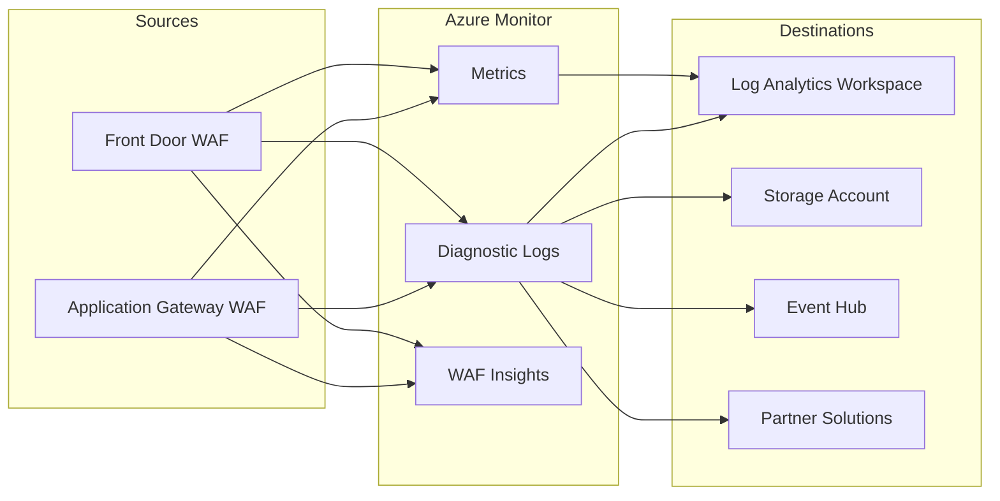

# :bar_chart: Module 12 — Monitoring: WAF Insights, Logs & Metrics

!!! abstract "Module Overview"
    Observability is the backbone of any security control. A WAF that blocks requests but generates no
    telemetry is a black box — you cannot tune what you cannot measure. This module dives deep into the
    three monitoring pillars that Azure WAF provides: **Diagnostic Logs**, **Azure Monitor Metrics**,
    and **WAF Insights**. You will learn how to enable each pillar, write production-ready KQL queries,
    build custom workbooks, and create actionable alerts that notify you the moment an attack campaign
    starts — or a legitimate user gets blocked by a false positive.

---

## 1 — WAF Monitoring Overview

Azure WAF emits telemetry through the **Azure Monitor** ecosystem. Every matched rule, every blocked
request, every bot signal travels through a unified pipeline that you can route to multiple
destinations. Think of the monitoring architecture as three concentric layers:

| Layer | What It Provides | Setup Effort |
|-------|-----------------|--------------|
| **Diagnostic Logs** | Per-request structured logs with full rule match detail | Medium — must enable diagnostic settings |
| **Metrics** | Aggregated numeric counters (total requests, blocks, matches) | Low — emitted automatically once WAF is active |
| **WAF Insights** | Curated, built-in dashboard with attack trends and geo maps | None — available in the WAF Policy blade |



All three layers feed from the same underlying data plane. Diagnostic Logs give you the richest detail,
Metrics give you the fastest signal for alerting, and WAF Insights gives you an instant visual overview
without writing a single query.

---

## 2 — Diagnostic Logging

Diagnostic logging is *not* enabled by default. Until you create a **diagnostic setting** on the
resource, the telemetry is generated internally but discarded. You must explicitly route it to at least
one destination.

### 2.1 Log Categories

=== "Application Gateway"

    | Log Category | Description |
    |-------------|-------------|
    | `ApplicationGatewayFirewallLog` | Every CRS/DRS rule evaluation — the most important log for WAF tuning. Contains `ruleId`, `action`, `message`, `details`, `transactionId`. |
    | `ApplicationGatewayAccessLog` | Layer-7 access log with client IP, URI, status code, backend response time. Essential for correlating WAF blocks with user experience. |
    | `ApplicationGatewayPerformanceLog` | Per-instance throughput, latency, connection counts. Useful for capacity planning, not WAF tuning. |

    !!! tip "Enable All Three"
        While `FirewallLog` is the primary WAF log, you will almost always need `AccessLog` alongside
        it. A WAF block appears in the firewall log, but the HTTP context (URI, query string, status
        code returned to the client) lives in the access log. Correlate them using `transactionId`.

=== "Front Door"

    | Log Category | Description |
    |-------------|-------------|
    | `FrontDoorWebApplicationFirewallLog` | WAF evaluation results including `ruleName`, `action`, `policyMode`, `trackingReference`. |
    | `FrontDoorAccessLog` | Full HTTP transaction log — client IP, URI, cache status, origin response time, `trackingReference`. |
    | `FrontDoorHealthProbeLog` | Health probe results to each origin. Not WAF-specific but critical for troubleshooting routing issues. |

    !!! info "Tracking Reference"
        Front Door uses a `trackingReference` field (a GUID) to correlate all log entries belonging
        to the same request. This is the equivalent of Application Gateway's `transactionId`.

### 2.2 Enabling Diagnostic Settings — Portal

1. Navigate to your **Application Gateway** or **Front Door** resource in the Azure portal.
2. Under **Monitoring**, select **Diagnostic settings**.
3. Click **+ Add diagnostic setting**.
4. Give the setting a descriptive name, e.g., `waf-to-law`.
5. Under **Logs**, select the categories listed above.
6. Under **Destination details**, check **Send to Log Analytics workspace** and pick your workspace.
7. Optionally add **Archive to a storage account** for long-term retention or **Stream to an event hub** for SIEM integration.
8. Click **Save**.

!!! warning "Cost Consideration"
    Diagnostic logs can generate significant data volume, especially `AccessLog` on high-traffic
    gateways. Use **Resource-specific** destination tables (not the legacy `AzureDiagnostics` table)
    for better query performance and cost control through table-level retention policies.

### 2.3 Enabling Diagnostic Settings — CLI

The following command enables all WAF-relevant log categories on an Application Gateway and routes
them to a Log Analytics workspace:

```bash
# Variables
RG="rg-waf-workshop"
APPGW_NAME="appgw-workshop"
LAW_ID="/subscriptions/<sub-id>/resourceGroups/$RG/providers/Microsoft.OperationalInsights/workspaces/law-waf-workshop"

# Create diagnostic setting
az monitor diagnostic-settings create \
  --name "waf-diag" \
  --resource "/subscriptions/<sub-id>/resourceGroups/$RG/providers/Microsoft.Network/applicationGateways/$APPGW_NAME" \
  --workspace "$LAW_ID" \
  --logs '[
    {"category":"ApplicationGatewayFirewallLog","enabled":true,"retentionPolicy":{"enabled":false,"days":0}},
    {"category":"ApplicationGatewayAccessLog","enabled":true,"retentionPolicy":{"enabled":false,"days":0}},
    {"category":"ApplicationGatewayPerformanceLog","enabled":true,"retentionPolicy":{"enabled":false,"days":0}}
  ]' \
  --metrics '[{"category":"AllMetrics","enabled":true}]'
```

For **Front Door**, the resource ID and category names change but the command structure is identical:

```bash
az monitor diagnostic-settings create \
  --name "waf-diag-fd" \
  --resource "/subscriptions/<sub-id>/resourceGroups/$RG/providers/Microsoft.Cdn/profiles/fd-workshop" \
  --workspace "$LAW_ID" \
  --logs '[
    {"category":"FrontDoorWebApplicationFirewallLog","enabled":true,"retentionPolicy":{"enabled":false,"days":0}},
    {"category":"FrontDoorAccessLog","enabled":true,"retentionPolicy":{"enabled":false,"days":0}},
    {"category":"FrontDoorHealthProbeLog","enabled":true,"retentionPolicy":{"enabled":false,"days":0}}
  ]'
```

### 2.4 Destination Comparison

| Destination | Best For | Retention | Query Support |
|-------------|----------|-----------|---------------|
| **Log Analytics** | Real-time querying, workbooks, Sentinel | Configurable per table (30–730 days) | Full KQL |
| **Storage Account** | Compliance archival, long-term retention | Unlimited (lifecycle policies) | None (must export first) |
| **Event Hub** | Streaming to external SIEM (Splunk, QRadar) | Transient | N/A |
| **Partner Solutions** | Datadog, Elastic, etc. | Varies | Varies |

!!! tip "Resource-Specific Tables"
    When configuring Log Analytics as a destination, choose **Resource specific** instead of
    **Azure diagnostics**. This routes logs to dedicated tables like `AGWFirewallLogs` and
    `AGWAccessLogs` instead of the monolithic `AzureDiagnostics` table — dramatically improving
    query performance and enabling per-table retention policies.

---

## 3 — WAF Insights

**WAF Insights** is a built-in, zero-configuration dashboard accessible directly from the WAF Policy
blade in the Azure portal. It entered **public preview** in 2024 and provides an instant visual
summary of WAF activity across all associated resources.

### How to Access

1. Navigate to your **WAF Policy** in the Azure portal.
2. In the left menu, select **Insights** under the **Monitoring** section.
3. The dashboard loads automatically — no Log Analytics workspace or diagnostic settings required
   for the built-in panels.

!!! info "Data Source"
    WAF Insights uses platform-level telemetry that is collected independently of diagnostic settings.
    However, enabling diagnostic logging alongside Insights gives you the drill-down capability through
    KQL that the built-in dashboard cannot provide.

### Dashboard Panels

The Insights dashboard is organized into several panels, each answering a specific operational question:

| Panel | What It Shows | Why It Matters |
|-------|--------------|----------------|
| **Attack Trends** | Time-series chart of blocked/detected requests over selected period | Spot attack campaigns and their duration at a glance |
| **Top Triggered Rules** | Bar chart of the most frequently matched managed rule IDs | Identify which CRS/DRS rules are firing most — tuning candidates |
| **Top Attacking IPs** | List of client IPs with highest block counts | Quick triage — are these known scanners or legitimate users? |
| **Geographic Distribution** | World map with heat overlay showing request origins | Identify geographic attack patterns; decide if geo-filtering is needed |
| **Action Breakdown** | Pie chart of Block vs. Detect vs. Allow actions | Verify that your WAF is in the expected mode and enforcement ratio |
| **Request Volume** | Total requests processed by WAF over time | Capacity planning and baseline establishment |

### Limitations

WAF Insights is intentionally simple. It does **not** support:

- Custom time ranges beyond the predefined options (1h, 6h, 24h, 7d, 30d).
- Drill-down into individual request details (use KQL for this).
- Exporting data to CSV or PDF.
- Cross-policy aggregation (each policy has its own Insights blade).

For anything beyond the built-in panels, you need KQL queries against your Log Analytics workspace.

---

## 4 — KQL Queries for WAF

Kusto Query Language (KQL) is your primary tool for deep WAF analysis. The queries below target the
`AzureDiagnostics` table (legacy mode) and can be adapted for resource-specific tables. Each query
includes an explanation of its purpose and the logic it applies.

### 4.1 All WAF Events — Last Hour

This is your starting point for any investigation. It retrieves every WAF evaluation in the last
60 minutes, sorted by time:

```kql
AzureDiagnostics
| where ResourceProvider == "MICROSOFT.NETWORK"
| where Category == "ApplicationGatewayFirewallLog"
| where TimeGenerated > ago(1h)
| project TimeGenerated, clientIp_s, requestUri_s, ruleId_s,
          ruleSetType_s, ruleSetVersion_s, ruleGroup_s,
          message_s, action_s, hostname_s, transactionId_g
| order by TimeGenerated desc
```

!!! tip "Adjust the Time Window"
    Replace `ago(1h)` with `ago(24h)`, `ago(7d)`, or a specific datetime range using
    `between(datetime(2024-01-15) .. datetime(2024-01-16))` for incident investigation.

### 4.2 Blocked Requests by Rule

Understanding *which* rules block the most traffic is the first step in tuning. This query groups
blocked events by rule ID and rule group, showing frequency:

```kql
AzureDiagnostics
| where Category == "ApplicationGatewayFirewallLog"
| where action_s == "Blocked"
| where TimeGenerated > ago(24h)
| summarize BlockCount = count() by ruleId_s, ruleGroup_s, message_s
| order by BlockCount desc
| take 20
```

A single rule generating thousands of blocks is either catching a real attack or a strong false
positive candidate — cross-reference with the request URIs and payloads to decide which.

### 4.3 Top Attacking IPs

Identify the most prolific sources of blocked requests. High-count IPs may be automated scanners,
botnets, or misconfigured legitimate services:

```kql
AzureDiagnostics
| where Category == "ApplicationGatewayFirewallLog"
| where action_s == "Blocked"
| where TimeGenerated > ago(24h)
| summarize BlockCount = count(),
            DistinctRules = dcount(ruleId_s),
            FirstSeen = min(TimeGenerated),
            LastSeen = max(TimeGenerated)
  by clientIp_s
| order by BlockCount desc
| take 25
```

!!! info "Enrichment"
    Feed the top IPs into Microsoft Threat Intelligence or a third-party reputation service.
    An IP hitting 15+ distinct rules in a short window is almost certainly malicious.

### 4.4 Events Timeline (Timechart)

Visualize WAF activity over time to spot spikes and correlate with known events (deployments,
marketing campaigns, attack campaigns):

```kql
AzureDiagnostics
| where Category == "ApplicationGatewayFirewallLog"
| where TimeGenerated > ago(7d)
| summarize
    Blocked = countif(action_s == "Blocked"),
    Detected = countif(action_s == "Detected"),
    Allowed = countif(action_s == "Allowed")
  by bin(TimeGenerated, 1h)
| render timechart
```

The `render timechart` operator produces an interactive line chart in the Log Analytics query editor.
A sudden spike in `Blocked` without a corresponding spike in `Detected` suggests an attack hitting
rules that are firmly in Prevention mode.

### 4.5 Anomaly Score Distribution

When using DRS 2.1+ in Anomaly Scoring mode, each request accumulates a score. This query shows the
distribution of scores to help you fine-tune the anomaly threshold:

```kql
AzureDiagnostics
| where Category == "ApplicationGatewayFirewallLog"
| where TimeGenerated > ago(24h)
| where isnotempty(details_data_s)
| extend AnomalyScore = toint(extract("Inbound Anomaly Score: (\\d+)", 1, details_data_s))
| where isnotnull(AnomalyScore)
| summarize RequestCount = count() by AnomalyScore
| order by AnomalyScore asc
| render columnchart
```

!!! warning "Score Threshold Tuning"
    If you see a large cluster of requests at score 5 that are false positives, consider raising
    the anomaly threshold from 5 to 10. But verify first — lowering the threshold catches more
    attacks but increases false positives. Always review the rules contributing to scores in the
    5–15 range.

### 4.6 False Positive Candidates

False positives are the #1 operational pain point with WAF. This query identifies rule + URI
combinations that block many *distinct* IPs — a pattern that usually indicates legitimate traffic
hitting a broad rule:

```kql
AzureDiagnostics
| where Category == "ApplicationGatewayFirewallLog"
| where action_s == "Blocked"
| where TimeGenerated > ago(7d)
| summarize
    DistinctIPs = dcount(clientIp_s),
    TotalBlocks = count(),
    SampleUri = any(requestUri_s)
  by ruleId_s, ruleGroup_s, message_s
| where DistinctIPs > 10
| order by DistinctIPs desc
```

A rule blocking 500+ distinct IPs on the same URI path is almost certainly a false positive. Create
an **exclusion** for that specific rule + request attribute combination rather than disabling the
rule globally.

### 4.7 Bot Traffic Analysis

If bot protection is enabled (see Module 07), this query breaks down bot categories and actions:

```kql
AzureDiagnostics
| where Category == "ApplicationGatewayFirewallLog"
| where ruleSetType_s == "Microsoft_BotManagerRuleSet"
| where TimeGenerated > ago(24h)
| summarize
    HitCount = count(),
    DistinctIPs = dcount(clientIp_s)
  by ruleId_s, ruleGroup_s, action_s
| order by HitCount desc
```

Cross-reference the `ruleGroup_s` values with the bot manager documentation to understand which
bot categories (good bots, bad bots, unknown bots) are being detected.

### 4.8 Rate Limiting Events

Custom rate-limit rules generate WAF log entries when they trigger. This query surfaces rate
limiting activity:

```kql
AzureDiagnostics
| where Category == "ApplicationGatewayFirewallLog"
| where ruleSetType_s == "Custom"
| where action_s in ("Blocked", "Log")
| where message_s contains "RateLimitRule"
| where TimeGenerated > ago(24h)
| summarize
    TriggerCount = count(),
    DistinctIPs = dcount(clientIp_s)
  by ruleId_s, message_s, action_s
| order by TriggerCount desc
```

### 4.9 Cross-Correlating WAF and Access Logs

Sometimes you need to see the full HTTP context alongside the WAF decision. This query joins the
firewall log with the access log using `transactionId`:

```kql
let wafEvents = AzureDiagnostics
| where Category == "ApplicationGatewayFirewallLog"
| where action_s == "Blocked"
| where TimeGenerated > ago(1h)
| project transactionId_g, ruleId_s, action_s, message_s;
AzureDiagnostics
| where Category == "ApplicationGatewayAccessLog"
| where TimeGenerated > ago(1h)
| join kind=inner wafEvents on $left.transactionId_g == $right.transactionId_g
| project TimeGenerated, clientIP_s, requestUri_s, httpMethod_s,
          httpStatus_d, ruleId_s, action_s, message_s, userAgent_s
| order by TimeGenerated desc
```

!!! tip "Front Door Equivalent"
    For Front Door, replace the category names with `FrontDoorWebApplicationFirewallLog` and
    `FrontDoorAccessLog`, and use `trackingReference_s` instead of `transactionId_g`.

---

## 5 — Azure Monitor Metrics

While logs provide per-request detail, **metrics** provide aggregated numeric signals that are ideal
for dashboards and real-time alerting. Azure WAF emits the following key metrics:

### 5.1 Key WAF Metrics

=== "Application Gateway"

    | Metric | Description | Aggregation |
    |--------|-------------|-------------|
    | `WAF Total Requests` | Total requests evaluated by WAF | Sum, Count |
    | `WAF Blocked Requests` | Requests blocked by managed or custom rules | Sum, Count |
    | `WAF Blocked Requests Count` | Alias for blocked requests with dimensional filtering | Sum |
    | `WAF Managed Rule Matches` | Managed rule match count by rule group and rule ID | Sum |
    | `WAF Custom Rule Matches` | Custom rule match count | Sum |

=== "Front Door"

    | Metric | Description | Aggregation |
    |--------|-------------|-------------|
    | `WebApplicationFirewallRequestCount` | Total WAF-evaluated requests with action dimension | Sum, Count |
    | `WebApplicationFirewallBlockedRequestCount` | Requests blocked | Sum |

### 5.2 Viewing Metrics in the Portal

1. Navigate to your Application Gateway or Front Door resource.
2. Under **Monitoring**, select **Metrics**.
3. Select the metric (e.g., `WAF Blocked Requests`).
4. Choose aggregation (usually **Sum**) and time range.
5. Optionally **Add filter** to scope by rule group, rule ID, or action.
6. Click **Pin to dashboard** to add the chart to an Azure Dashboard.

### 5.3 Creating a Metric Alert

Metric alerts fire within 1–5 minutes, making them the fastest alerting mechanism. Use the CLI to
create an alert that fires when blocked requests exceed 100 in a 5-minute window:

```bash
az monitor metrics alert create \
  --name "waf-high-block-rate" \
  --resource-group "rg-waf-workshop" \
  --scopes "/subscriptions/<sub-id>/resourceGroups/rg-waf-workshop/providers/Microsoft.Network/applicationGateways/appgw-workshop" \
  --condition "total WAFBlockedRequests > 100" \
  --window-size 5m \
  --evaluation-frequency 1m \
  --severity 2 \
  --description "WAF is blocking more than 100 requests in 5 minutes — possible attack or false positive storm" \
  --action-group "/subscriptions/<sub-id>/resourceGroups/rg-waf-workshop/providers/Microsoft.Insights/actionGroups/ag-security-team"
```

!!! note "Action Groups"
    The `--action-group` parameter references a pre-created Action Group that defines notification
    channels (email, SMS, webhook, Logic App, Azure Function). Create one first with
    `az monitor action-group create`.

---

## 6 — Azure Monitor Workbooks

Azure Monitor Workbooks are interactive, shareable reports that combine text, KQL queries,
metrics, and parameters into a single canvas. They are the preferred way to build operational
dashboards for WAF.

### 6.1 WAF Triage Workbooks

Microsoft publishes ready-made WAF triage workbooks in the
**[Azure-Network-Security](https://github.com/Azure/Azure-Network-Security)** GitHub repository.
These workbooks are designed for WAF tuning and include:

- **Application Gateway WAF Triage Workbook** — panels for top blocked rules, top IPs, URI
  analysis, anomaly score distribution, and recommended exclusions.
- **Front Door WAF Triage Workbook** — similar panels adapted for Front Door log schema.

To deploy a triage workbook:

1. Download the workbook JSON from the GitHub repository.
2. In the Azure portal, navigate to **Azure Monitor → Workbooks**.
3. Click **+ New** → **Advanced Editor** (the `</>` icon).
4. Paste the JSON template and click **Apply**.
5. Select your Log Analytics workspace when prompted.
6. Click **Save** and pin to your dashboard.

!!! tip "Lab Connection"
    **Lab 03B** in this workshop walks you through deploying and customizing the WAF Triage
    Workbook step by step. Refer to it for hands-on practice.

### 6.2 Building a Custom Workbook

You can create workbooks from scratch using KQL queries. A minimal WAF overview workbook might
include these panels:

| Panel | Query Basis | Visualization |
|-------|------------|---------------|
| WAF Activity Over Time | Timechart of blocked vs. detected | Line chart |
| Top 10 Triggered Rules | Group by ruleId, count | Bar chart |
| Top 10 Source IPs | Group by clientIp, count | Table |
| Geographic Distribution | Group by client country | Map |
| Recent Blocks | Latest 50 blocked requests | Grid/Table |

Each panel is a **query step** in the workbook editor. You can add **parameters** (time range
picker, dropdown for WAF policy name) that dynamically filter all panels.

---

## 7 — Alerting Strategies

Effective WAF alerting balances signal quality against noise. Too many alerts cause fatigue; too
few leave blind spots.

### 7.1 Recommended Alert Rules

| Alert | Type | Threshold | Severity |
|-------|------|-----------|----------|
| High block rate | Metric | > 100 blocked requests in 5 min | Sev 2 |
| Block rate spike | Metric (dynamic) | Anomalous increase vs. baseline | Sev 3 |
| Specific rule surge | Log query | > 50 matches of a single rule in 10 min | Sev 3 |
| New attacking IP | Log query | IP with > 20 blocks not seen in prior 7 days | Sev 4 |
| WAF mode change | Activity Log | WAF policy updated | Sev 4 |

### 7.2 Log Query Alert Example

Log-based alerts use KQL and are evaluated on a schedule (minimum every 5 minutes). This example
alerts when a single IP triggers more than 50 blocks in 10 minutes:

```kql
AzureDiagnostics
| where Category == "ApplicationGatewayFirewallLog"
| where action_s == "Blocked"
| summarize BlockCount = count() by clientIp_s
| where BlockCount > 50
```

To create this as a **Scheduled Query Rule**:

```bash
az monitor scheduled-query create \
  --name "waf-ip-block-surge" \
  --resource-group "rg-waf-workshop" \
  --scopes "/subscriptions/<sub-id>/resourceGroups/rg-waf-workshop/providers/Microsoft.OperationalInsights/workspaces/law-waf-workshop" \
  --condition "count 'BlockCount' > 0" \
  --condition-query "AzureDiagnostics | where Category == 'ApplicationGatewayFirewallLog' | where action_s == 'Blocked' | summarize BlockCount = count() by clientIp_s | where BlockCount > 50" \
  --evaluation-frequency 5m \
  --window-size 10m \
  --severity 2 \
  --action-groups "/subscriptions/<sub-id>/resourceGroups/rg-waf-workshop/providers/Microsoft.Insights/actionGroups/ag-security-team" \
  --description "Single IP blocked more than 50 times in 10 minutes"
```

### 7.3 Dynamic Threshold Alerts

Instead of fixed thresholds, Azure Monitor supports **dynamic thresholds** that learn the baseline
traffic pattern and alert only on statistical anomalies. This is ideal for WAF blocked request
counts that vary naturally throughout the day. Enable dynamic thresholds in the metric alert rule
by selecting **Dynamic** instead of **Static** for the threshold type.

!!! warning "Alert Fatigue"
    Start with a small number of high-confidence alerts. Add more gradually as you understand
    your baseline traffic. Route informational alerts (Sev 3–4) to a dashboard or Teams channel
    rather than email/SMS.

---

## :test_tube: Related Labs

- [:octicons-beaker-24: LAB03](../labs/lab03.md)
- [:octicons-beaker-24: LAB03B](../labs/lab03b.md)

---

## :white_check_mark: Key Takeaways

1. **Always enable diagnostic logging** — WAF telemetry is discarded until you create a diagnostic setting. Route logs to Log Analytics for queryability.
2. **Use resource-specific tables** instead of the legacy `AzureDiagnostics` table for better performance, cost control, and per-table retention.
3. **WAF Insights** provides a zero-configuration overview, but KQL queries are essential for deep investigation, tuning, and false positive identification.
4. **Metrics are fastest for alerting** — use them for threshold-based alerts (e.g., high block rate). Use log-based alerts for complex conditions.
5. **Deploy the WAF Triage Workbook** from the Azure-Network-Security repo as your starting point for operational dashboards.
6. **Cross-correlate** firewall logs with access logs using `transactionId` (AppGW) or `trackingReference` (Front Door) to see full request context.
7. **Start with few, high-quality alerts** and expand gradually. Use dynamic thresholds to reduce false alarms.

---

## :books: References

- [Azure WAF Monitoring and Logging — Microsoft Learn](https://learn.microsoft.com/azure/web-application-firewall/ag/application-gateway-waf-metrics)
- [WAF Diagnostic Logs — Application Gateway](https://learn.microsoft.com/azure/web-application-firewall/ag/web-application-firewall-logs)
- [WAF Diagnostic Logs — Front Door](https://learn.microsoft.com/azure/web-application-firewall/afds/waf-front-door-monitor)
- [Azure Monitor Diagnostic Settings](https://learn.microsoft.com/azure/azure-monitor/essentials/diagnostic-settings)
- [KQL Reference — Microsoft Learn](https://learn.microsoft.com/azure/data-explorer/kusto/query/)
- [Azure Monitor Workbooks](https://learn.microsoft.com/azure/azure-monitor/visualize/workbooks-overview)
- [WAF Triage Workbook — Azure-Network-Security GitHub](https://github.com/Azure/Azure-Network-Security/tree/master/Azure%20WAF)
- [Create Metric Alerts — Azure CLI](https://learn.microsoft.com/cli/azure/monitor/metrics/alert)

---

<div style="display: flex; justify-content: space-between;">
<div>[:octicons-arrow-left-24: Module 11](11-ddos.md)</div>
<div>[Module 13 :octicons-arrow-right-24:](13-copilot-sentinel.md)</div>
</div>
