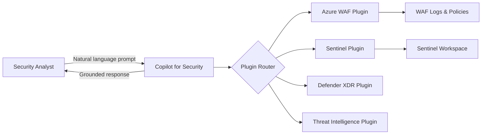
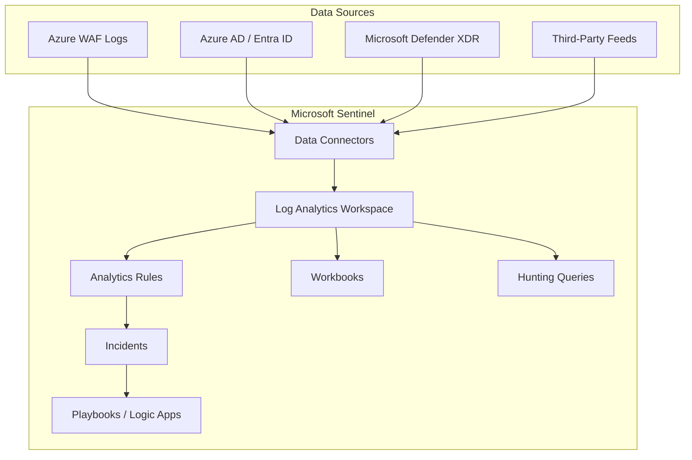
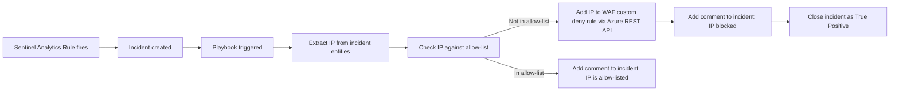

# :sparkles: Module 13 — Copilot for Security & Microsoft Sentinel Integration

!!! abstract "Module Overview"
    Modern security operations demand more than dashboards — they require intelligent triage, automated
    response, and the ability to investigate threats in natural language. This module explores two
    transformative capabilities that elevate Azure WAF from a passive filter to an integrated part of
    your security operations center (SOC): **Microsoft Copilot for Security**, an AI-powered assistant
    that lets you investigate WAF events conversationally, and **Microsoft Sentinel**, a cloud-native
    SIEM/SOAR platform that correlates WAF signals with your broader threat landscape, runs automated
    analytics rules, and triggers playbook-based remediation. We also cover **Azure Policy** for
    enforcing WAF governance at scale.

---

## 1 — Copilot for Security Overview

Microsoft Copilot for Security reached **General Availability (GA)** in April 2024. It is an
AI-powered security assistant built on large language models, grounded in Microsoft's global
threat intelligence and your organization's own security data. Copilot operates through a
natural language interface — you describe what you want in plain English (or other supported
languages) and Copilot translates your intent into queries, investigations, and recommendations.

### How It Works



Key characteristics:

| Feature | Detail |
|---------|--------|
| **Licensing** | Consumption-based — billed per Security Compute Unit (SCU) |
| **Access** | Standalone portal (securitycopilot.microsoft.com) or embedded in Defender XDR, Sentinel, Intune |
| **Grounding** | Responses are grounded in your tenant data plus Microsoft Threat Intelligence |
| **Plugins** | Extensible architecture — Microsoft publishes first-party plugins; organizations can create custom plugins |
| **Data Residency** | Prompts and responses processed within your chosen Azure geography |

!!! info "Security & Privacy"
    Copilot does **not** use your prompts or data to train foundation models. All interactions are
    scoped to your tenant and governed by Microsoft's data protection commitments.

---

## 2 — Copilot for WAF — Use Cases

The **Azure WAF plugin** for Copilot for Security enables analysts to interact with WAF telemetry
conversationally. Instead of writing KQL from scratch, you describe what you need and Copilot
generates the query, executes it, and summarizes the results.

### Example Prompts and Expected Outputs

Below are practical prompts you can use in Copilot, along with descriptions of what each returns:

=== "Attack Overview"

    **Prompt:**
    > "Show me the top WAF attacks in the last 24 hours"

    **Expected Output:** Copilot queries your WAF logs and returns a summary table of the most
    frequently triggered rule groups (e.g., SQL Injection, XSS, LFI) with hit counts, top source
    IPs, and a severity assessment. It may include a brief narrative: *"Your WAF blocked 2,341
    requests in the last 24 hours. 68% were SQL injection attempts originating primarily from
    three IP ranges..."*

=== "IP Investigation"

    **Prompt:**
    > "Which IPs were blocked most by my WAF today, and are any of them known threat actors?"

    **Expected Output:** A ranked list of source IPs with block counts, distinct rules triggered,
    and first/last seen timestamps. Copilot cross-references IPs against Microsoft Threat
    Intelligence and flags any with known associations to botnets, APT groups, or scanning services.

=== "Campaign Detection"

    **Prompt:**
    > "Is there an active SQL injection campaign targeting my applications?"

    **Expected Output:** Copilot analyzes temporal patterns in SQLi rule matches, looking for
    coordinated activity from multiple IPs or sustained high-volume attacks. It reports whether the
    pattern suggests an automated campaign, identifies the targeted URIs, and recommends response
    actions.

=== "Tuning Assistance"

    **Prompt:**
    > "What exclusions should I create for false positives on rule 942430?"

    **Expected Output:** Copilot examines the blocked requests matching rule 942430, identifies
    the common request attributes (URI paths, parameter names, header values), and suggests
    specific exclusion configurations. It may output the exclusion in both portal-step and CLI
    format.

=== "KQL Generation"

    **Prompt:**
    > "Write a KQL query to find all XSS attempts that were only detected but not blocked in the last week"

    **Expected Output:** A ready-to-run KQL query filtering on `ruleGroup_s` containing "XSS" and
    `action_s == "Detected"`, with a time range of 7 days. Copilot explains each clause and suggests
    next steps such as switching the policy to Prevention mode for those rules.

=== "Incident Triage"

    **Prompt:**
    > "Summarize WAF activity for IP 203.0.113.45 in the last 48 hours"

    **Expected Output:** A comprehensive profile of the IP's interactions: total requests, blocked
    vs. allowed, rules triggered, targeted URIs, user agent strings, and temporal pattern. Copilot
    assesses whether the behavior is consistent with a scanner, brute-force attempt, or legitimate
    user experiencing false positives.

=== "Geo Analysis"

    **Prompt:**
    > "Are there unusual geographic patterns in my WAF blocks this week?"

    **Expected Output:** A breakdown of blocks by source country with comparison to historical
    baseline. Copilot highlights any countries showing a significant increase and recommends
    whether geo-filtering custom rules would be appropriate.

=== "Policy Review"

    **Prompt:**
    > "Review my WAF policy configuration and suggest improvements"

    **Expected Output:** Copilot reads your WAF policy settings and provides a checklist assessment:
    rule set version, mode (Detection vs. Prevention), bot protection status, rate limiting
    configuration, and any disabled rules. It highlights gaps compared to best practices.

---

## 3 — Copilot WAF Plugin Capabilities

The Azure WAF plugin exposes a structured set of capabilities that Copilot can invoke:

| Capability | Description |
|-----------|-------------|
| **Investigate WAF events** | Query and summarize WAF log data across time ranges, IPs, rules, and URIs |
| **Generate KQL queries** | Produce syntactically correct KQL queries for custom investigations |
| **Recommend tuning actions** | Analyze false positive patterns and suggest exclusions or rule overrides |
| **Incident triage** | Build an activity profile for a specific IP, session, or URI path |
| **Threat intelligence lookup** | Cross-reference IPs, domains, and user agents against Microsoft TI feeds |
| **Policy assessment** | Review WAF policy configuration against best practices and flag gaps |
| **Compare policies** | Diff two WAF policies to identify configuration drift or inconsistencies |

!!! tip "Prompt Engineering Tips"
    - Be specific about **time ranges** — "last 24 hours" is better than "recently."
    - Include **resource names** if you have multiple WAF policies — "on policy `pol-prod-frontend`."
    - Ask **follow-up questions** — Copilot maintains conversation context within a session.
    - Use **"Explain"** prefix to get educational context — "Explain what rule 942100 detects."

---

## 4 — Microsoft Sentinel Overview

Microsoft Sentinel is a cloud-native **Security Information and Event Management (SIEM)** and
**Security Orchestration, Automation, and Response (SOAR)** solution built on top of Azure Monitor
and Log Analytics.



Sentinel's value for WAF operations lies in **correlation**. A WAF block in isolation tells you
a rule matched. Sentinel can correlate that block with sign-in anomalies from Entra ID, endpoint
alerts from Defender, and threat intelligence to determine whether the block is part of a larger
attack campaign.

### Core Components

| Component | Purpose |
|-----------|---------|
| **Data Connectors** | Ingest data from 200+ sources — Azure services, Microsoft 365, third-party SIEMs, custom logs |
| **Analytics Rules** | Scheduled or near-real-time KQL queries that generate **Incidents** when conditions are met |
| **Incidents** | Correlated groupings of alerts with assigned severity, owner, and status — the unit of SOC work |
| **Workbooks** | Interactive dashboards built on KQL (same as Azure Monitor Workbooks, accessible within Sentinel) |
| **Hunting Queries** | Ad-hoc KQL queries for proactive threat hunting — saved and shared across the SOC team |
| **Playbooks** | Azure Logic App workflows triggered by analytics rules — automated response actions |
| **Threat Intelligence** | STIX/TAXII feeds, Microsoft TI, and custom indicators integrated into detection logic |

---

## 5 — Connecting WAF to Sentinel

If you followed Module 12 and configured your WAF diagnostic logs to flow to a **Log Analytics
workspace**, you are already 80% done. Sentinel is enabled *on top of* an existing Log Analytics
workspace — the same data that powers your KQL queries and workbooks becomes available to
Sentinel's analytics engine.

### Step-by-Step: Enable Sentinel

=== "Portal"

    1. In the Azure portal, search for **Microsoft Sentinel**.
    2. Click **+ Create** (or **+ Add** if you already have Sentinel instances).
    3. Select the **Log Analytics workspace** where your WAF diagnostic logs are flowing.
    4. Click **Add**. Sentinel is now enabled on that workspace.
    5. Navigate to **Sentinel → Data connectors**.
    6. Search for **Azure Web Application Firewall** and click **Open connector page**.
    7. Follow the on-screen instructions to confirm the diagnostic settings are sending WAF logs to this workspace.

=== "CLI"

    ```bash
    # Enable Sentinel on an existing Log Analytics workspace
    az sentinel onboarding-state create \
      --resource-group "rg-waf-workshop" \
      --workspace-name "law-waf-workshop" \
      --name "default"

    # Verify Sentinel is active
    az sentinel onboarding-state show \
      --resource-group "rg-waf-workshop" \
      --workspace-name "law-waf-workshop" \
      --name "default"
    ```

!!! note "No Data Duplication"
    Enabling Sentinel does **not** duplicate your log data. Sentinel reads from the same Log
    Analytics tables your existing queries use. You pay Sentinel's per-GB analytics cost on top
    of the Log Analytics ingestion cost, but the data is stored only once.

### Verifying WAF Data in Sentinel

After enabling Sentinel, navigate to **Sentinel → Logs** and run:

```kql
AzureDiagnostics
| where Category == "ApplicationGatewayFirewallLog"
| take 10
```

If results appear, your WAF data is accessible to Sentinel's analytics engine.

---

## 6 — Sentinel Analytics Rules for WAF

Analytics rules are the detection engine of Sentinel. Each rule runs a KQL query on a schedule and
creates an **Incident** when the query returns results. Below are three production-ready rule
definitions for WAF scenarios.

### Rule 1: High-Volume WAF Blocks from Single IP

This rule detects potential brute-force or DDoS-layer-7 attacks where a single IP accumulates
more than 100 blocks in a 5-minute window:

```kql
// Sentinel Analytics Rule: High Volume WAF Blocks
// Frequency: Every 5 minutes | Lookback: 5 minutes | Severity: High
AzureDiagnostics
| where Category == "ApplicationGatewayFirewallLog"
| where action_s == "Blocked"
| summarize
    BlockCount = count(),
    DistinctRules = dcount(ruleId_s),
    TargetedURIs = make_set(requestUri_s, 10),
    FirstBlock = min(TimeGenerated),
    LastBlock = max(TimeGenerated)
  by clientIp_s
| where BlockCount > 100
| extend
    IPCustomEntity = clientIp_s,
    Description = strcat("IP ", clientIp_s, " triggered ", BlockCount, " WAF blocks across ", DistinctRules, " distinct rules")
```

!!! tip "Entity Mapping"
    The `IPCustomEntity` field maps to Sentinel's **IP entity**, enabling automatic enrichment
    with threat intelligence, geo-location, and related incidents on the incident page.

### Rule 2: SQL Injection Campaign Detection

This rule identifies coordinated SQL injection attacks — multiple SQLi rule matches from the same
source within a short window, targeting different URIs:

```kql
// Sentinel Analytics Rule: SQL Injection Campaign
// Frequency: Every 10 minutes | Lookback: 10 minutes | Severity: High
AzureDiagnostics
| where Category == "ApplicationGatewayFirewallLog"
| where ruleGroup_s has "SQLI" or ruleGroup_s has "SQL"
| where action_s in ("Blocked", "Detected")
| summarize
    SQLiHits = count(),
    DistinctRules = dcount(ruleId_s),
    TargetedURIs = dcount(requestUri_s),
    URISamples = make_set(requestUri_s, 5),
    RulesSamples = make_set(ruleId_s, 10),
    FirstSeen = min(TimeGenerated),
    LastSeen = max(TimeGenerated)
  by clientIp_s
| where SQLiHits > 10 and DistinctRules > 2
| extend
    IPCustomEntity = clientIp_s,
    Description = strcat("Potential SQLi campaign from ", clientIp_s, ": ", SQLiHits, " hits across ", TargetedURIs, " URIs using ", DistinctRules, " distinct rules")
```

This rule requires both volume (>10 hits) *and* diversity (>2 distinct rules) to avoid alerting
on single-rule false positives.

### Rule 3: Anomalous Geographic Access Pattern

This rule detects WAF blocks from countries that have not appeared in your traffic baseline during
the previous 14 days — a potential indicator of a new attack source:

```kql
// Sentinel Analytics Rule: Anomalous Geo Access
// Frequency: Every 1 hour | Lookback: 1 hour | Severity: Medium
let baseline = AzureDiagnostics
| where Category == "ApplicationGatewayFirewallLog"
| where TimeGenerated between(ago(14d) .. ago(1h))
| distinct client_country_s;
AzureDiagnostics
| where Category == "ApplicationGatewayFirewallLog"
| where action_s == "Blocked"
| where TimeGenerated > ago(1h)
| where client_country_s !in (baseline)
| summarize
    BlockCount = count(),
    DistinctIPs = dcount(clientIp_s),
    SampleIPs = make_set(clientIp_s, 5)
  by client_country_s
| where BlockCount > 5
| extend Description = strcat("New source country detected: ", client_country_s, " with ", BlockCount, " blocks from ", DistinctIPs, " IPs")
```

!!! warning "Field Availability"
    The `client_country_s` field is populated by Application Gateway's GeoIP lookup. If you use
    Front Door, the equivalent field may differ. Verify your schema before deploying this rule.

---

## 7 — Sentinel Workbooks for WAF

Sentinel workbooks extend the Azure Monitor Workbooks concept with security-focused templates.
A WAF security dashboard in Sentinel should include the following panels:

| Panel | KQL Basis | Visualization |
|-------|----------|---------------|
| **Attack Timeline** | Timechart of blocked requests by hour | Line chart |
| **Top 10 Source IPs** | Group by `clientIp_s`, count blocks | Table with TI enrichment |
| **Rule Breakdown** | Group by `ruleGroup_s` and `ruleId_s` | Stacked bar chart |
| **Geographic Map** | Group by `client_country_s`, count | Map visualization |
| **Active Incidents** | Join with `SecurityIncident` table | Table with severity badges |
| **Top Targeted URIs** | Group by `requestUri_s`, count blocks | Horizontal bar chart |

To create a workbook:

1. Navigate to **Sentinel → Workbooks → + Add workbook**.
2. Click **Edit** to enter the workbook editor.
3. Add a **Query** step for each panel above.
4. Set the visualization type (chart, table, map) for each step.
5. Add a **Parameter** step at the top with a time range picker.
6. Click **Save** and assign it to a resource group.

!!! tip "Community Templates"
    Check the **Content hub** in Sentinel for pre-built WAF workbook templates. Install the
    **Azure Web Application Firewall** solution to get templates, analytics rules, and hunting
    queries in one package.

---

## 8 — Playbook Automation

Sentinel **playbooks** are Azure Logic App workflows that execute automatically when an analytics
rule fires. They enable automated response without human intervention — critical for high-volume
WAF scenarios.

### Example: Auto-Block Attacking IP

When the "High Volume WAF Blocks" analytics rule creates an incident, a playbook can automatically
add the offending IP to a WAF custom rule that blocks it at the edge:



### Playbook Implementation Steps

1. **Create a Logic App** with the **Microsoft Sentinel incident trigger**.
2. Add an action to **parse the incident entities** and extract the IP address.
3. Add a **Condition** to check the IP against a known allow-list (stored in a SharePoint list, Key Vault, or hardcoded).
4. If not allow-listed, use an **HTTP action** to call the Azure Management REST API:
    - `PUT` to update the WAF policy's custom rules, adding a match condition for the offending IP with `Block` action.
5. Add a **Sentinel — Add comment to incident** action to document the automated response.
6. Optionally **close the incident** as True Positive with a classification reason.

!!! warning "Safeguards"
    Automated IP blocking is powerful but dangerous. Always include:

    - An **allow-list check** to prevent blocking legitimate IPs (monitoring systems, partners).
    - A **maximum block duration** — add the IP with an expiry mechanism (e.g., Logic App timer to remove it after 24h).
    - **Rate limiting on the playbook** — prevent runaway automation from adding hundreds of custom rules and hitting WAF limits.

### PowerShell: Add IP to WAF Custom Rule

If you prefer a script-based approach over Logic Apps, the following PowerShell snippet adds an IP
to an existing WAF policy's custom rules:

```powershell
# Requires Az.Network module
$policy = Get-AzApplicationGatewayFirewallPolicy `
  -Name "pol-prod-frontend" `
  -ResourceGroupName "rg-waf-workshop"

$newRule = New-AzApplicationGatewayFirewallCustomRuleMatch `
  -MatchVariable (New-AzApplicationGatewayFirewallMatchVariable -VariableName "RemoteAddr") `
  -Operator "IPMatch" `
  -MatchValue "203.0.113.45"

$customRule = New-AzApplicationGatewayFirewallCustomRule `
  -Name "BlockAttacker_203_0_113_45" `
  -Priority 10 `
  -RuleType "MatchRule" `
  -MatchCondition $newRule `
  -Action "Block"

$policy.CustomRules.Add($customRule)
Set-AzApplicationGatewayFirewallPolicy -InputObject $policy
```

---

## 9 — Azure Policy for WAF Governance

Azure Policy enforces organizational standards at the subscription or management group level. For
WAF, this means ensuring that every public-facing Application Gateway or Front Door has WAF enabled
and configured correctly — without relying on individual teams to remember.

### Built-In WAF Policies

Azure provides several built-in policy definitions for WAF governance:

| Policy Name | Effect | What It Enforces |
|------------|--------|------------------|
| `Web Application Firewall (WAF) should be enabled for Application Gateway` | Audit / Deny | Ensures every AppGW has a WAF policy associated |
| `Web Application Firewall (WAF) should be enabled for Azure Front Door Service` | Audit / Deny | Ensures every Front Door endpoint has WAF enabled |
| `Web Application Firewall (WAF) should use the specified mode for Application Gateway` | Audit / Deny | Enforces Prevention mode (not Detection) |
| `Web Application Firewall (WAF) should use the specified mode for Azure Front Door Service` | Audit / Deny | Enforces Prevention mode on Front Door |

### Assigning a Policy via CLI

The following commands assign the "WAF should be enabled for Application Gateway" policy at the
resource group level with an **Audit** effect:

```bash
# Find the policy definition ID
POLICY_DEF_ID=$(az policy definition list \
  --query "[?displayName=='Web Application Firewall (WAF) should be enabled for Application Gateway'].id" \
  --output tsv)

# Create the policy assignment
az policy assignment create \
  --name "require-waf-on-appgw" \
  --display-name "Require WAF on all Application Gateways" \
  --scope "/subscriptions/<sub-id>/resourceGroups/rg-waf-workshop" \
  --policy "$POLICY_DEF_ID" \
  --params '{"effect":{"value":"Audit"}}'
```

To switch from **Audit** (reports non-compliance) to **Deny** (prevents resource creation without
WAF), change the effect parameter:

```bash
az policy assignment create \
  --name "enforce-waf-on-appgw" \
  --display-name "Enforce WAF on all Application Gateways" \
  --scope "/subscriptions/<sub-id>/resourceGroups/rg-production" \
  --policy "$POLICY_DEF_ID" \
  --params '{"effect":{"value":"Deny"}}'
```

### Custom Policy: Enforce Prevention Mode

You can create a custom policy that ensures all WAF policies in your subscription are in
**Prevention** mode:

```json
{
  "mode": "All",
  "policyRule": {
    "if": {
      "allOf": [
        {
          "field": "type",
          "equals": "Microsoft.Network/ApplicationGatewayWebApplicationFirewallPolicies"
        },
        {
          "field": "Microsoft.Network/ApplicationGatewayWebApplicationFirewallPolicies/policySettings.mode",
          "notEquals": "Prevention"
        }
      ]
    },
    "then": {
      "effect": "audit"
    }
  }
}
```

!!! note "Policy vs. Enforcement"
    Start with **Audit** mode to discover non-compliant resources without breaking anything. Review
    the compliance report, remediate existing resources, and then switch to **Deny** once your
    organization is ready for strict enforcement.

### Compliance Monitoring

After assigning policies, monitor compliance through:

```bash
# Check compliance state
az policy state list \
  --resource-group "rg-waf-workshop" \
  --filter "complianceState eq 'NonCompliant'" \
  --query "[].{Resource:resourceId, Policy:policyAssignmentName}" \
  --output table
```

The compliance dashboard in the Azure portal (**Policy → Compliance**) provides a visual overview
of all policy assignments, their compliance percentage, and the specific resources that are
non-compliant.

---

## :test_tube: Related Labs

- [:octicons-beaker-24: LAB10](../labs/lab10.md)
- [:octicons-beaker-24: LAB11](../labs/lab11.md)

---

## :white_check_mark: Key Takeaways

1. **Copilot for Security** is GA and provides a natural language interface for WAF investigation — ask questions instead of writing KQL from scratch.
2. **Sentinel sits on top of Log Analytics** — if your WAF logs already flow to a workspace, enabling Sentinel requires no data duplication.
3. **Analytics rules** are scheduled KQL queries that auto-generate incidents. Deploy rules for high-volume blocks, SQLi campaigns, and anomalous geo patterns.
4. **Playbooks** enable automated response — auto-blocking IPs via Logic Apps — but always include safeguards (allow-lists, expiry, rate limits).
5. **Azure Policy** enforces WAF governance at scale — ensure WAF is enabled and in Prevention mode across all resources without manual checks.
6. **Combine Copilot + Sentinel** for a powerful SOC workflow: Sentinel detects and creates incidents, Copilot helps analysts investigate and triage them conversationally.

---

## :books: References

- [Microsoft Copilot for Security — Overview](https://learn.microsoft.com/security-copilot/microsoft-security-copilot)
- [Copilot for Security — WAF Plugin](https://learn.microsoft.com/azure/web-application-firewall/waf-copilot)
- [Microsoft Sentinel — Overview](https://learn.microsoft.com/azure/sentinel/overview)
- [Sentinel Data Connectors](https://learn.microsoft.com/azure/sentinel/data-connectors-reference)
- [Sentinel Analytics Rules](https://learn.microsoft.com/azure/sentinel/detect-threats-custom)
- [Sentinel Playbooks](https://learn.microsoft.com/azure/sentinel/automate-responses-with-playbooks)
- [Azure Policy for WAF](https://learn.microsoft.com/azure/web-application-firewall/shared/waf-azure-policy)
- [Azure Policy — Built-In Definitions](https://learn.microsoft.com/azure/governance/policy/samples/built-in-policies)

---

<div style="display: flex; justify-content: space-between;">
<div>[:octicons-arrow-left-24: Module 12](12-monitoring.md)</div>
<div>[Module 14 :octicons-arrow-right-24:](14-best-practices.md)</div>
</div>
