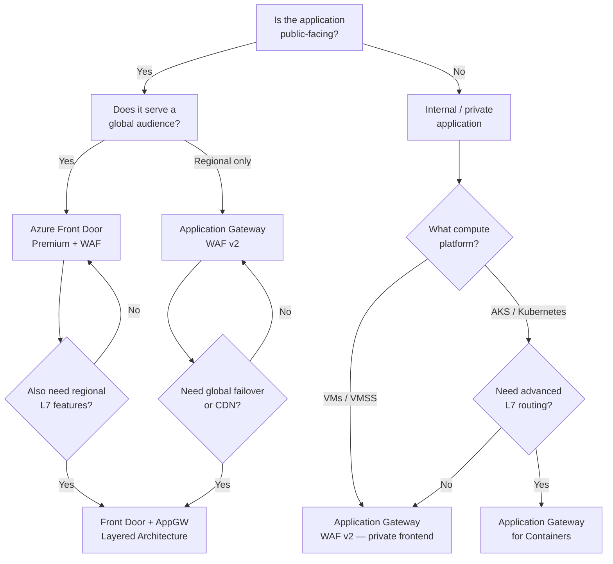
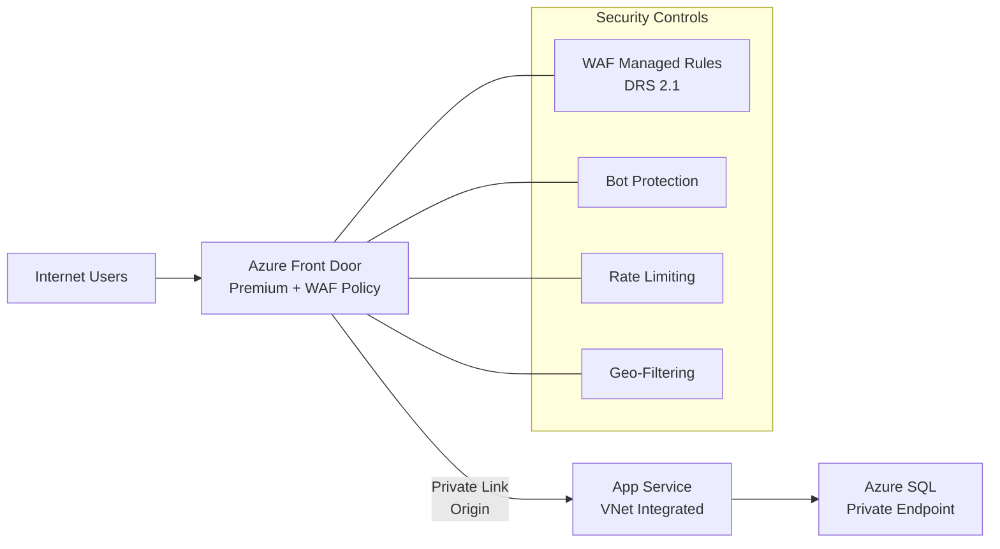
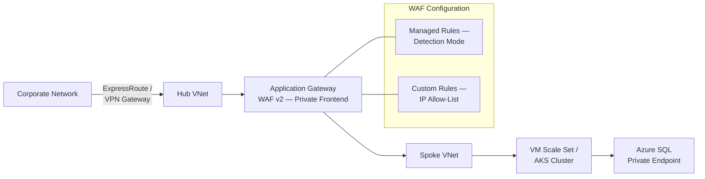
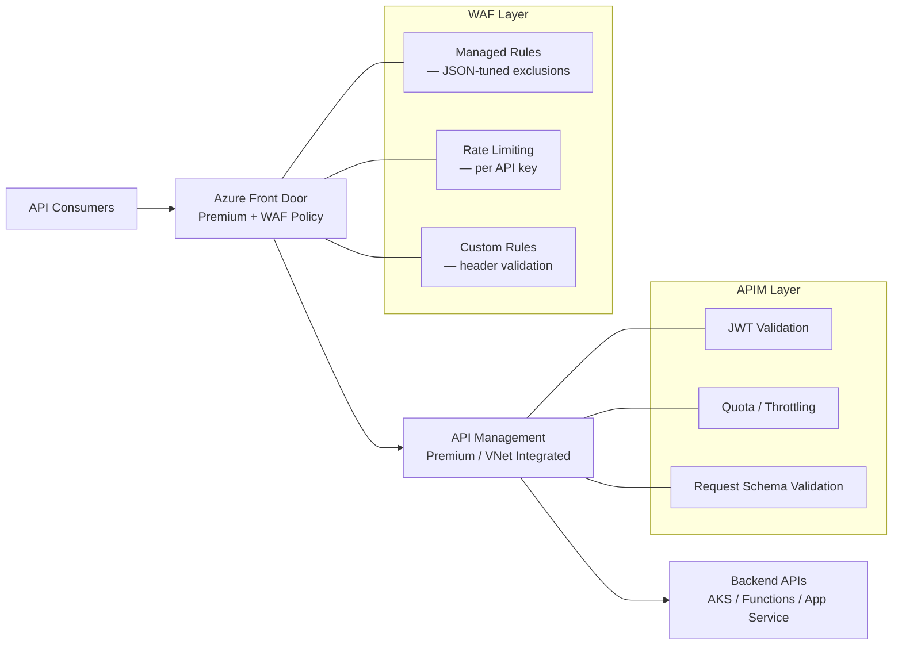
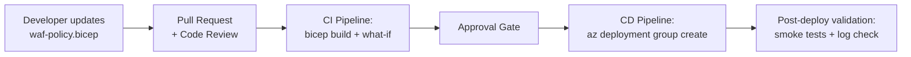

# :trophy: Module 14 — Reference Architectures & Best Practices

!!! abstract "Module Overview"
    Architecture decisions made early in a project determine how effectively your WAF protects
    applications for years to come. This module is your decision-making companion — it provides a
    structured approach to choosing the right WAF deployment model, presents four reference
    architectures with detailed diagrams, consolidates operational best practices into an actionable
    checklist, documents platform limits you must design around, and shows how to define your entire
    WAF configuration as infrastructure code using Bicep. Whether you are planning a new deployment
    or rationalizing an existing one, this module gives you the blueprints and guardrails.

---

## 1 — WAF Architecture Decision Tree

Choosing the right Azure WAF deployment starts with understanding your application's traffic
pattern, audience, and infrastructure. The following decision tree guides you through the key
questions:



### Decision Summary

| Scenario | Recommended WAF | Why |
|----------|----------------|-----|
| Public app, global users | Front Door Premium | Anycast edge, global PoPs, built-in CDN |
| Public app, single region | Application Gateway WAF v2 | Regional L7 LB with full WAF |
| Internal app | Application Gateway WAF v2 (private) | Private frontend IP, VNet integration |
| Kubernetes workloads | Application Gateway for Containers | Native K8s integration, Gateway API |
| Global + regional features needed | Front Door + Application Gateway | Layered: edge WAF + regional WAF |

!!! info "When to Layer"
    A layered architecture (Front Door → Application Gateway) gives you **two WAF inspection
    points**. Front Door handles volumetric attacks and bot protection at the edge, while
    Application Gateway provides regional-specific rules and deeper integration with VNet-hosted
    backends. The trade-off is added complexity and cost.

---

## 2 — Reference Architecture: Public Web Application

The most common pattern: a public-facing web application protected by Front Door with WAF,
backed by an App Service integrated into a VNet with a private endpoint.



### Key Design Decisions

**Origin Lockdown** is critical in this architecture. Without it, attackers can bypass Front Door
by sending requests directly to the App Service's public URL. Implement origin lockdown by:

1. **Private Link Origin** (recommended) — Front Door Premium connects to App Service via Private
   Link. The App Service has no public endpoint at all.
2. **Access Restrictions** — If Private Link is not feasible, configure App Service access
   restrictions to allow only Front Door's service tag (`AzureFrontDoor.Backend`) and validate the
   `X-Azure-FDID` header matches your Front Door instance ID.

```bash
# Configure access restriction to allow only Front Door
az webapp config access-restriction add \
  --resource-group "rg-waf-workshop" \
  --name "app-workshop" \
  --priority 100 \
  --service-tag AzureFrontDoor.Backend \
  --http-header x-azure-fdid=<your-front-door-id>
```

!!! warning "Never Skip Origin Lockdown"
    A WAF in front of a publicly accessible origin is like a locked front door with an open window.
    Every Front Door + WAF deployment must include origin lockdown.

---

## 3 — Reference Architecture: Internal Application

Internal applications serve corporate users who connect through ExpressRoute, VPN, or Azure
Virtual Desktop. The WAF still provides value by protecting against insider threats, compromised
devices, and lateral movement.



### Key Design Decisions

- **Private Frontend IP** — Application Gateway is deployed in a dedicated subnet within the hub
  VNet with only a private frontend IP. No public IP is assigned.
- **Detection Mode First** — Internal applications typically have more complex, non-standard
  request patterns. Start in Detection mode, analyze logs for 2–4 weeks, create exclusions, then
  switch to Prevention.
- **IP Allow-Listing** — Use custom rules to restrict access to known corporate IP ranges, adding
  a network-layer access control on top of the L7 WAF inspection.
- **NSG Integration** — Network Security Groups on the Application Gateway subnet must allow
  the required management traffic (GatewayManager service tag, health probes).

---

## 4 — Reference Architecture: API Protection

APIs require a different WAF strategy than web applications. They typically accept JSON payloads
(not HTML forms), use authentication tokens, and have well-defined request schemas.



### How WAF and APIM Complement Each Other

| Control | WAF | APIM |
|---------|-----|------|
| SQL Injection / XSS | :white_check_mark: Managed rules inspect payloads | :x: No inspection |
| Rate Limiting | :white_check_mark: Per-IP rate limits at edge | :white_check_mark: Per-subscription/key throttling |
| Authentication | :x: Not a WAF concern | :white_check_mark: JWT validation, OAuth flows |
| Schema Validation | :x: Rules are pattern-based | :white_check_mark: OpenAPI schema enforcement |
| Bot Protection | :white_check_mark: Bot manager rules | :x: No built-in bot detection |
| IP Filtering | :white_check_mark: Geo and IP custom rules | :white_check_mark: IP filter policies |

!!! tip "JSON False Positives"
    APIs that accept JSON payloads frequently trigger CRS/DRS rules designed for HTML form data.
    Create exclusions for request body inspection on API endpoints that accept structured JSON,
    and rely on APIM's schema validation for payload integrity.

---

## 5 — Reference Architecture: Multi-Region

For applications requiring high availability across Azure regions, Front Door provides global
load balancing with WAF at the edge, routing to regional Application Gateways that provide
additional L7 capabilities.

```mermaid
flowchart TD
    A[Internet Users] --> B[Azure Front Door<br>Premium + WAF Policy<br>Global]

    B --> C[Region 1 — East US]
    B --> D[Region 2 — West Europe]

    subgraph Region 1 — East US
        C --> E[Application Gateway<br>WAF v2]
        E --> F[AKS Cluster /<br>App Service]
        F --> G[Azure SQL<br>Read-Write]
    end

    subgraph Region 2 — West Europe
        D --> H[Application Gateway<br>WAF v2]
        H --> I[AKS Cluster /<br>App Service]
        I --> J[Azure SQL<br>Read Replica]
    end

    G <-->|Geo-Replication| J
```

### Design Considerations

- **Single WAF Policy at Front Door** — Maintain one global WAF policy at the Front Door level.
  This ensures consistent security posture across all regions.
- **Regional WAF Policies** — Application Gateways in each region can have their own WAF policies
  for region-specific rules (e.g., compliance requirements, regional IP blocks).
- **Health Probes** — Front Door monitors backend health and automatically fails over. WAF blocks
  do not affect health probe results (probes bypass WAF).
- **Session Affinity** — If your application requires sticky sessions, configure Front Door
  session affinity. WAF does not impact session cookie handling.

!!! note "Cost Optimization"
    In a multi-region setup, you can use **Application Gateway WAF v2** in the primary region and
    a simpler **Application Gateway Standard v2** (without WAF) in the secondary region if the
    Front Door WAF provides sufficient protection. This reduces cost in the DR region.

---

## 6 — WAF Best Practices Summary

The following practices are distilled from Microsoft's official guidance, Azure support team
experience, and production deployment patterns across enterprise customers.

### 6.1 Policy and Configuration

!!! tip "Best Practice #1: Always Use WAF Policy Objects"
    Legacy WAF configuration (embedded in Application Gateway) is deprecated. Always create a
    **WAF Policy** resource (`Microsoft.Network/ApplicationGatewayWebApplicationFirewallPolicies`)
    and associate it with your gateway. Policies support per-site and per-URI rules, versioning,
    and cross-resource sharing.

!!! tip "Best Practice #2: Start in Detection Mode, Then Switch to Prevention"
    Deploy WAF in **Detection** mode first. Run for at least 1–2 weeks under production traffic.
    Analyze the firewall logs to identify false positives. Create exclusions for legitimate
    patterns. Only then switch to **Prevention** mode. This approach prevents outages caused by
    overly aggressive rules blocking legitimate traffic.

!!! tip "Best Practice #3: Use the Latest Managed Rule Set"
    Always use **DRS 2.1** (Default Rule Set) — it provides the best detection accuracy with the
    lowest false positive rate. DRS 2.1 uses anomaly scoring by default, which is more nuanced
    than the per-rule blocking of older CRS versions.

### 6.2 Security Features

!!! tip "Best Practice #4: Enable Bot Protection"
    Bot Manager Rule Set adds detection for known bad bots, verified good bots (search engines),
    and unknown bots. Without it, your WAF only inspects for OWASP attack patterns and misses
    credential stuffing, scraping, and automated abuse.

!!! tip "Best Practice #5: Implement Rate Limiting"
    Custom rate-limit rules are your first line of defense against application-layer DDoS and
    brute-force attacks. Define rate limits per source IP with thresholds based on your
    application's expected traffic patterns.

!!! tip "Best Practice #6: Lock Down Origins"
    When using Front Door, configure Private Link origins or access restrictions to ensure
    traffic cannot bypass the WAF by going directly to the backend.

### 6.3 Operations

!!! tip "Best Practice #7: Define WAF Configuration as Code"
    Use **Bicep**, **Terraform**, or **ARM templates** to define your WAF policies. This enables
    version control, peer review, automated testing, and consistent deployments across
    environments. See Section 9 for a complete Bicep example.

!!! tip "Best Practice #8: Monitor with WAF Insights + Log Analytics"
    Enable diagnostic logging to a Log Analytics workspace. Use WAF Insights for quick overview
    and KQL queries for deep investigation. Deploy the WAF Triage Workbook from the
    Azure-Network-Security GitHub repository.

!!! tip "Best Practice #9: Use the WAF Triage Workbook for Tuning"
    The WAF Triage Workbook automates false positive identification by surfacing rules that block
    many distinct IPs on the same URI — the hallmark of a false positive. Use it during your
    Detection-to-Prevention transition and ongoing operations.

!!! tip "Best Practice #10: Combine WAF with DDoS Protection"
    Azure WAF handles Layer-7 attacks. Azure DDoS Protection handles Layer-3/4 volumetric attacks.
    Together they provide comprehensive protection. DDoS Protection is enabled at the VNet level
    and protects all public IPs in the VNet.

---

## 7 — WAF Limits & Quotas

Every Azure resource has platform limits. Designing within these limits avoids runtime surprises.
The following table consolidates the most important WAF limits:

### Application Gateway WAF v2

| Resource | Limit | Notes |
|----------|-------|-------|
| Custom rules per policy | **100** | Includes match rules and rate-limit rules |
| Match conditions per custom rule | **5** | Each condition can have up to 10 match values |
| Exclusions per policy | **100** | Per-rule exclusions count separately |
| IP address ranges per match condition | **600** | Across all custom rules in the policy |
| Request body inspection limit | **128 KB** | Default; can be increased to 2 MB on WAF v2 |
| Max request body size (hard limit) | **4 MB** | Requests exceeding this are rejected |
| File upload limit | **100 MB (medium)** to **4 GB (XXL)** | Depends on gateway SKU size |
| WAF policies per subscription | **100** | Soft limit; request increase via support |
| Associated Application Gateways per policy | **Unlimited** | A single policy can be shared |

### Front Door WAF

| Resource | Limit | Notes |
|----------|-------|-------|
| Custom rules per policy | **100** | Same as AppGW |
| Match conditions per custom rule | **10** | Higher than AppGW |
| IP address ranges per match condition | **600** | Same as AppGW |
| Rate-limit rules per policy | **5** | Lower than custom rule limit |
| Rate-limit duration options | **1 min, 5 min** | Only two options available |
| Request body inspection limit | **128 KB** | Fixed; cannot be increased |
| Geo-match conditions | All countries/regions | Uses ISO 3166-1 codes |
| WAF policies per subscription | **100** | Soft limit |
| Custom rules with regex match | **5** per policy | Regex is expensive; limited by design |

!!! warning "Plan for Limits"
    The 100 custom rules limit seems generous until you start adding per-IP blocks, rate limits,
    geo-filters, and header validations. Use IP address **ranges** (CIDR notation) instead of
    individual IPs, and consolidate rules with multiple match conditions where possible.

---

## 8 — Migration Guide

### 8.1 Legacy WAF Config to WAF Policy

Older Application Gateway deployments may use the **legacy WAF configuration** embedded directly
in the gateway resource rather than a standalone WAF Policy object.

**Why migrate?**

- WAF Policies support **per-site** and **per-URI** rule customization — legacy config applies
  globally only.
- WAF Policies support **exclusions**, **custom rules**, **bot protection** — unavailable in
  legacy config.
- Legacy config is deprecated and will not receive new features.

**Migration steps:**

1. **Export current config** — Document your current WAF mode, disabled rules, and any firewall
   exclusions.
2. **Create a WAF Policy** — Create a new `ApplicationGatewayWebApplicationFirewallPolicies`
   resource with the same mode and rule set version.
3. **Recreate disabled rules** — In the WAF Policy, override the specific rules that were disabled
   in legacy config.
4. **Add exclusions** — Recreate any exclusions in the WAF Policy's exclusion section.
5. **Associate the policy** — Link the WAF Policy to the Application Gateway.
6. **Verify** — Monitor logs for 24–48 hours to confirm identical behavior.
7. **Remove legacy config** — Once confirmed, remove the legacy WAF configuration from the gateway.

```bash
# Associate WAF policy with Application Gateway
az network application-gateway update \
  --name "appgw-workshop" \
  --resource-group "rg-waf-workshop" \
  --set firewallPolicy.id="/subscriptions/<sub-id>/resourceGroups/rg-waf-workshop/providers/Microsoft.Network/ApplicationGatewayWebApplicationFirewallPolicies/pol-workshop"
```

### 8.2 CRS 3.x to DRS 2.1 Migration

DRS 2.1 is the successor to the CRS (OWASP Core Rule Set) versions. Key differences:

| Aspect | CRS 3.x | DRS 2.1 |
|--------|---------|---------|
| Scoring Mode | Per-rule blocking (default) | Anomaly scoring (default) |
| False Positive Rate | Higher | Lower — rules tuned for Azure traffic |
| Rule Coverage | OWASP CRS upstream | Microsoft-enhanced fork with additional rules |
| Bot Protection | Not included | Separate Bot Manager Rule Set available |
| Update Cadence | Tied to OWASP releases | Updated independently by Microsoft |

**Migration steps:**

1. **Switch to DRS 2.1 in Detection mode** — Update the managed rule set version in your WAF
   Policy to DRS 2.1, keeping the policy in Detection mode.
2. **Monitor for 1–2 weeks** — DRS 2.1 may trigger on different patterns than CRS 3.x. Review
   the firewall logs for new detections.
3. **Review anomaly scores** — DRS 2.1 uses anomaly scoring. Requests accumulate scores across
   multiple rule matches. Understand the score distribution before setting the threshold.
4. **Update exclusions** — Some exclusions may need adjustment because rule IDs changed between
   CRS 3.x and DRS 2.1.
5. **Switch to Prevention mode** — Once the Detection-mode logs show clean results, switch to
   Prevention.

!!! note "Rule ID Changes"
    Some rule IDs changed between CRS 3.x and DRS 2.1. Cross-reference the
    [DRS 2.1 rule group documentation](https://learn.microsoft.com/azure/web-application-firewall/ag/application-gateway-crs-rulegroups-rules)
    to update any rule-specific exclusions or overrides.

---

## 9 — WAF as Code

Defining WAF configuration as infrastructure code is a best practice that enables version control,
automated deployment, peer review, and environment consistency. The following Bicep template
defines a complete WAF policy with managed rules, custom rules, and exclusions.

### Complete Bicep Template

```bicep
@description('WAF Policy for production web application')
param location string = resourceGroup().location
param policyName string = 'pol-prod-webapp'

resource wafPolicy 'Microsoft.Network/ApplicationGatewayWebApplicationFirewallPolicies@2023-11-01' = {
  name: policyName
  location: location
  properties: {

    // Policy Settings
    policySettings: {
      requestBodyCheck: true
      maxRequestBodySizeInKb: 128
      fileUploadLimitInMb: 100
      state: 'Enabled'
      mode: 'Prevention'
      requestBodyInspectLimitInKB: 128
      fileUploadEnforcement: true
      requestBodyEnforcement: true
    }

    // Managed Rules
    managedRules: {
      managedRuleSets: [
        {
          ruleSetType: 'Microsoft_DefaultRuleSet'
          ruleSetVersion: '2.1'
          ruleGroupOverrides: [
            {
              ruleGroupName: 'SQLI'
              rules: [
                {
                  ruleId: '942430'
                  state: 'Enabled'
                  action: 'Log'
                }
              ]
            }
          ]
        }
        {
          ruleSetType: 'Microsoft_BotManagerRuleSet'
          ruleSetVersion: '1.1'
        }
      ]
      exclusions: [
        {
          matchVariable: 'RequestArgNames'
          selectorMatchOperator: 'Equals'
          selector: 'callback'
          exclusionManagedRuleSets: [
            {
              ruleSetType: 'Microsoft_DefaultRuleSet'
              ruleSetVersion: '2.1'
              ruleGroups: [
                {
                  ruleGroupName: 'XSS'
                  rules: [
                    { ruleId: '941100' }
                    { ruleId: '941130' }
                  ]
                }
              ]
            }
          ]
        }
      ]
    }

    // Custom Rules
    customRules: [
      {
        name: 'BlockMaliciousCountries'
        priority: 10
        ruleType: 'MatchRule'
        action: 'Block'
        matchConditions: [
          {
            matchVariables: [
              { variableName: 'RemoteAddr' }
            ]
            operator: 'GeoMatch'
            matchValues: [ 'XX' , 'YY' ]
            negationConditon: false
          }
        ]
      }
      {
        name: 'RateLimitPerIP'
        priority: 20
        ruleType: 'RateLimitRule'
        rateLimitDuration: 'FiveMins'
        rateLimitThreshold: 500
        action: 'Block'
        matchConditions: [
          {
            matchVariables: [
              { variableName: 'RemoteAddr' }
            ]
            operator: 'IPMatch'
            negationConditon: true
            matchValues: [ '10.0.0.0/8' ]
          }
        ]
        groupByUserSession: [
          { groupByVariables: [ { variableName: 'ClientAddr' } ] }
        ]
      }
      {
        name: 'AllowHealthProbes'
        priority: 5
        ruleType: 'MatchRule'
        action: 'Allow'
        matchConditions: [
          {
            matchVariables: [
              { variableName: 'RequestUri' }
            ]
            operator: 'Contains'
            matchValues: [ '/health', '/ready' ]
            negationConditon: false
          }
        ]
      }
    ]
  }

  tags: {
    environment: 'production'
    managedBy: 'bicep'
    lastReviewed: '2024-06-01'
  }
}

output policyId string = wafPolicy.id
```

### Deploying the Template

```bash
# Deploy WAF policy using Bicep
az deployment group create \
  --resource-group "rg-waf-workshop" \
  --template-file "waf-policy.bicep" \
  --parameters policyName="pol-prod-webapp"

# Verify deployment
az network application-gateway waf-policy show \
  --name "pol-prod-webapp" \
  --resource-group "rg-waf-workshop" \
  --query "{name:name, mode:policySettings.mode, ruleSet:managedRules.managedRuleSets[0].ruleSetType}" \
  --output table
```

### CI/CD Integration

Integrate the Bicep template into your CI/CD pipeline to ensure WAF configuration changes go
through the same review and approval process as application code:



!!! tip "What-If Preview"
    Use `az deployment group what-if` to preview changes before applying them. This shows exactly
    which rules, exclusions, or settings will be added, modified, or removed — preventing
    accidental disruptions in production.

```bash
# Preview changes before deploying
az deployment group what-if \
  --resource-group "rg-waf-workshop" \
  --template-file "waf-policy.bicep" \
  --parameters policyName="pol-prod-webapp"
```

---

## :white_check_mark: Key Takeaways

1. **Use the decision tree** to select the right WAF deployment model — Front Door for global apps, Application Gateway for regional, layered for complex scenarios.
2. **Always lock down origins** when using Front Door — Private Link origins are the gold standard.
3. **WAF + APIM** complement each other for API protection — WAF handles attack patterns, APIM handles authentication and schema validation.
4. **Follow the Detection → Tune → Prevention workflow** — never deploy WAF in Prevention mode on day one.
5. **Design within platform limits** — 100 custom rules, 128 KB body inspection, 600 IP ranges per condition.
6. **Define WAF as code** using Bicep or Terraform, deployed through CI/CD with what-if previews and approval gates.
7. **Migrate to WAF Policy** and **DRS 2.1** if you are still on legacy configuration or CRS 3.x.

---

## :books: References

- [Azure WAF Best Practices — Microsoft Learn](https://learn.microsoft.com/azure/web-application-firewall/ag/best-practices)
- [WAF on Application Gateway — Overview](https://learn.microsoft.com/azure/web-application-firewall/ag/ag-overview)
- [WAF on Front Door — Overview](https://learn.microsoft.com/azure/web-application-firewall/afds/afds-overview)
- [Application Gateway for Containers](https://learn.microsoft.com/azure/application-gateway/for-containers/overview)
- [Front Door Origin Security — Private Link](https://learn.microsoft.com/azure/frontdoor/private-link)
- [WAF Policy Resource — Bicep Reference](https://learn.microsoft.com/azure/templates/microsoft.network/applicationgatewaywebapplicationfirewallpolicies)
- [Azure WAF Quotas and Limits](https://learn.microsoft.com/azure/azure-resource-manager/management/azure-subscription-service-limits#azure-web-application-firewall-limits)
- [DRS 2.1 Rule Groups and Rules](https://learn.microsoft.com/azure/web-application-firewall/ag/application-gateway-crs-rulegroups-rules)
- [Migrate to WAF Policy](https://learn.microsoft.com/azure/web-application-firewall/ag/migrate-policy)

---

<div style="display: flex; justify-content: space-between;">
<div>[:octicons-arrow-left-24: Module 13](13-copilot-sentinel.md)</div>
<div>[Module 15 :octicons-arrow-right-24:](15-labs-wrapup.md)</div>
</div>
